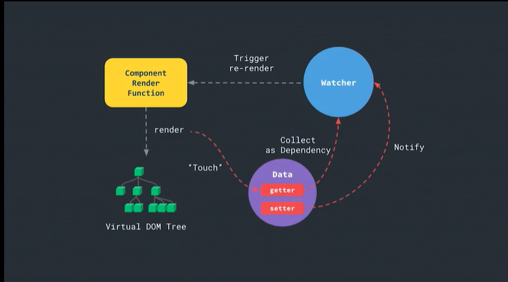

# Vue2响应式

<a href="https://www.bilibili.com/video/BV1d4411v7UX?p=2">视频链接</a>



## 响应式（Reactivity）

### Part 1

it means when you change the state and how the state reflects in the update of the entire system.

响应式表示当状态变更，系统会自动更新关联状态。

In our particular context, how changing state reflects into changes in the dom.

在web场景下，就是不断变化的状态反应到DOM上的变化。

How does Vue track changes?

Vue是如何跟踪变化的。


### Part 2

举个例子，写一个程序，要求b总是a的10倍。

如果使用<u>**命令式的（procedural）**</u>写法，当a改变时b不会更新，它们不会保持关系的同步：

```javascript
let a = 3;
let b = a * 10;
console.log(b); // 30
a = 4;
console.log(b); // 30
```

那么如何让它们保持同步呢？我们希望它们的关系式**<u>声明式的（declarative）</u>**。

如果有一个神奇的函数叫`onAchange`呢？当a改变时，它会自动重新执行这个传入函数，那么问题就解决了：

```javascript
onAchanged(()=>{
	b = a * 10;
})
```

转化成更接近web开发的问题，`span.cell.b1`这个dom元素的文本内容要和状态（state）中的a保持同步。此时可以复用上面的`onAchanged`函数，此处改名为`onStateChanged`：

```javascript
<span class="cell b1"></span>

onStateChanged(()=>{
	document.querySelector('.cell.b1').textContent = state.a * 10;
})
```

如果将操作DOM的代码进一步抽象为模板语言，我们实际上就创造了一个模板解析库。即内部代码可以抽象为`view = render(state)`

```javascript
<span class="cell b1"> {{ state.a * 10 }} </span>

onStateChange(()=>{
	view = render(state);
})
```

（画外音：`view = render(state)`是所有视图渲染系统的高度抽象形式。）


### Part 3

那么问题来了，这个神奇的`onStateChange()`函数是如何实现的呢？

它大概的实现方式如下：

```javascript
let update;
const onStateChanged = _update => {
	update = _update; //把传入的_update更新函数保存到外部update变量
}

// 要求用户使用setState这一特殊函数来操作状态(state)
const setState = newState => {
	state = newState;
	update(); //当用户操作状态时，调用更新函数，进行视图的更新
}
```

来捋一下以上的逻辑：

- 在`onStateChanged`函数中，我们把传入的更新函数保存在一个外部变量中。
- 用户通过调用`setState`函数，先更新状态（state）的值，然后调用先前保存的更新函数。

#### React

熟悉react的，一定对以上实现很熟悉。这就是React中响应式的工作原理。

```javascript
onStateChanged(() => {
	view = render(state);
});

setState({a: 5});
```

#### Vue

熟悉vue的，一定注意到vue中没有类似`setState()`的函数，而是直接访问/设置状态的变量的值。

实际上，vue中会使用ES5的`Object.defineProperty`方法，重写所有属性的`getter`和`setter`方法。在`getter`和`setter`方法中做一些类似`setState()`函数的操作。

```javascript
onStateChange(()=>{
	view = render(state);
})

state.a = 5;
```


最后，我们把`onStateChange()`统一重命名为`autorun`，它实际上就是一来跟踪的基本形式：

```javascript
autorun(()=>{
	console.log(state.count);
})
```


## getter和setter

如果你不了解`Object.defineProperty`的用法，可以去查一下文档。（或者看我的笔记）

`getter`和`setter`是vue实现响应式的第一步，它们在保证原始对象在保持原始行为（能通过属性访问属性的值，能为属性设置新的值）的同时，**添加我们想要的附加行为**。

### 练习

实现一个`convert`函数，它接收一个对象`obj`，遍历这个对象的所有属性，并重新定义每个属性的`getter`和`setter`。

同时，所有对这个对象的访问和赋值操作都需要打印日志(`console.log`)。

以下是需要实现的效果：

```javascript
const obj = { foo: 123 };
convert(obj);

obj.foo; // 打印 'getting key "foo": 123'
obj.foo = 234; // 打印 'setting key "foo" to 234'
obj.foo; // 打印 'getting key "foo": 234'
```


### 练习答案

```javascript
function convert(obj){
	Object.keys(obj).forEach((key) => {
        let oldValue = obj[key];
        Object.defineProperty(obj, key, {
            get(){
            	console.log(`getting key "${key}": ${oldValue}`);
                return oldValue;
        	},
        	set(newValue){
            	console.log(`setting key "${key}" to ${newValue}`);
            	oldValue = newValue;
        	}
        });
    });
}
```

- 使用`Object.keys()`获取对象的属性数组。
- 使用数组的`forEach()`方法遍历对象属性。
- 对于每个属性，将其旧值保存在一个变量中。然后用`Object.defineProperty()`为对象的属性重定义`getter`和`setter`。
- 在`getter`和`setter`中，除了原始行为，如`getter`中的返回属性的值：`return oldValue`，以及`setter`中的用新值更新旧值：`oldValue = newValue`。我们添加了一些附加操作：打印日志。


看起来非常直接且简单，不是吗？其实这里的“附加操作”给了我们很大的发挥空间，因为这不仅限于打印日志那么简单的操作。我们可以添加诸如依赖收集`depend()`和更新通知`notify()`之类的操作，而这恰是响应式的关键操作。


## 依赖跟踪（Dependency Tracking）

接下来，了解一下依赖跟踪的原理。

我们创造一个`Dep`类和它的实例`dep`，表示“依赖项”。

并实现它的`depend`和`notify`方法来进行依赖收集和更新通知。

- `depend`表示当前正在执行的代码依赖于该依赖项。

- `notify`表示依赖项发生了改变，因此任何之前依赖于该依赖项的表达式、计算、函数都会被通知重新执行。这些表达式、计算、函数都可以被称作该依赖项的订阅者（subscriber）。

那依赖收集在哪里发生呢？

- `autorun`函数。其中可以进行注册一些函数作为依赖项的订阅者，即收集依赖。
- 依赖收集指的是收集订阅者和依赖项的依赖关系，在代码中更侧重于表示收集订阅者，而非收集依赖项。

### 练习

- 创建一个`Dep`类，其中有两个方法：`depend`和`notify`
- 创建一个`autorun`函数，接收一个更新函数（updater function）。
- 在更新函数中，显示调用一个Dep类的实例`dep`的`depend`方法，即调用`dep.depend()`。
- 在之后的代码中，可以调用`dep.notify()`再次运行更新函数。

```javascript
const dep = new Dep();

autorun(() => {
	dep.depend();
	console.log("updated"); // 实际这里执行的是渲染视图的工作`view = render(state)`，这里简化
}); // 打印"updated"

dep.notify(); // 打印"updated"
```


### 练习答案

```javascript
// 一个用于表示依赖项的类
// 将它暴露给window对象（用于测试）
window.Dep = class Dep{
    constructor(){
        this.subscriber = new Set();
    }
	depend(){
        if(activeUpdate){
            // 注册一个正在执行的更新函数作为订阅者
            this.subscribers.add(activeUpdate);
        }
    },
    notify(){
        // 执行所有订阅者函数
        this.subscribers.forEach(sub => sub());
    }
}

let activeUpdate;

function autorun(update){
	function wrappedUpdate(){
        activeUpdate = wrappedUpdate;
        update();
        activeUpdate = null;
    }
    wrappedUpdate();
}
```

- `autorun`函数中定义的`wrappedUpdate`函数，实际上是为了在更新函数执行时，将它保存到一个外部变量如`activeUpdate`中，以便依赖项类`Dep`能够访问到它。

- `Dep`类中有一个成员变量`subscriber`，用来保存收集来的订阅者们，即更新函数。

- `depend`方法访问外部变量`activeUpdate`，把这个正在执行的更新函数添加到`subscriber`集合中，即注册该函数。

- `notify`方法执行所有依赖于该依赖项的订阅者，即执行订阅者们的更新操作。

  - 实际上，我们注册和执行的不是更新函数，而是一个包装函数`wrappedUpdate`。更重要的是，更新函数中会调用`dep.depend()`，再进行依赖收集。这使得依赖收集系统动态以及迭代地更新依赖。
  - 这份简易代码实现只涉及到依赖的添加，未涉及依赖的清理和如何处理新增属性的问题。

  

## 迷你观察者（mini observer）

接下来，我们将上两个练习结合起来。修改练习1中的`convert`函数：

在`getter`中调用`dep.depend`，在`setter`中调用`dep.notify`。

如此，当我们访问一个属性时，它调用`dep.depend`进行依赖收集；当我们通过赋值改变属性值时，它调用`dep.notify`触发改变。

### 练习

- 将练习1中的`convert`函数重命名为`observe`函数，并复用练习2中的`autorun`函数
- `observe`函数：用于转换接收对象的属性，并让属性变成响应式。对于每个属性，它被赋予一个`Dep`类的实例来追踪一组订阅者（更新函数），并且在触发`setter`时触发这些订阅者函数的执行。
- `autorun`函数：接收一个更新函数，在更新函数订阅的属性被赋值时执行更新函数。一个更新函数订阅属性，意味着一个更新函数依赖于该属性。

注意在`autorun`函数中访问了属性state.count，这意味着触发了该属性的`getter`，这让我们有机会调用`dep.depend`。而在`state.count++`中为属性赋值，这意味着触发了该属性的`setter`，这让我们有机会调用`dep.notify`。

```javascript
const state = {
	count: 0
}

observe(state);

autorun(() => {
	console.log(state.count);
}); // 打印 "count is: 0"

state.count++; // 打印 "count is: 1"
```


### 练习答案

```javascript
function observe(obj){
	Object.keys(obj).forEach(key => {
        let oldValue = obj[key];
        let dep = new Dep();
        Object.defineProperty(obj, key, {
            get(){
                dep.depend(); // 依赖收集
                return oldValue;
            },
            set(newValue){
                const isChanged = oldValue !== newValue; //值没有改变时，不进行更新，节省性能
                if(isChanged){
                    oldValue = newValue;
                    dep.notify(); // 
                }
            }
        })
    })
}

window.Dep = class Dep{
    constructor(){
        this.subscribers = new Set();
    }
    depend(){
        if(activeUpdate){
            this.subscribers.add(activeUpdate);
        }
    }
    notify(){
        this.subscribers.forEach(sub => sub())
    }
}

let activeUpdate;

function autorun(update){
	function wrappedUpdate(){
        activeUpdate = wrappedUpdate;
        update();
        activeUpdate = null;
    }
    wrappedUpdate();
}
```

`update`函数通常是一条条渲染函数`render()`，描述状态（state）如何渲染成视图（view），这可能涉及到对虚拟dom的理解，如何动态渲染标签和组件等等。

渲染函数quick look：

```javascript
render(h){
	return h('div',{ some attrs },[ some virtual dom children ]); //虚拟dom根节点
}
```

请先根据文头的<a href="https://www.bilibili.com/video/BV1d4411v7UX?p=2">视频链接</a>进行学习，在未来本人可能会推出关于这些知识的文章。