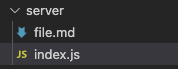
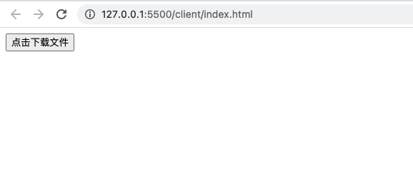
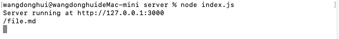
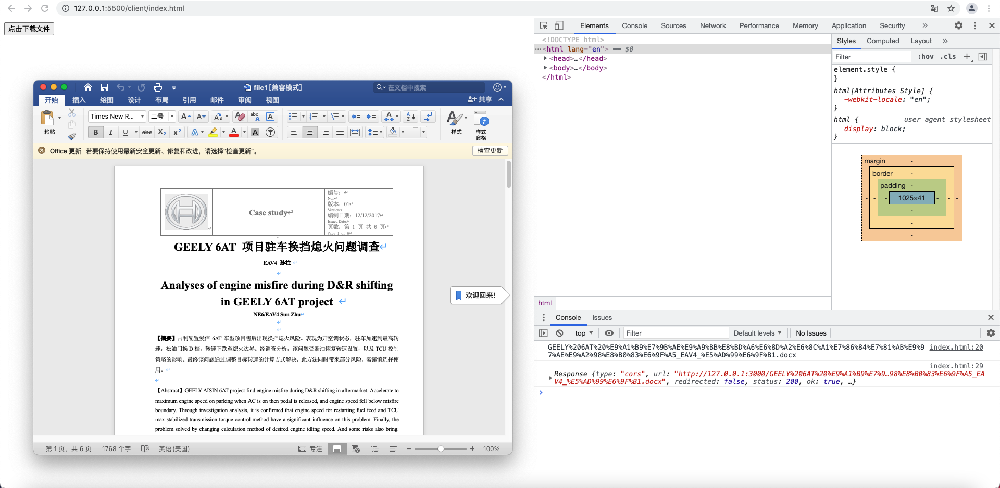
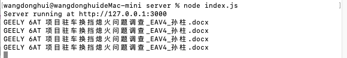

# 使用Fetch请求文件，并下载到本地


## 问题描述

最近遇到需要向后端请求文件，并让用户下载到本地的需求。我第一时间想到的是原生的Fetch API，正好可以测试一下如何实际使用Fetch方法请求文件。

然而，当我一通搜索+复制黏贴以后，自信地告诉后端同学：“只需要给我一个能请求到文件的url和文件名”之后，后端同学一句“这些具体是指什么”，把我问蒙了。

因此，我想着搭建一个简易的前后端传输文件的场景，来测试一下如何利用Fetch方法解决上述的需求。


## 问题拆解

1. 前端如何使用Fetch方法，向后端请求文件。
2. 前端如何将请求到的文件下载到用户本地。


## 解决方案

### Part 1：使用Fetch方法，向后端请求文件

#### 前端

关于Fetch方法的使用，可以参考笔记中JS一章的对应内容。

大致代码：`fetch(url).then(res => res.blob()).then(blob => {})`

这里我使用了请求二进制大文件的对应方法`res.blob()`。

特别注意的是：`url`即后端同学问我的可以请求到文件的`url`，随后可以看到我在简易的后端里是如何处理这个`url`的。

#### 后端

我使用nodejs搭建了一个简易的后端，代码如下：

index.js

```javascript
const http = require('http')
const fs = require('fs')
const url = require('url')

http.createServer(function(req,res){
    let pathname = url.parse(req.url).pathname; // 解析url
    console.log(pathname)
    
    fs.readFile(pathname.substr(1), function(err,data){ // 读取文件，文件名从pathname.substr(1)解析得到
        if(err){
            console.log(err)
            res.writeHead(404,{'Content-type': 'text/html'})
            res.end()
        }
        else {
            res.writeHead(200, {'Content-Type': 'application/json',
        'Access-Control-Allow-Origin':'http://127.0.0.1:5500'}) //成功读取文件，加上Mime类型响应头和跨域响应头
            res.end(data); // 结束响应
        }
    })
}).listen(3000);

console.log('Server running at http://127.0.0.1:3000')
```

服务器目录如下：



需要注意以下几点：

- 我使用了`url.parse(req.url).pathname`获取了请求的`url`的路径名。
- 我使用了`fs.readFile()`根据处理后的路径名读取服务器上对应的文件。**因为index.js和请求的文件是同一级目录，所以读取文件的路径直接写成了文件名。如果要请求的文件不在同一级目录，要修改读取文件的路径。**
- 在文件读取成功的逻辑分支里，为了解决<u>**跨域问题**</u>，我在响应头里写入了`Access-Control-Allow-Origin`这一头部，并指定其值为前端所在的域名。
- 最后，我通过`res.end()`将读取的文件数据流作为响应内容，并结束响应。

整个后端的处理逻辑：解析`url`->读取文件->设置解决跨域问题的响应头->返回文件数据


### Part 2：将文件下载到本地

前端请求到文件数据以后，还要进行一步处理，使其可以将文件下载到本地。

这里我使用了`a`标签，设置其`download`属性，来进行下载。其他方案可以自行百度。

```javascript
blob => {
    let url = window.URL.createObjectURL(blob)
    let a = document.createElement('a')
    a.download = 'file1.md' // filename
    a.href = url
    a.click()
    window.URL.revokeObjectURL(url);
}
```

其中注释为`filename`的地方，上例为`file1.md`，其实只是指定了用户下载到本地的文件名，可以和服务器上的文件名不一样，相当于重命名了该文件。


### Part 3：完整流程

最后，附上全部代码和整体流程：

#### 前端

index.html

```javascript
<!DOCTYPE html>
<html lang="en">
<head>
    <meta charset="UTF-8">
    <meta http-equiv="X-UA-Compatible" content="IE=edge">
    <meta name="viewport" content="width=device-width, initial-scale=1.0">
    <title>Fetch API test</title>
</head>
<body>
    <button id="btn">点击下载文件</button>
    <script>
        document.querySelector('#btn').addEventListener('click',function(){
            fetch("http://127.0.0.1:3000/file.md")
            .then(res => res.blob())
            .then(blob => {
                let url = window.URL.createObjectURL(blob)
                let a = document.createElement('a')
                a.download = 'file1.md'
                a.href = url
                a.click()
                window.URL.revokeObjectURL(url);
            })
        })
        
    </script>
</body>
</html>
```

#### 后端

index.js

```javascript
const http = require('http')
const fs = require('fs')
const url = require('url')

http.createServer(function(req,res){
    let pathname = url.parse(req.url).pathname;
    console.log(pathname)
    
    fs.readFile(pathname.substr(1), function(err,data){
        if(err){
            console.log(err)
            res.writeHead(404,{'Content-type': 'text/html'})
            res.end()
        }
        else {
            res.writeHead(200, {'Content-Type': 'application/json',
        'Access-Control-Allow-Origin':'http://127.0.0.1:5500'})
            res.end(data);
        }
    })
}).listen(3000);

console.log('Server running at http://127.0.0.1:3000')
```

#### 流程

1. 将前端index.html页面通过VSCode的live server插件架设到`http://127.0.0.1:5500`

   

2. 点击页面上的按钮，触发点击事件处理程序。在处理程序中，调用了Fetch方法向后端请求文件`file.md`，其中`url`为`http://127.0.0.1:3000/file.md`。

3. 后端接收到请求，解析`url`，获取到`pathname`变量为`/file.md`。

   

   

   - 如图看到`pathname`变量为`/file.md`，应该对其进行处理才能获取对应的文件名。

4. 后端对`pathname`变量字符串进行切割，留下对应的文件名`file.md`，并读取文件。（注意该文件在服务器的目录结构）

5. 后端在响应体中返回文件数据。

6. 前端接收到文件数据，通过创建`a`标签的方法，将文件下载到本地。（下载到本地的文件名可以被重命名）

   

因为我测试了很多遍，所以下载的文件名后跟了(3)，但是不影响我们验证了文件确实按照`filename`进行了重命名。


如有错误，欢迎指正！


## 2021/8/9  更新

在后续的debug中，我发现了上述代码实现的几个问题。这几个问题虽然看起来并没有影响代码功能，实际上只是恰好没有掉入这些坑，或者问题没有表现出来。


### url中的中文

请求的文件url中一旦有中文，就可能会出现意想不到的错误，比如服务端接收到的请求url是**乱码**的。

这里可以用一对对应的函数 `encodeURI()` 和 `decodeURI()`来对中文进行编码和翻译。

- 在前端，用`encodeURI()`对中文进行编码：

```javascript
let url = "GEELY 6AT 项目驻车换挡熄火问题调查_EAV4_孙柱.docx";

fetch(`http://127.0.0.1:3000/${encodeURI(url)}`,{ // 用encodeURI()编码url中的中文
	headers:{
		'content-type':'application/json;charset=utf-8'
	}
})
```

编码出来是这样的结果：

```json
GEELY%206AT%20%E9%A1%B9%E7%9B%AE%E9%A9%BB%E8%BD%A6%E6%8D%A2%E6%8C%A1%E7%86%84%E7%81%AB%E9%97%AE%E9%A2%98%E8%B0%83%E6%9F%A5_EAV4_%E5%AD%99%E6%9F%B1.docx
```

- 在后端，以nodejs举例，可以用`decodeURI()`对编码后的url进行翻译：

```javascript
fs.readFile(decodeURI(pathname).substr(1), function(err,data){ ... })
```

翻译出来的结果：

```bash
GEELY 6AT 项目驻车换挡熄火问题调查_EAV4_孙柱.docx
```


**注意**：用其他语言可能对应的函数名不同，不一定叫`decodeURI`


### Fetch 函数的两次请求

Fetch 函数在发送非简单请求时，会先进行一次【预检请求】（请求方法为OPTION），目的是为了验证服务器是否可以处理非简单请求。

预检请求被通过以后，才会再进行【真正的GET/POST等请求】，**真正去服务器请求资源**。

这类似于如下的场景：

浏览器（发送OPTION请求）：我的请求可不简单，服务器你这能处理吗？

服务器（收到OPTION请求）：我能行（返回200）。

浏览器（收到响应码200，再发送GET/POST...请求）：那我这次真的来请求资源啦。

服务器（收到GET/POST...请求）：好的，给你（200）/ 抱歉，我没有（404）。


至于什么样的请求是【简单请求】，详情自行百度。

在本例中，虽然使用的请求方法 GET 是简单请求方法。但是我们还设置了头部 Content-type，其值为 application/json，这一点使得该请求不再属于【简单请求】。

- 对于【简单请求】，fetch 只会发送一次请求。
- 对于跨域且【非简单请求】，fetch 才会发送两次请求。


**后端再处理请求时，务必要注意对两次不同请求的不同处理！**

```javascript
if(req.method == 'GET'){ // 处理第二次的请求方法为GET的请求
        fs.readFile(decodeURI(pathname).substr(1), function(err,data){ // decodeURI()将url中用encodeURI()编码过的中文进行翻译
            if(err){
                console.log(err)
                res.writeHead(404,{'Content-type': 'application/json;charset=utf-8'})
                res.end("error")
            }
            else {
                res.writeHead(200, {'Content-Type': 'application/json;charset=utf-8'})
                res.end(data);
            }
        })
}
else{ // 如果是GET以外的请求，返回200。此处是为了 直接通过 第一次的请求方法为OPTION的请求。
        res.writeHead(200,{'Content-Type': 'text/html;charset=utf-8'})
        res.end();
}
```


### 错误处理

如果后端因找不到请求的文件而返回404，之前的代码就可能直接把整个响应作为文件的二进制数据，生成一个文件，从而导致非预期的结果。

（用户：我的文件怎么只有两行内容，一行是"code"，一行是"message":"404 Not Found ..." ？？？）


因此我们在前端的代码中添加错误处理代码：

```javascript
fetch(`http://127.0.0.1:3000/${encodeURI(url)}`,{ // 用encodeURI()编码url中的中文
	headers:{
		'content-type':'application/json;charset=utf-8'
	}
})
.then(res => { // res为第一次请求方法为OPTION的请求的响应，用于确认服务器是否具有响应功能
	if(res.ok){
		return res.blob() // 若第一次请求通过，则再发送GET请求去请求文件
	}
	else{ // 错误处理
		let err = new Error(res.statusText)
		err.response = res
		throw err
	}
})
.then(blob => { // 对GET请求的响应数据进行处理，实现用户本地下载文件
	let url = window.URL.createObjectURL(blob)
	let a = document.createElement('a')
	a.download = filename
	a.href = url
	a.click()
	window.URL.revokeObjectURL(url)
})
.catch(err=>{ // 错误处理
	console.log(err);
})
```


另外一小点需要注意的是：

- 使用`res.blob()`会把响应的数据直接转换成二进制数据，所以直接填到生成的文件中（因为数据表示的本质就是二进制，所以响应的数据无论是什么牛鬼蛇神，都能转）
- 使用`res.json()`，响应的数据会以json格式返回，所以如果不用`JSON.parse()`方法先解析json格式数据，就没办法填到生成的文件中（会报错）。

第二种方法便于调试，因为这样可以检测出之前代码的问题。（响应体可不是json格式的数据，会报错哦）

但为了最少地修改代码（懒），所以修改后的演示代码保持第一种。


### 修改后的演示代码

前端 index.html

```javascript
<!DOCTYPE html>
<html lang="en">
<head>
    <meta charset="UTF-8">
    <meta http-equiv="X-UA-Compatible" content="IE=edge">
    <meta name="viewport" content="width=device-width, initial-scale=1.0">
    <title>Fetch API test</title>
</head>
<body>
    <button id="btn">点击下载文件</button>
    <script>
        document.querySelector('#btn').addEventListener('click',function(){
            let url = "GEELY 6AT 项目驻车换挡熄火问题调查_EAV4_孙柱.docx";
            let filename = "file1.docx";
            Fetch(url, filename)
        })

        function Fetch(url, filename){
            
            console.log(encodeURI(url)); // 用encodeURI()编码url中的中文

            fetch(`http://127.0.0.1:3000/${encodeURI(url)}`,{ // 用encodeURI()编码url中的中文
                headers:{
                    'content-type':'application/json;charset=utf-8'
                }
            })
            .then(res => { // res为第一次请求方法为OPTION的请求的响应，用于确认服务器是否具有响应功能
                if(res.ok){
                    console.log(res)
                    return res.blob() // 若第一次请求通过，则再发送GET请求去请求文件
                }
                else{ // 错误处理
                    console.log(res);
                    let err = new Error(res.statusText)
                    err.response = res
                    throw err
                }
            })
            .then(blob => { // 对GET请求的响应数据进行处理，实现用户本地下载文件
                    let url = window.URL.createObjectURL(blob)
                    let a = document.createElement('a')
                    a.download = filename
                    a.href = url
                    a.click()
                    window.URL.revokeObjectURL(url)
            })
            .catch(err=>{ // 错误处理
                console.log(err);
            })
        }
        
    </script>
</body>
</html>
```


后端 index.js

```javascript
const http = require('http')
const fs = require('fs')
const url = require('url')

http.createServer(function(req,res){
    let pathname = url.parse(req.url).pathname;
    console.log(decodeURI(pathname).substr(1)); // decodeURI()将url中用encodeURI()编码过的中文进行翻译
    
    // 为所有响应设置跨域头部
    res.setHeader("Access-Control-Allow-Headers", "content-type,XXX");
    res.setHeader("Access-Control-Allow-Methods", "*");
    res.setHeader("Access-Control-Allow-Origin", "*");
    res.setHeader("Access-Control-Allow-Credentials", "true");

    if(req.method == 'GET'){ // 处理第二次的请求方法为GET的请求
        fs.readFile(decodeURI(pathname).substr(1), function(err,data){ // decodeURI()将url中用encodeURI()编码过的中文进行翻译
            if(err){
                console.log(err)
                res.writeHead(404,{'Content-type': 'application/json;charset=utf-8'})
                res.end("error")
            }
            else {
                res.writeHead(200, {'Content-Type': 'application/json;charset=utf-8'})
                res.end(data);
            }
        })
    }
    else{ // 如果是GET以外的请求，返回200。此处是为了 直接通过 第一次的请求方法为OPTION的请求。
        res.writeHead(200,{'Content-Type': 'text/html;charset=utf-8'})
        res.end();
    }
    
}).listen(3000);

console.log('Server running at http://127.0.0.1:3000')
```

（**我对每个请求做了统一的跨域头部设置，因为两次请求都是跨域的**）


#### 前端页面效果



#### 后端命令行输出



