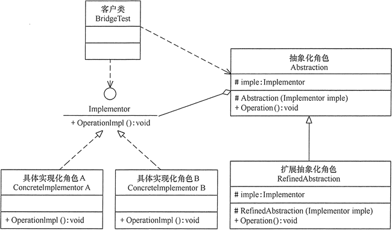

# 设计模式

参考网页：http://c.biancheng.net/view/1361.html

参考书：Design Patterns - Elements of Reusable Object-Oriented Software（中文译名：设计模式 - 可复用的面向对象软件元素）

| 序号 | 模式 & 描述                                                  | 包括                                                         |
| :--- | :----------------------------------------------------------- | :----------------------------------------------------------- |
| 1    | **创建型模式** 这些设计模式提供了一种在创建对象的同时隐藏创建逻辑的方式，而不是使用新的运算符直接实例化对象。这使得程序在判断针对某个给定实例需要创建哪些对象时更加灵活。 | 工厂模式（Factory Pattern）抽象工厂模式（Abstract Factory Pattern）单例模式（Singleton Pattern）建造者模式（Builder Pattern）原型模式（Prototype Pattern） |
| 2    | **结构型模式** 这些设计模式关注类和对象的组合。继承的概念被用来组合接口和定义组合对象获得新功能的方式。 | 适配器模式（Adapter Pattern）桥接模式（Bridge Pattern）过滤器模式（Filter、Criteria Pattern）组合模式（Composite Pattern）装饰器模式（Decorator Pattern）外观模式（Facade Pattern）享元模式（Flyweight Pattern）代理模式（Proxy Pattern） |
| 3    | **行为型模式** 这些设计模式特别关注对象之间的通信。          | 责任链模式（Chain of Responsibility Pattern）命令模式（Command Pattern）解释器模式（Interpreter Pattern）迭代器模式（Iterator Pattern）中介者模式（Mediator Pattern）备忘录模式（Memento Pattern）观察者模式（Observer Pattern）状态模式（State Pattern）空对象模式（Null Object Pattern）策略模式（Strategy Pattern）模板模式（Template Pattern）访问者模式（Visitor Pattern） |
| 4    | **J2EE 模式** 这些设计模式特别关注表示层。这些模式是由 Sun Java Center 鉴定的。 | MVC 模式（MVC Pattern）业务代表模式（Business Delegate Pattern）组合实体模式（Composite Entity Pattern）数据访问对象模式（Data Access Object Pattern）前端控制器模式（Front Controller Pattern）拦截过滤器模式（Intercepting Filter Pattern）服务定位器模式（Service Locator Pattern）传输对象模式（Transfer Object Pattern） |


## 简单工厂

### 定义

一个具体的工厂类，可以生成多个不同的产品。因为创建实例的方法通常是static方法，所以又称为静态工厂方法。


### 优点

1. 工厂与产品的职责区分明确。工厂类包含必要的逻辑判断，可以决定什么时候创建哪一个产品的实例。免除了用户直接创建产品对象的职责。
2. 用户无需知道具体产品的类名，只需知道工厂类为创建该产品对外提供的参数。
3. 可以引入配置文件，在不修改客户端代码的情况下更换和添加新的具体产品类。

### 缺点

1. 工厂类单一。负责所有产品的创建，职责过重，一旦异常，整个系统将受到影响。且代码臃肿。
2. 工厂类扩展困难。一旦添加新产品，不得不修改工厂逻辑，违反开闭原则。一旦产品过多，工厂类的逻辑会过于复杂。

### 应用场景

产品种类较少。


## 工厂模式

### **定义**

定义一个创建对象的接口，让其子类自己决定实例化哪一个工厂类，工厂模式使其创建过程延迟到子类进行。

主要由4个角色：

1. 抽象工厂（Abstract Factory）：提供了创建产品的接口，调用者通过它访问具体工厂的工厂方法，如`newProduct()`，来创建产品。
2. 具体工厂（Concrete Factory）：实现抽象工厂的抽象工厂方法，如`newProduct()`，完成具体产品的创建。
3. 抽象产品（Product）：定义了产品的规范，描述了产品的主要特性和功能。
4. 具体产品（Concrete Product）：实现了抽象产品定义的接口，由具体工厂来创建，和具体工厂一一对应。

工厂模式通常有1个抽象产品，多个具体产品实现它。有1个抽象工厂，多个具体工厂实现它。且<u>具体产品与具体工厂一一对应</u>。

### JS实现

按照特定接口创建对象：

```javascript
function createPerson(name, age, job){
	let o = new Object();
	o.name = name;
	o.age = age;
	o.job = job;
	o.sayName = function(){
		console.log(this.name);
	};
	return o;
}

let person1 = createPerson("Nicholas", 29, "Software Engineer");
let person2 = createPerson("Greg", 27, "Doctor");
```

- 虽然解决了创建多个类似对象的问题，但没有解决对象标识问题（即新创建的对象是什么类型，因为类型仍然都是Object）。

### 优点

1. 用户只要知道具体工厂的名称就可以得到所需产品的实例，无需知道产品的具体创建过程。

2. 添加新产品时，只需添加对应的工厂类，符合开闭原则。

3. 解耦。高层模块只需知道产品的抽象类，而无需关心其实现类，满足迪米特法则、依赖倒置原则和里氏替换原则。

### 缺点

1. 由于具体产品和具体工厂一一对应，所以类容易过多，增加复杂度。
2. 由于只有1个抽象产品和1个抽象工厂，工厂只能生产这类抽象产品。如电视机厂只生产电视机。

### 应用场景

- 客户只知道创建产品的工厂名，而不知道具体的产品名。如 TCL 电视工厂、海信电视工厂等。
- 创建对象的任务由多个具体子工厂中的某一个完成，而抽象工厂只提供创建产品的接口。
- 客户不关心创建产品的细节，只关心产品的品牌


## 抽象工厂

### 定义

是一种为访问类提供一个创建一组相关或相互依赖对象的接口，且访问类无须指定所要产品的具体类就能得到同族的不同等级的产品的模式结构。

抽象工厂考虑不同等级产品的生产，一个具体工厂可以生产一个<u>产品族</u>内的多个产品。一个产品族内往往有多个抽象产品的实现类。


抽象工厂通常有多个抽象产品，每个抽象产品有多个具体产品实现它。有1个抽象工厂，多个具体工厂实现它。一个具体工厂负责生产一个<u>产品族</u>，一个<u>产品族</u>由实现不同抽象产品的具体产品组成。

### 实现


### 优点

1. 当增加一个新的产品族时，只需增加一个新的具体工厂，满足开闭原则。

### 缺点

2. 当产品族中需要添加一个新的具体产品时，所有的具体工厂类都需要进行修改，不满足开闭原则。

### 应用场景

抽象工厂模式最早的应用是用于创建属于不同操作系统的视窗构件。如 Java 的 AWT 中的 Button 和 Text 等构件在 Windows 和 UNIX 中的本地实现是不同的。

1. 当需要创建的对象是一系列相互关联或相互依赖的产品族时，如电器工厂中的电视机、洗衣机、空调等。
2. 系统中有多个产品族，但每次只使用其中的某一族产品。如有人只喜欢穿某一个品牌的衣服和鞋。
3. 系统中提供了产品的类库，且所有产品的接口相同，客户端不依赖产品实例的创建细节和内部结构。


## 简单工厂、工厂方法和抽象工厂的区别

**简单工厂**：一个产品抽象类 + 唯一工厂类，工厂类的创建方法依据入参判断并创建具体产品对象。

**工厂方法**：一个产品抽象类 + 多个工厂类，利用多态创建不同的产品对象，避免了大量的if-else判断。

**抽象工厂**：多个产品抽象类 + 多个工厂类，产品子类分组，同一个工厂实现类创建同组中的不同产品，减少了工厂子类的数量。


## 单例模式

### 定义

保证一个类仅有一个实例，并提供一个访问它的全局访问点。

### JS实现

闭包缓存一个内部变量实现单例。

```javascript
function getSingleton(fn){
	var instance = null;
	
	return function(){
		if(!instance){
			instance = fn.apply(this, arguments);
		}
		return instance;
	}
}
```

### Java实现

**私有静态实例 + 私有构造函数 + 公有静态方法（唯一访问点）**

1. 懒汉式 + 线程不安全

   - 这种方式是最基本的实现方式，这种实现最大的问题就是不支持多线程。因为没有加锁 synchronized，所以严格意义上它并不算单例模式。

     ```java
     public class Singleton {  
         private static Singleton instance;  
         private Singleton (){}  
       
         public static Singleton getInstance() {  
         if (instance == null) {  
             instance = new Singleton();  
         }  
         return instance;  
         }  
     } 
     ```

     

2. 懒汉式 + 线程安全

   - 这种方式具备很好的 lazy loading，能够在多线程中很好的工作，但是，效率很低，99% 情况下不需要同步。
     优点：第一次调用才初始化，避免内存浪费。缺点：必须加锁 synchronized 才能保证单例，但加锁会影响效率。

     ```java
     public class Singleton {  
         private static Singleton instance;  
         private Singleton (){}  
         public static synchronized Singleton getInstance() {  
         if (instance == null) {  
             instance = new Singleton();  
         }  
         return instance;  
         }  
     } 
     ```

     

3. 饿汉式

   - 这种方式比较常用，但容易产生垃圾对象。它基于 classloder 机制避免了多线程的同步问题，不过，instance 在类装载时就实例化，不能确定有其他的方式（或者其他的静态方法）导致类装载。
     优点：没有加锁，执行效率会提高。
     缺点：类加载时就初始化，浪费内存。

     ```java
     public class Singleton {  
         private static Singleton instance = new Singleton();  
         private Singleton (){}  
         public static Singleton getInstance() {  
         return instance;  
         }  
     }  
     ```

4. **双检锁/双重校验锁（DCL，即 double-checked locking）**

   - 采用双锁机制，安全且在多线程情况下能保持高性能。getInstance() 的性能对应用程序很关键。

     ```java
     public class Singleton {  
         private volatile static Singleton singleton;  
         private Singleton (){}  
         public static Singleton getSingleton() {  
         if (singleton == null) {  
             synchronized (Singleton.class) {  
             if (singleton == null) {  
                 singleton = new Singleton();  
             }  
             }  
         }  
         return singleton;  
         }  
     }  
     ```

5. 登记式/静态内部类

   - 这种方式同样利用了 classloder 机制来保证初始化 instance 时只有一个线程。 SingletonHolder 类没有被主动使用，只有显示通过调用 getInstance 方法时，才会显示装载 SingletonHolder 类，从而实例化 instance。

     ```java
     public class Singleton {  
         private static class SingletonHolder {  
         private static final Singleton INSTANCE = new Singleton();  
         }  
         private Singleton (){}  
         public static final Singleton getInstance() {  
         return SingletonHolder.INSTANCE;  
         }  
     }   
     ```

6. 枚举

   - 不仅能避免多线程同步问题，而且还自动支持序列化机制，防止反序列化重新创建新的对象，绝对防止多次实例化。

     ```java
     public enum Singleton {  
         INSTANCE;  
         public void whateverMethod() {  
         }  
     }  
     ```


### 优点

1. 提供了对唯一实例的受控访问。
2. 由于系统内存中只存在一个对象，因此可以节约系统资源。适用于需要频繁创建和销毁对象时。
3. 避免对共享资源的多重占用。

### 缺点

1. 不适用于变化的对象，如果同一类型的对象总是要在不同的用例场景发生变化，单例就会引起数据的错误，不能保存彼此的状态。
2. 由于单利模式中没有抽象层，因此单例类的扩展有很大的困难。 
3. 单例类的职责过重，在一定程度上违背了“单一职责原则”。 
4. 滥用单例将带来一些负面问题，如为了节省资源将数据库连接池对象设计为的单例类，可能会导致共享连接池对象的程序过多而出现连接池溢出；如果实例化的对象长时间不被利用，系统会认为是垃圾而被回收，这将导致对象状态的丢失。 


## 原型模式

### 定义

用原型实例指定创建对象的种类，并且通过拷贝这些原型创建新的对象。

### JS实现

在JavaScript中，实现原型模式是在ECMAScript5中，提出的[Object.create](https://developer.mozilla.org/zh-CN/docs/Web/JavaScript/Reference/Global_Objects/Object/create)方法，使用现有的对象来提供新创建的对象的__proto__。

```javascript
var prototype = {
    name: 'Jack',
    getName: function() {
        return this.name
    }
}

var obj = Object.create(prototype, {
    job: {
        value: 'IT'
    }
})

console.log(obj.getName())  // Jack
console.log(obj.job)  // IT
console.log(obj.__proto__ === prototype)  //true
```

**1. 方法继承**

```javascript
var Parent = function() {}
Parent.prototype.show = function() {}
var Child = function() {}

// Child继承Parent的所有原型方法
Child.prototype = new Parent()
```

**2. 所有函数默认继承Object**

```javascript
var Foo = function() {}
console.log(Foo.prototype.__proto__ === Object.prototype) // true
```


### Java实现

暂无


## 代理模式

### 定义

给某对象提供一个代理以控制对该对象的访问。这时，访问对象不适合或者不能直接引用目标对象，代理对象作为访问对象和目标对象之间的中介。

主要角色：

1. 抽象主题（Subject）类：通过接口或抽象类声明真实主题和代理对象实现的业务方法。
2. 真实主题（Real Subject）类：实现了抽象主题中的具体业务，是代理对象所代表的真实对象，是最终要引用的对象。
3. 代理（Proxy）类：提供了与真实主题相同的接口，其内部含有对真实主题的引用，它可以访问、控制或扩展真实主题的功能。


代理模式通过定义一个继承抽象主题的代理来包含真是主题，从而实现对真实主题的访问。

根据代理的创建时期，代理模式分为静态代理和动态代理。

- 静态：由程序员创建代理类或特定工具自动生成源代码再对其编译，在程序运行前代理类的 .class 文件就已经存在了。
- 动态：在程序运行时，运用反射机制动态创建而成。

### JS实现

代理模式主要有三种：保护代理、虚拟代理、缓存代理

#### 保护代理

主要实现了访问主体的限制行为，以过滤字符作为简单的例子。

```javascript
// 主体，发送消息
function sendMsg(msg) {
    console.log(msg);
}

// 代理，对消息进行过滤
function proxySendMsg(msg) {
    // 无消息则直接返回
    if (typeof msg === 'undefined') {
        console.log('deny');
        return;
    }
    
    // 有消息则进行过滤
    msg = ('' + msg).replace(/泥\s*煤/g, '');

    sendMsg(msg);
}


sendMsg('泥煤呀泥 煤呀'); // 泥煤呀泥 煤呀
proxySendMsg('泥煤呀泥 煤'); // 呀
proxySendMsg(); // deny
```

在访问主体之前进行控制，没有消息的时候直接在代理中返回了，拒绝访问主体，这数据保护代理的形式。

有消息的时候对敏感字符进行了处理，这属于虚拟代理的模式。

#### 虚拟代理

控制对主体的访问时，加入了一些额外的操作。

**节流函数**，是一种虚拟代理的实现。

```javascript
// 函数防抖，频繁操作中不处理，直到操作完成之后（再过 delay 的时间）才一次性处理
function debounce(fn, delay) {
    delay = delay || 200;
    
    var timer = null;

    return function() {
        var arg = arguments;
          
        // 每次操作时，清除上次的定时器
        clearTimeout(timer);
        timer = null;
        
        // 定义新的定时器，一段时间后进行操作
        timer = setTimeout(function() {
            fn.apply(this, arg);
        }, delay);
    }
};

var count = 0;

// 主体
function scrollHandle(e) {
    console.log(e.type, ++count); // scroll
}

// 代理
var proxyScrollHandle = (function() {
    return debounce(scrollHandle, 500);
})();

window.onscroll = proxyScrollHandle;
```

#### 缓存代理

可以为一些开销大的运算结果提供暂时的缓存，提升效率。

比如缓存加法操作。

```javascript
// 主体
function add() {
    var arg = [].slice.call(arguments);

    return arg.reduce(function(a, b) {
        return a + b;
    });
}

// 代理
var proxyAdd = (function() {
    var cache = [];

    return function() {
        var arg = [].slice.call(arguments).join(',');
        
        // 如果有，则直接从缓存返回
        if (cache[arg]) {
            return cache[arg];
        } else {
            var ret = add.apply(this, arguments);
            return ret;
        }
    };
})();

console.log(
    add(1, 2, 3, 4),
    add(1, 2, 3, 4),

    proxyAdd(10, 20, 30, 40),
    proxyAdd(10, 20, 30, 40)
); // 10 10 100 100
```

代理模式有以下功能：（引自JavaScript高级程序设计（第4版））

#### 跟踪属性访问

通过捕获 get、set 和 has 等操作，可以知道对象属性什么时候被访问、被查询。把实现相应捕获器的对象代理放到应用中，可以监控这个对象何时在何处被访问过：

```javascript
const user = {
	name: 'Jake'
};

const proxy = new Proxy(user, {
	get(target, property, receiver){
		console.log(`Getting ${property}`);
		return Reflect.get(...arguments);
	},
    set(target, property, value, receiver){
        console.log(`Setting ${property} = ${value}`);
        return Reflect.set(...arguments);
    }
});

proxy.name; // Getting name
proxy.age = 27; // Setting age = 27
```

#### 隐藏属性

代理的内部实现对外部代码是不可见的，因此可以隐藏目标对象上的属性：

```javascript
const hiddenProperties = ['foo', 'bar'];
const targetObject = {
	foo: 1,
	bar: 2,
	baz: 3
};
const proxy = new Proxy(targetObject, {
	get(target, property) {
		if(hiddenProperties.includes(property)) {
			return undefined;
		}
		else {
			return Reflect.get(...arguments);
		}
	},
	has(target, property) {
		if(hiddenProperties.includes(property)) {
			return false;
		}
		else {
			return Reflect.has(...arguments);
		}
	}
});

// get()
console.log(proxy.foo); // undefined
console.log(proxy.bar); // undefined
console.log(proxy.baz); // 3
```

#### 属性验证

因为所有赋值操作都会触发 set() 捕获器，所以可以根据所赋的值决定是允许还是拒绝赋值：

```javascript
const target = {
	onlyNumbersGoHere: 0
};

const proxy = new Proxy(target, {
	set(target, property, value){
		if(typeof value !== 'number'){
			return false;
		}
		else {
			return Reflect.set(...arguments);
		}
	}
});

proxy.onlyNumbersGoHere = 1;
console.log(proxy.onlyNumbersGoHere); // 1
proxy.onlyNumbersGoHere = '2';
console.log(proxy.onlyNumbersGoHere); // 1
```

#### 函数与构造函数参数验证

跟保护和验证对象属性类似，也可以对函数和构造函数参数进行审查。

可以让函数只接收某种类型的值：

```javascript
function median(...nums) {
	return nums.sort()[Math.floor(nums.length / 2)];
}

const proxy = new Proxy(median, {
	apply(target, thisArg, argumentsList) {
		for(const arg of argumentsList) {
			if(typeof arg !== 'number') {
				throw 'Non-number argument provided';
			}
			return Reflect.apply(...arguments);
		}
	}
});

console.log(proxy(4, 7, 1)); // 4
console.log(proxy(4, '7', 1)); // Error: Non-number argument provided
```

类似地，可以要求实例化时必须给构造函数传参：

```javascript
class User {
	constructor(id){
		this.id_ = id;
	}
}

const proxy = new Proxy(User, {
	construct(target, argumentsList, newTarget){
		if(argumentsList[0] === undefined){
			throw 'User cannot be instantiated without id';
		}
		else{
			return Reflect.construct(...arguments);
		}
	}
});

new proxy(1);

new proxy(); // Error: User cannot be instatiated without id
```

#### 数据绑定与可观察对象

通过代理可以把运行时原本不相关的部分联系到一起。这样就可以实现各种模式，从而让不同的代码相互操作。

比如，可以将被代理的类绑定到一个全局实例集合，让所有创建的实例都被添加到这个集合中：

```javascript
const userList = [];

class User {
	constructor(name){
		this.name_ = name;
	}
}

const proxy = new Proxy(User, {
	constructor(){
		const newUser = Reflect.construct(...arguments);
		userList.push(newUser);
		return newUser;
	}
});

new proxy('John');
new proxy('Jacob');
new proxy('Jingleheimerschmidt');

console.log(userList); // [User {}, User {}, User {}]
```

另外，还可以把集合绑定到一个事件分派程序，每次插入新实例都会发送消息：

```javascript
const userList = [];

function emit(newValue){
	console.log(newValue);
}

const proxy = new Proxy(userList, {
	set(target, property, value, receiver){
		const result = Reflect.set(...arguments);
		if(result){
			emit(Reflect.get(target, property, receiver));
		}
		return result;
	}
});

proxy.push('John'); // John
proxy.push('Jacob'); // Jacob
```


### 优点

1. 代理模式在客户端与目标对象之间起到一个中介作用和保护目标对象的作用。
2. 代理对象可以扩展目标对象的功能。
3. 代理模式能将客户端与目标对象分离，降低耦合，增加可扩展性。

### 缺点

1. 代理模式会造成系统设计中类的数量增加
2. 在客户端和目标对象之间增加一个代理对象，会造成请求处理速度变慢。
3. 增加了系统复杂度。

### 应用场景

使用代理模式主要有两个目的：一是保护目标对象，二是增强目标对象。

- 远程代理，这种方式通常是为了隐藏目标对象存在于不同地址空间的事实，方便客户端访问。例如，用户申请某些网盘空间时，会在用户的文件系统中建立一个虚拟的硬盘，用户访问虚拟硬盘时实际访问的是网盘空间。
- 虚拟代理，这种方式通常用于要创建的目标对象开销很大时。例如，下载一幅很大的图像需要很长时间，因某种计算比较复杂而短时间无法完成，这时可以先用小比例的虚拟代理替换真实的对象，消除用户对服务器慢的感觉。
- 安全代理，这种方式通常用于控制不同种类客户对真实对象的访问权限。
- 智能指引，主要用于调用目标对象时，代理附加一些额外的处理功能。例如，增加计算真实对象的引用次数的功能，这样当该对象没有被引用时，就可以自动释放它。
- 延迟加载，指为了提高系统的性能，延迟对目标的加载。例如，[Hibernate](http://c.biancheng.net/hibernate/) 中就存在属性的延迟加载和关联表的延时加载。


## 适配器模式

### 定义

将一个类的接口转换成客户希望的另外一个接口，使得原本由于接口不兼容而不能一起工作的那些类能一起工作。

### 实现

主要角色：

1. 目标（target）接口：当前系统业务所期待的接口，它可以是抽象类或接口。
2. 适配者（Adaptee）类：它是被访问和适配的现存组件库中的组件接口。
3. 适配器（Adaptor）类：它是一个转换器，通过继承或引用适配者对象，把适配者接口转换成目标接口，让用户按目标接口的格式访问适配者。

### JS实现

一个简单的数据格式转换的适配器

```javascript
// 渲染数据，格式限制为数组了
function renderData(data) {
    data.forEach(function(item) {
        console.log(item);
    });
}

// 对非数组的进行转换适配
function arrayAdapter(data) {
    if (typeof data !== 'object') {
        return [];
    }

    if (Object.prototype.toString.call(data) === '[object Array]') {
        return data;
    }

    var temp = [];

    for (var item in data) {
        if (data.hasOwnProperty(item)) {
            temp.push(data[item]);
        }
    }

    return temp;
}

var data = {
    0: 'A',
    1: 'B',
    2: 'C'
};

renderData(arrayAdapter(data)); // A B C
```

### 优点

1. 客户端通过适配器可以透明地调用目标接口。
2. 复用了现存的类。
3. 将目标类和适配者类解耦，解决了目标类和适配者类接口不一致的问题。
4. 符合开闭原则。

### 缺点

1. 适配器的编写要结合业务场景全面考虑，会增加系统复杂性。
2. 降低代码可读性。


## 桥接模式

### 定义

将抽象与实现分离，使它们可以独立变化。**用组合关系代替继承关系**来实现。

### 实现

2个角色：

1. 抽象化（Abstraction）角色：定义抽象类，并包含一个对实现化对象的引用。
2. 扩展抽象化（Refined Abstraction）角色：抽象化角色的子类。实现父类中的业务方法，并通过组合关系调用实现化角色中的业务方法。
3. 实现化（Implementor）角色：定义实现化角色的接口，供扩展抽象化角色调用。
4. 具体实现化（Concrete Implementor）角色：给出实现化角色接口的具体实现。



### JS实现

常用于事件监控和通过桥接连接多个类。

#### 事件监控

```javascript
function getBeerById(id, callback) {
	asyncRequest('GET', 'beer.url?id=' + id, function(resp){
		callback(resp.responseText)
	});
}

addEvent(element, 'click', getBeerByIdBridge);

function getBeerByIdBridge(e) {
  getBeerById(this.id, function(beer) {
    console.log('Requested Beer: ' + beer)
  });
}
```

`getBeerByIdBridge`函数隔离了`getBeerById`函数的抽象和实现。现在，我们可以任意更改`getBeerById`函数的形参`callback`的具体实现，达到不同的回调结果。可以这么理解：我们现在在面向接口编程。

#### 连接多个类

```javascript
var Class1 = function(a, b, c) {
	this.a = a;
	this.b = b;
	this.c = c;
}
var Class 2 = function(d) {
	this.d = d;
}
var BridgeClass = function(a, b, c, d) {
	this.one = new Class1(a, b, c);
	this.two = new Class2(d);
}
```

`Class1`和`Class2`被`BridgeClass`组合起来，实现了模块的快速组装。实现与抽象部分分离，可以更灵活地创建对象。

### 优点

1. 代码解耦，将抽象与实现分离。利于分层和组件的模块化。
2. 提高可扩充性
3. 对客户隐藏实现细节。

### 缺点

1. 大量的类导致开发成本增加，可能减少性能。


## 迭代器模式

### 定义

提供一个对象（迭代器）来顺序访问聚合对象中的一系列数据，而不暴露聚合对象的内部表示。

### 实现

主要角色：

1. 抽象聚合（Aggregate）角色：定义存储、添加、删除聚合对象以及创建迭代器对象的接口。
2. 具体聚合（ConcreteAggregate）角色：实现抽象聚合类，返回一个具体迭代器的实例。
3. 抽象迭代器（Iterator）角色：定义访问和遍历聚合元素的接口，通常包含 hasNext()、first()、next() 等方法。
4. 具体迭代器（Concretelterator）角色：实现抽象迭代器接口中所定义的方法，完成对聚合对象的遍历，记录遍历的当前位置。


### JS实现

JS中有可迭代对象iterable和迭代器iterator（协议），分别对应抽象聚合和抽象迭代器。

每个可迭代对象都是具体聚合，其中的迭代器都是具体迭代器。

JS通过可迭代对象类中的[Symbol.iterator]属性，返回一个迭代器，从而规定该类的迭代行为。

```javascript
class Person {
	constructor(){
		this.nicknames= ['Jack','Jake','J-Dog'];
	}
	*[Symbol.iterator](){ // 生成器函数
		yield *this.nicknames.entries(); //Person类有可迭代对象
	}
}
let p = new Person();
for(let [idx, nickname] of p){
	console.log(nickname);
}
// Jack
// Jake
// J-Dog
```

### 优点

1. 访问一个聚合对象的内容而无须暴露它的内部表示。
2. 遍历任务交由迭代器完成，这简化了聚合类。
3. 它支持以不同方式遍历一个聚合，甚至可以自定义迭代器的子类以支持新的遍历。
4. 增加新的聚合类和迭代器类都很方便，无须修改原有代码。
5. 封装性良好，为遍历不同的聚合结构提供一个统一的接口。

### 缺点

1. 增加了类的个数，这在一定程度上增加了系统的复杂性。


## 观察者模式

### 定义

指多个对象间存在一对多的依赖关系，当一个对象的状态发生改变时，所有依赖于它的对象都得到通知并被自动更新。

### 实现

主要角色：

1. 抽象主题（Subject）：也叫抽象目标，提供了一个用于保存观察者对象的聚集类和增加、删除观察者对象的方法，以及通知所有观察者的抽象方法。
2. 具体主题（Concrete Subject）：也叫具体目标，实现了抽象主题/目标中的<u>通知</u>方法。当具体主题的内部状态发生改变时，通知所有注册过的观察者对象。
3. 抽象观察者（Observer）：它是一个抽象类或接口，包含了一个更新自己的抽象方法，当接到具体主题的更改通知时被调用。
4. 具体观察者（Concrete Observer）：实现抽象观察者中定义的<u>更新</u>方法，以便在得到目标的更改通知时更新自身的状态。


### JS实现

JS事件是典型的观察者模式。

JS是观察者，事件处理函数是它的更新方法。而DOM对象是主题/目标/被观察者，当事件被触发时，浏览器调用绑定在DOM对象上的事件处理函数。

### 优点

1. 降低了目标与观察者之间的耦合关系。两者之间是抽象耦合关系，符合依赖倒置原则。
2. 目标与观察者之间建立了一套触发机制。

### 缺点

1. 目标与观察者之间的依赖关系并没有完全解除，有可能出现循环引用。
2. 当观察者对象很多时，通知的发布会花费很多时间，影响程序效率。


## 策略模式

### 定义

定义一系列算法，将每个算法封装起来，使它们可以相互替换。**将算法的使用和算法的实现分离开来**。

### 实现

3个角色：

1. 抽象策略（Strategy）类：定义了一个公共接口，不同的算法以不同的方式实现该接口。
2. 具体策略（Concrete Strategy）类：实现了抽象策略定义的接口，提供具体的算法实现。
3. 环境（Context）类：持有一个策略类的引用，客户端通过该引用调用不同的算法。


### JS实现

```javascript
var fnA = function(val) {
	return val * 1
}

var fnB = function(val) {
	return val * 2
}

var fnC = function(val) {
	return val * 3
}

var calculate = function(fn, val) {
	return fn(val)
}

console.log(calculate(fnA, 100)) // 100
console.log(calculate(fnB, 100)) // 200
console.log(calculate(fnC, 100)) // 300
```

### 优点

1. 避免使用多重条件语句（if...else, switch语句）
2. 提供了一系列可重用的算法族，恰当使用继承可以把算法族的公共代码转移到父类中，从而避免重复代码。
3. 提供相同行为的不同实现。
4. 支持开闭原则：在不修改原代码的情况下，增加新算法。
5. 把算法的使用放到环境（Context）类中，把算法的实现移到具体策略类中，将算法的实现和使用分离。

### 缺点

1. 客户端需要事先了解所有策略算法的区别，以选择合适的算法。
2. 造成很多的策略类，增加维护难度。


## 桥接模式和策略模式的区别

1. 在类型上，

   - 桥接模式属于结构型模式。结构型模式的特点：通过继承、聚合的方式组合类和对象，以形成更大的结构。

   - 策略模式属于行为型模式。行为型模式的特点：处理对象之间的通信方式，往往通过引入中介者对象将通信双方解耦。（将 Context 和实际的算法提供者解耦）

2. 在形式上，对比两者的结构图：

   - 桥接模式中， Abstraction 也可以发生变化（RefinedAbstraction）。Implementor 和 Abstraction 两者的变化是完全独立的。RefinedAbstraction 和 concreteImplementor 之间是松散耦合的，仅仅通过 Abstraction 和 Implementor 之间的关系而联系起来。
   - 策略模式中，不考虑 Context 的变化，只考虑算法的可替代性。

3. 在语意上，

   - 桥接模式，强调 Implementor 接口仅提供基本操作，而 Abstraction 基于这些基本操作，定义更高层次的操作。
   - 策略模式，强调 Strategy 抽象接口提供算法，一般是无状态、无数据的，而 Context 简单调用这些算法完成操作。


## 模板模式

### 定义

定义一个操作中的算法骨架，而将算法的一些步骤延迟到子类中，使得子类可以不改变该算法结构的情况下重定义该算法的某些特定步骤。

### 实现

2个角色：

1. 抽象类/抽象模板
   -  模板方法：定义了算法的骨架，按某种顺序调用其包含的基本方法。
   - 基本方法：是整个算法中的一个步骤，包含以下几种类型。
     - 抽象方法：在抽象类中声明，由具体子类实现。
     - 具体方法：在抽象类中已经实现，在具体子类中可以继承或重写它。
     - 钩子方法：在抽象类中已经实现，包括用于判断的逻辑方法和需要子类重写的空方法两种。

2. 具体子类/具体实现

### 优点

1. 它封装了不变部分，扩展可变部分。它把认为是不变部分的算法封装到父类中实现，而把可变部分算法由子类继承实现，便于子类继续扩展。
2. 它在父类中提取了公共的部分代码，便于代码<u>复用</u>。
3. 部分方法是由子类实现的，因此子类可以通过扩展方式增加相应的功能，符合<u>开闭原则</u>

### 缺点

1. 对每个不同的实现都需要定义一个子类，这会导致类的个数增加，系统更加庞大，设计也更加抽象，间接地增加了系统实现的复杂度。
2. 父类中的抽象方法由子类实现，子类执行的结果会影响父类的结果，这导致一种反向的控制结构，它提高了代码阅读的难度。
3. 如果父类添加新的抽象方法，则所有子类都要改一遍。


## 设计模式的六大原则

#### **1、开闭原则（Open Close Principle）**

开闭原则的意思是：**对扩展开放，对修改关闭**。在程序需要进行拓展的时候，不能去修改原有的代码，实现一个热插拔的效果。简言之，是为了使程序的扩展性好，易于维护和升级。想要达到这样的效果，我们需要使用接口和抽象类，后面的具体设计中我们会提到这点。

#### **2、里氏代换原则（Liskov Substitution Principle）**

里氏代换原则是面向对象设计的基本原则之一。 里氏代换原则中说，任何基类可以出现的地方，子类一定可以出现。LSP 是继承复用的基石，只有当派生类可以替换掉基类，且软件单位的功能不受到影响时，基类才能真正被复用，而派生类也能够在基类的基础上增加新的行为。里氏代换原则是对开闭原则的补充。实现开闭原则的关键步骤就是抽象化，而基类与子类的继承关系就是抽象化的具体实现，所以里氏代换原则是对实现抽象化的具体步骤的规范。

#### **3、依赖倒转原则（Dependence Inversion Principle）**

这个原则是开闭原则的基础，具体内容：针对接口编程，依赖于抽象而不依赖于具体。

#### **4、接口隔离原则（Interface Segregation Principle）**

这个原则的意思是：使用多个隔离的接口，比使用单个接口要好。它还有另外一个意思是：降低类之间的耦合度。由此可见，其实设计模式就是从大型软件架构出发、便于升级和维护的软件设计思想，它强调降低依赖，降低耦合。

#### **5、迪米特法则，又称最少知道原则（Demeter Principle）**

最少知道原则是指：一个实体应当尽量少地与其他实体之间发生相互作用，使得系统功能模块相对独立。

#### **6、合成复用原则（Composite Reuse Principle）**

合成复用原则是指：尽量使用合成/聚合的方式，而不是使用继承。
