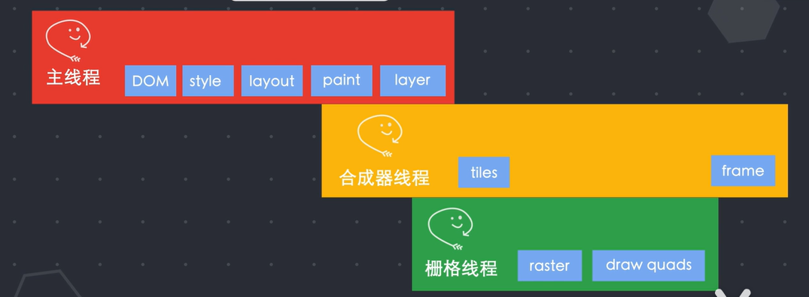

# 二、浏览器

## 浏览器如何运行

推荐视频：<a href="https://www.bilibili.com/video/BV1x54y1B7RE">视频链接</a>

### 结构

用户界面→浏览器引擎→渲染引擎→功能模块（网络、js解析器等）

​							↓				

​					数据持久层(cookie等)

### 渲染引擎

又称为浏览器内核。

- IE使用Trident，Firefox使用Gecko，Safari使用Webkit，Chrome/Opera/Edge使用Blink

### 进程与线程

- **进程**是操作系统进行资源分配和调度的基本单元，可以申请和拥有计算机资源。进程是程序的基本执行实体。
- **线程**是操作系统能够进行运算调度的最小单位。一个进程中可以并发多个线程，每条线程并行执行不同的任务。

### 单进程浏览器

单进程浏览器中有：

- 页面线程，负责页面渲染page rendering、展示page display和插件plugins
- JS线程，执行JS代码
- 其他线程

缺点：

- 不稳定：其中一个线程的卡死可能会导致整个浏览器无法正常运行。
- 不安全：浏览器之间可以共享数据，一个线程可以访问浏览器进程内的所有数据。
- 不流畅：一个进程负责太多事，导致运行效率问题。

### 多进程浏览器

- **浏览器进**程：控制浏览器除标签页外的用户界面，包括地址栏、书签、后退和前进按钮，以及负责与其他线程协调工作。
- **网络进程**：发起/接受网络请求。
- **GPU进程**：负责整个浏览器页面的渲染。
- 插件进程：控制网站使用的所有插件。
- 渲染进程：控制显示tab标签内的所有内容。浏览器默认情况下会为每个标签页都创建一个进程。
- 缓存进程。

### 浏览器请求网页过程

#### TCP/IP协议族

分为四层：应用层、TCP传输控制层、IP网络层、链路层。

- 应用层：提供特定于应用程序的协议，如HTTP/FTP/IMAP
- 传输控制层：发送数据包到计算机上使用特定端口号的应用程序。
- 网络层：使用IP地址将数据包发送到特定的计算机。
- 链路层：将二进制数据包与网络信号相互之间转换。

#### 请求过程

- 在应用层，使用HTTP协议请求获取html文本。发送请求消息，在发送前会被分解为很多片段，称之为数据包。
- 在TCP传输控制层，每个数据包都会被分配一个端口号（源端口、目的端口），表明一个计算机的哪个应用程序要接受并使用数据包。
  - TCP是面向连接的可靠的字节流协议。在发送数据前先经过三次握手建立连接，一方发送数据后，另一方必须发送ack确认数据收到。
  - TCP会根据数据包上携带的序列号进行排序重组，并且发送方会在一个特定时间内没有接收到接收方的ack确认时，会重新传送该数据包（超时重传）。
- 在IP网络层，每个数据包将会赋予目标计算机的IP地址（源IP、目标IP）。
  - IP是不可靠的无连接协议，不关心数据包是否到达目的地，也不关心连接和端口号是否可靠。它的工作是发送数据包并将其路由到目标计算机。
  - 其中每个数据包都是独立互不依赖的，所以有可能会乱序到达目标地址，或在传输过程中丢失。保证数据包到达和顺序正确的工作都交给了TCP协议。
  - 在当数据包过大时，在IP层会进行分包。
- 在链路层，将数据包的文本信息转译成电子信号，然后通过电缆传输。在电缆另一端的路由器检查每个数据包中的目标地址，并确定将其发送到何处。
- 最终数据包到达服务器，从TCP/IP协议族的底部开始向上运行。当数据包向上通过协议族时，客户端添加的所有路由数据，例如IP地址和端口号都将从数据包中剥离出来。
- 当数据到达栈顶时，数据包已经重新恢复成最初始的形式。通过端口号可以将数据传输给当前服务器监听该端口的应用程序。应用程序根据当前请求数据作出反应，并把请求的资源通过同样的方式返回客户端。

### 浏览器渲染过程

- 当你在浏览器地址栏输入地址时，浏览器进程的**UI线程**会捕捉你的输入内容。
  - 如果访问的是网址，则**UI线程**会启动一个**网络线程**来请求DNS进行<u>域名解析</u>。接着开始连接服务器获取数据。
  - 如果输入的是一串关键词，浏览器认为你要搜索，就会使用默认配置的搜索引擎来查询。
- **网络线程**获取到数据之后：
  - 通过SafeBrowsing来检查站点是否是恶意站点。
  - 如果是，则会提示警告页面，告诉你该站点有安全问题。浏览器会阻止访问，当然你也可以强行继续访问。
  - SafeBrowsing是谷歌内部的一套站点安全系统，通过检测该站点的数据来判断是否安全。比如通过查看该站点的IP是否在谷歌的黑名单中。
- 当返回数据准备完毕，并且安全校验通过之后：
  - **网络线程**会通知**UI线程**自己准备完毕。**UI线程**会创建一个**渲染器进程**（Render Thread）来渲染页面。
  - **浏览器进程**通过<u>IPC管道</u>将数据传递给**渲染器进程**的主线程，正式进入渲染流程。
- 正式进入渲染流程：（Render Process -- Main Thread）
  - **渲染器进程**接收到的数据，通常是html。渲染器进程的核心任务是把html/css/js/image等资源渲染成用户可以交互的web页面。
  - **渲染器进程**的主线程解析html，构建DOM数据结构。
  - html首先经过`tokeniser`标记化，通过词法分析将输入的html内容解析成多个标记。根据识别后的标记进行<u>DOM树</u>构造。
  - 在<u>DOM树</u>构造过程中，以document对象为根节点，向树中添加节点。
  - html中往往会引入额外资源：图片、CSS需要通过网络下载或从缓存中直接加载，不会阻塞html的解析，因为不会影响DOM生成。
  - html解析时遇到script标签，往往会中断解析，转而去加载、解析并执行JS。
- 获得<u>DOM树</u>后：
  - **计算Style**：主线程需要解析CSS，并确定每个DOM节点的计算样式。（即使不指定样式，浏览器也会有自己的样式表）
  - **layout布局**：接下来需要知道每个节点在页面的位置。主线程通过遍历DOM和计算好的样式来生成<u>布局树(layout tree)</u>。<u>布局树</u>上每个节点记录了x,y坐标和边框尺寸。
  - 设置了display:none的节点不会出现在<u>布局树</u>上，伪类的content内容不出现在<u>DOM树</u>上。
- 至此获得了<u>DOM树</u>和<u>布局树</u>：
  - 还需要知道以什么顺序绘制(paint)节点。
  - **绘制**(paint)阶段：主线程遍历<u>布局树</u>创建一个<u>绘制记录表(Paint Record)</u>，该表记录了绘制的顺序。
  - （**栅格化**(Rastering)：把节点信息转化成像素点，显示在屏幕上。
  - 新的栅格化方案叫做**合成**(Compositing)，是一种将页面的各个部分分成多个图层，分别对其进行栅格化，并在**合成器线程**(Compositor Thread)中单独进行合成页面的技术。
  - 简单来说，就是页面所有元素按照某种规则进行分图层，并把图层都栅格化好，然后只需要把可视区的内容组合成一帧展示给用户。）
- **主线程**将绘制顺序确定后：
  - 将布局树和绘制顺序等信息传递给**合成器线程**。
  - **合成器线程**将每个图层栅格化。
  - 由于一层可能像页面的整个长度一样大，因此**合成器线程**将它们切分为很多**图块**(tiles)。然后将每个图块发送给**栅格线程**(Raster Thread)
  - **栅格线程**栅格化每个图块，并将它们储存在GPU内存中。
  - 图块栅格化完毕后，**合成器线程**收集图块信息(draw quads)。这些信息记录了图块在内存中的位置和在页面的绘制位置。
  - 根据这些信息，**合成器线程**生成了一个**合成器帧**(Compositor Frame)，然后这些帧通过IPC传送给**浏览器进程**。
  - 然后**浏览器进程**将合成器帧传送到GPU，GPU渲染展示到屏幕上。**至此你看到了屏幕上的内容！**
- 当页面发生变化：
  - 生成一个新的合成器帧，通过GPU再次渲染到屏幕上。

### 重排

当改变一个元素的尺寸位置属性时，会重新进行样式计算(Computed Style)、布局(Layout)、绘制(Paint)和后面的所有流程。

### 重绘

当改变一个元素的颜色属性时，不会重新触发布局，但会触发样式计算和绘制。

- 重排和重绘以及JS都在主线程上运行，就会出现抢占执行时间的问题。
- 如果JS在下一帧开始时不归还主线程，动画就会出现延迟，即**掉帧**。

### 优化

1. **requestAnimationFrame()**
   - 该函数在每一帧被调用，将JS运行任务分成更小的任务块，并分配到每一帧。在每一帧时间用完前，暂停JS执行，归还主线程。
   - 下一帧开始时，主线程就可以按时执行布局和绘制。
   - React Fiber用到该API做了优化。
2. **CSS transform**
   - 通过该属性实现的动画不会经过布局和绘制，而是直接运行在合成器线程和栅格线程中，因此不受到主线程中JS执行的影响。也节省了很多运算时间。

## 浏览器差异/兼容性

暂无

## *Headless Browser

暂无

## *WebView

暂无