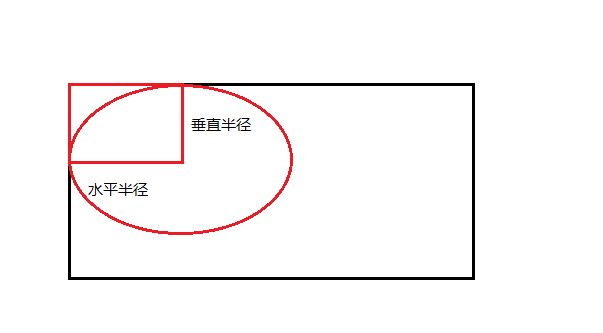

# 四、CSS

<a href="https://www.bilibili.com/video/BV1XJ411X7Ud?p=72">参考视频</a>

## 基本语法

### CSS实例

由2个部分组成：**选择器**和一条或多条**声明**。


### CSS注释

`/* 这是注释 */`


### 简单选择器

#### 类型选择器

`elementName{ }`，如`p{ }, h1{ }, div{ }`等。

#### 类选择器

`.className{ }`，如`.active{ }, .strong{ }`等。

#### ID选择器

`#id{ }`，如`#result`。id最好不重复，但css中重复id的样式会生效。

#### 通用选择器

`*{ }`，用于匹配任意元素。

#### 属性选择器

- [attr]：选择含有指定属性的元素。
- [attr = value]：选择含有指定属性和属性值的元素。
- [attr ^= value]：选择属性值以指定值**开头**的元素。
- [attr $= value]：选择属性值以指定值**结尾**的元素。
- [attr *=  value]：选择属性值**含有**指定值的元素。

可结合其他选择器使用：

```css
a[href="http://www.w3school.com.cn/"][title="W3School"] {color: red;}
```


### 复合选择器

#### 交集选择器

作用：选中同时复合多个条件的元素。

语法：`选择器1选择器2...选择器n{ }`。

注意：如果有元素选择器，必须以元素选择器开头。

```css
div.red { background: red; }
.a.b.c { color: blue; }
```

#### 并集选择器（选择器分组）

作用：同时选择多个选择器对应的元素。

语法：`选择器1，选择器2，选择器3，...，选择器n`。

```css
h1, span { color: green; }
#b1, .p1, h1, a[type="text"] { color: white; }
```


### 关系选择器

- 父元素：直接包含子元素的元素。
- 子元素：直接被父元素包含的元素。
- 祖先元素：直接或间接包含后代元素的元素。一个元素的父元素也是该元素的祖先元素。
- 后代元素：直接或间接被祖先元素包含的元素。一个元素的子元素也是该元素的后代元素。
- 兄弟元素：拥有相同父元素的元素。

#### 子元素选择器

作用：选中指定父元素的指定子元素。

语法：`父元素 > 子元素`

```css
div > span { color: red; } //选中div元素的所有span子元素
div > p > span { color: blue; } //可连写 
```

#### 后代元素选择器

作用：选中指定元素内的指定后代元素。

语法：`祖先 后代`，注意中间的空格。

```css
div span { color: red; } //选中div元素的所有span后代元素
div p span { color: blue; } //可连写
```

#### 选择下一个兄弟元素

语法：`上一个元素 + 下一个元素`。每找到一个符合的“上一个元素”，只选择一个“下一个元素”，且必须是紧挨着的。

```css
<script>
p + span { color: red; }
</script>
...
<body>
    <p> p1 </p>
    <span> span1 </span> // 红色
    <p> p2 </p>
    <span> span2 </span> // 红色
    <p> p3 </p>
    <div> div1 </div>
    <span> span3 </span>
</body>
```

#### 选择下面所有的兄弟

语法：`兄 ~ 弟`。不会选择上面（前面）的兄弟元素。

上一个例子中，若使用`~`，则三个`span`元素文字都是红色。


### 伪类（选择器）

1个冒号`:`，常用的有`:first-child`,  `:last-child `, `:first-of-type`,  `:last-of-type`, `:nth-child()`, `:hover`

注意：

- 直接写`:nth-child(n)`表示选中所有子元素，`:nth-child(2n)或:nth-child(even)`表示选中所有偶数位子元素（第2,4,6...个），`:nth-child(2n+1)或:nth-child(odd)`表示选中所有奇数位子元素（第1,3,5...个）。
- `:first-child`,  `:last-child `, `nth-child()`等根据**所有**子元素进行排序。而`:first-of-type`, `:last-of-type`, `:nth-of-type()`等在子元素中的指定选择器的结果中进行排序。

| 选择器                                                       | 例子                  | 例子描述                                                     |
| :----------------------------------------------------------- | :-------------------- | :----------------------------------------------------------- |
| [:active](https://www.w3school.com.cn/cssref/selector_active.asp) | a:active              | 选择活动的链接。                                             |
| [:checked](https://www.w3school.com.cn/cssref/selector_checked.asp) | input:checked         | 选择每个被选中的 <input> 元素。                              |
| [:disabled](https://www.w3school.com.cn/cssref/selector_disabled.asp) | input:disabled        | 选择每个被禁用的 <input> 元素。                              |
| [:empty](https://www.w3school.com.cn/cssref/selector_empty.asp) | p:empty               | 选择没有子元素的每个 `<p>` 元素。                              |
| [:enabled](https://www.w3school.com.cn/cssref/selector_enabled.asp) | input:enabled         | 选择每个已启用的 <input> 元素。                              |
| [:first-child](https://www.w3school.com.cn/cssref/selector_first-child.asp) | p:first-child         | 选择作为其父的首个子元素的每个 `<p>` 元素。                    |
| [:first-of-type](https://www.w3school.com.cn/cssref/selector_first-of-type.asp) | p:first-of-type       | 选择作为其父的首个 `<p>` 元素的每个 `<p>` 元素。                 |
| [:focus](https://www.w3school.com.cn/cssref/selector_focus.asp) | input:focus           | 选择获得焦点的 <input> 元素。                                |
| [:hover](https://www.w3school.com.cn/cssref/selector_hover.asp) | a:hover               | 选择鼠标悬停其上的链接。                                     |
| [:in-range](https://www.w3school.com.cn/cssref/selector_in-range.asp) | input:in-range        | 选择具有指定范围内的值的 <input> 元素。                      |
| [:invalid](https://www.w3school.com.cn/cssref/selector_invalid.asp) | input:invalid         | 选择所有具有无效值的 <input> 元素。                          |
| [:lang(*language*)](https://www.w3school.com.cn/cssref/selector_lang.asp) | p:lang(it)            | 选择每个 lang 属性值以 "it" 开头的 `<p>` 元素。                |
| [:last-child](https://www.w3school.com.cn/cssref/selector_last-child.asp) | p:last-child          | 选择作为其父的最后一个子元素的每个 `<p>` 元素。                |
| [:last-of-type](https://www.w3school.com.cn/cssref/selector_last-of-type.asp) | p:last-of-type        | 选择作为其父的最后一个 `<p>` 元素的每个 `<p>` 元素。             |
| [:link](https://www.w3school.com.cn/cssref/selector_link.asp) | a:link                | 选择所有未被访问的链接。                                     |
| [:not(*selector*)](https://www.w3school.com.cn/cssref/selector_not.asp) | :not(p)               | 选择每个非 `<p>` 元素的元素。                                  |
| [:nth-child(*n*)](https://www.w3school.com.cn/cssref/selector_nth-child.asp) | p:nth-child(2)        | 选择作为其父的第二个子元素的每个 `<p>` 元素。                  |
| [:nth-last-child(*n*)](https://www.w3school.com.cn/cssref/selector_nth-last-child.asp) | p:nth-last-child(2)   | 选择作为父的第二个子元素的每个`<p>`元素，从最后一个子元素计数。 |
| [:nth-last-of-type(*n*)](https://www.w3school.com.cn/cssref/selector_nth-last-of-type.asp) | p:nth-last-of-type(2) | 选择作为父的第二个`<p>`元素的每个`<p>`元素，从最后一个子元素计数 |
| [:nth-of-type(*n*)](https://www.w3school.com.cn/cssref/selector_nth-of-type.asp) | p:nth-of-type(2)      | 选择作为其父的第二个 `<p>` 元素的每个 `<p>` 元素。               |
| [:only-of-type](https://www.w3school.com.cn/cssref/selector_only-of-type.asp) | p:only-of-type        | 选择作为其父的唯一 `<p>` 元素的每个 `<p>` 元素。                 |
| [:only-child](https://www.w3school.com.cn/cssref/selector_only-child.asp) | p:only-child          | 选择作为其父的唯一子元素的 `<p>` 元素。                        |
| [:optional](https://www.w3school.com.cn/cssref/selector_optional.asp) | input:optional        | 选择不带 "required" 属性的 <input> 元素。                    |
| [:out-of-range](https://www.w3school.com.cn/cssref/selector_out-of-range.asp) | input:out-of-range    | 选择值在指定范围之外的 <input> 元素。                        |
| [:read-only](https://www.w3school.com.cn/cssref/selector_read-only.asp) | input:read-only       | 选择指定了 "readonly" 属性的 <input> 元素。                  |
| [:read-write](https://www.w3school.com.cn/cssref/selector_read-write.asp) | input:read-write      | 选择不带 "readonly" 属性的 <input> 元素。                    |
| [:required](https://www.w3school.com.cn/cssref/selector_required.asp) | input:required        | 选择指定了 "required" 属性的 <input> 元素。                  |
| [:root](https://www.w3school.com.cn/cssref/selector_root.asp) | root                  | 选择元素的根元素。                                           |
| [:target](https://www.w3school.com.cn/cssref/selector_target.asp) | #news:target          | 选择当前活动的 #news 元素（单击包含该锚名称的 URL）。        |
| [:valid](https://www.w3school.com.cn/cssref/selector_valid.asp) | input:valid           | 选择所有具有有效值的 <input> 元素。                          |
| [:visited](https://www.w3school.com.cn/cssref/selector_visited.asp) | a:visited             | 选择所有已访问的链接。                                       |

#### 超链接的伪类

1. `:link`    正常的（链接）

2. `:visited`    访问过的（链接）

   - 由于隐私的原因，`:visited`这个伪类只能修改链接的颜色。

     ```css
     a:visited {
     	color: orange; //生效
     	font-size: 50px; //不生效
     }
     ```

3. `:active`    鼠标点击时。（可以点击后不松手查看样式，否则就跳转了。）

4. `:hover`    鼠标移入时。


### 伪元素（选择器）

表示页面中一些特殊的并不真实存在的元素（特殊的位置）。

2个冒号`:`

| 选择器                                                       | 例子            | 例子描述                      |
| :----------------------------------------------------------- | :-------------- | :---------------------------- |
| [::after](https://www.w3school.com.cn/cssref/selector_after.asp) | p::after        | 在每个 `<p>` 元素之后插入内容。 |
| [::before](https://www.w3school.com.cn/cssref/selector_before.asp) | p::before       | 在每个 `<p>` 元素之前插入内容。 |
| [::first-letter](https://www.w3school.com.cn/cssref/selector_first-letter.asp) | p::first-letter | 选择每个 `<p>` 元素的首字母。   |
| [::first-line](https://www.w3school.com.cn/cssref/selector_first-line.asp) | p::first-line   | 选择每个 `<p>` 元素的首行。     |
| [::selection](https://www.w3school.com.cn/cssref/selector_selection.asp) | p::selection    | 选择用户选择的元素部分。      |


### 样式的继承

为一个元素设置的样式，同时也会应用到它的后代元素上。

- 继承是发生在祖先和后代之间。
- 继承的设计是为了方便开发，利用继承我们可以将一些通用的样式统一设置到共同的祖先元素上。这样只需要设置一次即可让所有元素都具有该样式。
- 注意：并不是所有的样式都会被继承。比如：背景、布局等。


### 权重（Specificity）

样式的冲突：当我们通过不同的选择器，选中相同的元素，且为相同的样式设置不同的值时，就发生了样式的冲突。

发生样式冲突时，应用哪个样式由选择器的权重（优先级）决定。

#### 选择器的权重

一共4个等级：

内联样式    1,0,0,0

id选择器    0,1,0,0

类、伪类、属性选择器    0,0,1,0

标签、伪元素选择器    0,0,0,1

- 通用选择器`*`、子选择器`>`、相邻兄弟选择器`+`    0,0,0,0
- 继承的样式没有优先级。（最逊的）

- 比较优先级时，需要将各等级内的选择器的优先级进行相加计算，最后优先级越高，则越优先显示。

- 权重计算公式：权重 = 第一等级选择器 * 个数，第二等级选择器 * 个数，第三等级选择器 * 个数，第四等级选择器 * 个数

  ```css
  #myid.div1.div2::after {} // 优先级 0,1,2,1
  ```

- 比较规则：**低等级的选择器，个数再多也不会越等级超过高等级的选择器的优先级**。同等级时，个数越多，优先级越高。比如优先级`1,0,0,0` > `0,1000,0,0` > `0,999,0,0`

- 可以在某个样式后加`!important`，此时该样式会获取到最高的优先级，甚至超过内联样式。


### 长度单位

#### 像素

`px`

- 不同屏幕的像素大小是不同的，像素越小的屏幕显示效果越清晰。
- 所以同样`200px`在不同的设备下显示效果不一样。

#### 百分比

`%`

- 相对于父元素属性的百分比，使子元素属性跟随父元素的改变而改变。

#### em

- 相对于<u>元素自身</u>的字体大小来计算
- 1em = 1 * font-size
- em会根据字体大小的改变而改变

#### rem

- 相对于<u>根元素(html)</u>的字体大小来计算


### 颜色单位

#### 颜色名

可以直接使用颜色名来设置颜色：<a href="https://www.runoob.com/cssref/css-colornames.html">参考链接</a>

#### RGB

- R代表red，G代表green，B代表blue，三色混合调配处不同的颜色。（色光混合）
- 每一种颜色的范围在 0 - 255 (0% - 100%) 之间。
- 语法：`rgb(红色, 绿色, 蓝色)`
- 黑色：`rgb(0,0,0)`，白色：`rgb(255, 255, 255)`

#### RGBA

- 在`RGB`的基础上，加上了透明度(A)通道。
- 加上第四个值，表示不透明度。
- 语法：`rgba(红色, 绿色, 蓝色, 不透明度)`

#### 十六进制的RGB值

- 语法：`#红色绿色蓝色`

- 每个颜色的范围在 00 - ff
- 如果颜色的两位是一样的可以简写成一位，如`#aabbcc`简写为`#abc`

#### HSL

- H代表色相(hue)，S代表饱和度(saturation)，L代表亮度(lightness)。
- 取值范围：色相(0 - 360)，饱和度(0% - 100%)，亮度(0% - 100%)。
- 语法：`hsl(色相, 饱和度, 亮度)`

#### HSLA

- 加上不透明度。
- `hsl(色相, 饱和度, 亮度, 不透明度)`


## 布局

### 文档流（normal flow）

- 网页是一个多层的结构，一层摞着一层。通过css可以分别为每一层设置样式。
- 作为用户只能看到最上层。
- 最底层成为文档流，文档流是网页的基础。
- 我们所创建的元素默认都是在文档流中进行排列。
- 在文档流中的2类元素：块元素、行内元素。

#### 块元素

- 典型元素是 div

- 块元素会在页面中**独占一行**。
- 默认宽度是父元素的全部。（会把父元素撑满）
- 默认高度是被内容（子元素）撑开。

#### 行内元素

- 典型元素是 span
- 行内元素在页面中不会独占一行，只占自身的大小。
- 在页面中从左向右水平排列，如果一行不能容纳所有行内元素，则剩余元素会换到第二行继续从左向右排列。（各国书写习惯不同，浏览器对元素的排列顺序可能不同）
- 默认宽度和高度是被内容撑开。


### 盒子模型（box model）

css将页面中所有元素设置为一个矩形的盒子，对页面的布局就变成了不同的盒子摆放到不同的位置。

组成：内容区(content)、内边距(padding)、边框(border)、外边距(margin)


#### 内容区

元素中的所有的子元素和文本内容都在内容区中排列。

- 内容区的大小由`width`和`height`两个属性来设置，分别指定区域的宽度和高度。

#### 边框

边框里面属于盒子内部，外面属于盒子外部。边框的大小会影响整个盒子的大小。

- 边框的宽度    `border-width`

  - 默认值一般是3个像素。

  - 可以指定四个方向的宽度：

    四个值：上、右、下、左

    三个值：上、左右、下

    两个值：上下、左右

    一个值：上下左右

- 边框的颜色    `border-color`

  - 默认值为`color`属性的值。（`color`代表前景色，为边框、文字等属性的默认颜色）
  - 也可以指定四个方向的颜色，规则同上。

- 边框的样式    `border-style`

  - 默认值是none。

  - 也可以指定四个方向的样式，规则同上。

  - 可选值：

    `solid`：实线

    `dotted`：点状虚线

    `dashed`：虚线

    `double`：双线

- `border`属性为以上三种属性的简写属性，空格隔开，没有先后顺序：

```css
.box {
	border-width: 10px; //指定四个方向的宽度都是10px
	border-color: orange;
	border-style: solid;
    //等同于
    border: 10px orange solid;
}
```

- `border-top`, `border-right`, `border-bottom`, `border-left`分别为单独一条边设置。

#### 内边距

- 内容区和边框之间的距离。

- 一共四个方向：`padding-top`, `padding-right`, `padding-bottom`, `padding-left`

- `padding`属性是以上四个方向的简写属性，可以同时指定四个方向的内边距，规则和`border-width`一样：

  ```css
  .box {
  	padding: 10px 20px 30px 40px; // 上 右 下 左
  }
  ```

- 背景颜色（`background-color`）会延伸到内边距上。

- 盒子可见框的大小，由内容区+内边距+边框共同决定。

#### 外边距

- 外边距不会影响盒子可见框的大小，但影响盒子的位置。
- 一共四个方向：`margin-top`, `margin-right`, `margin-bottom`, `margin-left`
- `margin`属性是以上四个方向的简写属性，可以同时指定四个方向的外边距，规则和`border-width`一样。
- 元素在页面中是按照从左向右、从上到下的顺序排列的，所以默认情况下，如果设置左、上外边距，则会移动元素自身；而设置下、右外边距，则会移动其他元素。
- 外边距可以设置<u>负值</u>，则相当于往相反的方向。

#### 水平方向的布局

元素在父元素中水平方向的位置**必须满足**以下等式：

```
margin-left + border-left + padding-left + width + padding-right + border-right + margin-right = 父元素内容区的宽度
```

如果等式不满足，则称为过渡约束，则等式会自动调整：

- 如果这7个值中没有为`auto`的情况，则浏览器会自动调整`margin-right`的值。
- 有3个值可以设置为`auto`：`width`, `margin-left`, `margin-right`。如果某个值为`auto`，则会自动调整该值。
  - 如果将1个宽度和1个外边距设置为`auto`，宽度会调整为最大，该外边距为0。
  - 如果将3个值都设置为`auto`，则宽度最大，外边距都为0。
  - 如果将2个外边距设置为`auto`且宽度为固定值，则将外边距设置为相同的值。（**水平居中**）

- 因为外边距可以是负值，所以当宽度设置成大于父元素内容区的宽度时，`margin-right`会被自动调整成负值。同时元素从父元素中溢出。

#### 垂直方向的布局

- 默认情况下（不指定父元素`height`），父元素的高度被内容撑开。
- 当父元素高度被指定时，因为子元素是在父元素内容区排列的，所以如果子元素的高度超过了父元素的高度，就会溢出。

#### 垂直外边距的重叠

<u>相邻</u>的<u>垂直</u>方向外边距会发生重叠现象。

- 兄弟元素间的相邻垂直外边距，如果一正一负，取两者的和；否则取两者中绝对值较大者。

  兄弟元素之间的外边距的重叠，对于开发是有利的，不需要处理。

- 父子元素间的相邻外边距，子元素的会传递给父元素（上外边距）。

  父子外边距的折叠会影响到页面的布局，必须要进行处理。

  - 解决方案：

    1. 父元素用`padding`代替`margin`。
    2. 子元素用透明边框隔开`border:1px solid transparent`。
    3. 子元素使用绝对定位`position:absolute`。
    4. 父元素`overflow:hidden`。
    5. 子元素`float:left`或`display:inline-block`。
    6. 子元素用`padding:1px`隔开。

       ...
    
    （注：“隔开”的原理是用边框、内边距等使父子元素的外边距不再相邻。）

#### 行内元素的盒模型

与块元素的盒模型的区别：

- 行内元素不支持设置`width`和`height`。
- 行内元素可以设置`padding`，但垂直方向的`padding`不会影响页面布局。`border`和`margin`同理。

#### 盒子的大小

默认情况下，盒子可见框的大小由内容区、内边距和边框共同决定。

`box-sizing`用来设置盒子尺寸的计算方式。（设置`width`和`height`的算法）可选值如下：

- `content-box`  默认值，宽度和高度用来设置<u>内容区</u>的大小。
- `border-box`  宽度和高度用来设置<u>整个盒子可见框</u>的大小，此时`width`和`height`指的是内容区+内边距+边框的总合。

#### 轮廓阴影和圆角

`outline`用来设置元素的轮廓线，用法和`border`一样，不同点在于，轮廓不会影响到可见框的大小。


`box-shadow`用来设置元素的阴影效果，阴影不会影响页面布局。

- 语法：`box-shadow: 水平偏移量 垂直偏移量 模糊半径 颜色`
- 水平偏移量：设置阴影的水平位置，正值向右移动，负值向左移动。
- 垂直偏移量：设置阴影的垂直位置，正值向下移动，负值向上移动。
- 模糊半径：越大阴影越模糊。


`border-radius`用来设置四个角的圆角半径。

- 语法：`border-radius`可以接收：

  - 四个值：左上、右上、右下、左下。
  - 三个值：左上、右上/左下、右下。
  - 两个值：左上/右下、右上/左下。

- 指定水平方向和垂直方向时，以`/`相隔。

  ```css
  border-radius: 20px / 40px; // 所有角的水平半径20px，垂直半径40px
  ```

- 将元素设置为一个圆形：

  ```css
  border-radius: 50%;
  ```

`border-top-left-radius`，`border-top-right-radius`，`border-bottom-left-radius`和`border-bottom-right-radius`分别设置左上、右上、左下、右下的圆角半径。

- 语法：`border-top-left-radius`等可以接收2个值，水平方向和垂直方向半径，半径不同时可以画出椭圆。


### 溢出

设置父元素的`overflow`属性处理子元素的水平和垂直溢出。可选值如下：

- `visible`：默认值，子元素会从父元素中溢出，在父元素外部的位置显示。
- `hidden`：溢出内容将会被裁剪，不会显示。
- `scroll`：生成两个滚动条，通过滚动条来查看完整的内容。
- `auto`：根据需要生成滚动条。

`overflow-x`和`overflow-y`分别单独设置水平、垂直溢出。


### display

设置元素显示的类型，可选值如下：

- `inline`：将元素设置为行内元素。
- `block`：将元素设置为块元素。
- `inline-block`：将元素设置为行内块元素，既可以设置宽度和高度，又不会独占一行。
- `table`：将元素设置为一个表格。
- `none`：元素不在页面中显示。
- `flex`和`grid`详见弹性盒布局和栅格布局。


### visibility

设置元素的显示状态，可选值如下：

- `visible`：默认值，元素在页面中显示。
- `hidden`：元素在页面中隐藏，但是依然占据页面中的位置。


### 浮动（float）

设置`float`属性，通过浮动可以使一个元素向其父元素的左侧或右侧移动。可选值如下：

- `none`：默认值，元素不浮动。
- `left`：元素向左浮动。
- `right`：元素向右浮动。

#### 注意

- 元素设置浮动以后，水平布局的等式就不需要强制成立。
- 元素设置浮动以后，会完全从文档流中脱离，不再占用文档流的位置。所以元素下面的，还在文档流的元素会自动向上移动。（有可能重叠）
- 根据上述特点，可以便捷地将块元素水平排成一行。

#### 特点

1. 浮动元素会完全脱离文档流，不再占据文档流中的位置。**元素脱离文档流后，特点会发生变化**：

   块元素

   - 块元素不再独占一行。
   - 块元素默认情况下宽度和高度都被内容撑开。

   行内元素

   - 行内元素，会变成块元素，特点和块元素一样。

   脱离文档流以后，不需要再区分块元素和行内元素。

2. 设置浮动以后，元素会向父元素的左侧或右侧移动。

3. 浮动元素默认不会移到父元素外部。

4. 水平方向上，浮动元素向左或向右移动时，不会超过在html结构中在它前面的其他浮动元素。

5. 垂直方向上，浮动元素不会超过在html结构中在它前面的兄弟元素，最多和它一样高。

6. 浮动元素不会覆盖文字，文字会自动**环绕**在浮动元素周围。所以可以利用浮动来设置文字环绕图片的效果。


### clear

当元素之前有浮动元素时，元素会上移。

设置`clear`，清除浮动元素对当前元素产生的影响。可选值如下：

- `left`：清除左侧浮动元素对当前元素的影响。
- `right`：清除右侧浮动元素对当前元素的影响。
- `both`：清除两侧中较大影响的一侧。

#### 原理

设置clear以后，浏览器会自动为元素添加一个上外边距，以使其位置不受其他元素的影响。


### 定位（position）

设置`position`属性，将元素摆放在页面的任意位置。可选值如下：

- `static`：默认值，元素是静止的，没有开启定位。
- `relative`：相对定位。
- `absolute`：绝对定位。
- `fixed`：固定定位。
- `sticky`：粘滞定位。

#### 相对定位（relative）

1. 元素开启相对定位以后，如果不设置偏移量，元素不会发生任何变化。
2. 相对定位是参照与元素在文档流中的原有位置进行定位的。
3. 相对定位会提升元素的层级。
4. 相对定位不会使元素脱离文档流。
5. 相对定位不会改变元素的性质，块元素还是块元素，行内元素还是行内元素。

#### 偏移量（offset）

当元素开启定位后，可以通过偏移量来设置元素的位置。

- top：定位元素离定位位置上边的距离。

- bottom：定位元素离定位位置下边的距离。

- left：定位元素离定位位置左侧的距离。

- right：定位元素离定位位置右侧的距离。

#### 绝对定位（absolute）

1. 元素开启绝对定位以后，如果不设置偏移量，元素的**位置**不会发生变化。
2. 绝对定位是参照元素的**包含块**进行定位的。
3. 绝对定位会使元素脱离文档流。
4. 绝对定位会改变元素的性质：行内元素变成块元素，块元素的宽高被内容撑开。
5. 绝对定位会提升元素的层级。

#### 包含块（containing block）

- 正常情况下，包含块是当前元素最近的祖先块元素。

- 绝对定位元素，包含块就是它最近的**开启了定位**的祖先元素。如果所有的祖先元素都没有开启定位，则根元素(html)是它的包含块。

#### 固定定位（fixed）

1. 类似于绝对定位，唯一不同的是参照与浏览器的视口（可视区域）进行定位。
2. 固定定位的元素不会随网页的滚动条滚动。

#### 粘滞定位（sticky）

CSS3新增，兼容性较差（特指IE）。

1. 元素的位置基于用户滚动位置定位，`sticky` 定位的元素位置在 `relative` 和 `fixed` 之间切换，具体取决于滚动位置。
2. 它会被相对定位，直到浏览器可视区域中满足给定的偏移位置，否则会被粘住到固定的位置。

```html
<!DOCTYPE html>
<html>
    <head>
        <style>
            .title {    
                position: sticky;    
                top: 0;    
                padding: 5px;    
                background-color: #ccc;
			}
            .item {    
                height: 50px;    
                line-height: 50px;
			}
        </style>
    </head>
    <body>
    <h1>Contacts</h1>
        <div class="title">A</div>
        <div class="item">啊三</div>
        <div class="item">啊五</div>
        <div class="item">apple</div>
        <div class="item">Alph</div>
        <div class="item">ABC</div>
        <div class="item">apple</div>
        <div class="item">Alph</div>
        <div class="item">ABC</div>
        <div class="item">apple</div>
        <div class="item">Alph</div>
        <div class="item">ABC</div>
        <div class="title">B</div>
        <div class="item">Banana</div>
        <div class="item">Back</div>
        <div class="item">Banana</div>
        <div class="item">Back</div>
        <div class="item">Banana</div>
        <div class="item">Back</div>
        <div class="item">Banana</div>
        <div class="item">Back</div>
        <div class="item">Banana</div>
        <div class="item">Back</div>
        <div class="title">C</div>
        <div class="item">China</div>
        <div class="item">Cat</div>
        <div class="item">Cookie</div>
        <div class="item">Cake</div>
        <div class="item">Color</div>
        <div class="item">China</div>
        <div class="item">Cat</div>
        <div class="item">Cookie</div>
        <div class="item">Cake</div>
        <div class="item">Color</div>
    </body>
</html>
```


### 弹性盒布局（flex）

https://www.ruanyifeng.com/blog/2015/07/flex-grammar.html

#### 是什么？

- 任何容器都可以指定为flex布局

  ```css
  .box {
  	display: flex;
  }
  ```

- 行内元素也可以使用flex布局

  ```css
  .box {
  	display: inline-flex;
  }
  ```

- webkit内核的浏览器，必须加上-webkit前缀

  ```css
  .box {
  	display: -webkit-flex;  /* Safari */
      display: flex;
  }
  ```


#### 基本概念


flex container：采用flex布局的元素。

flex item：其所有子元素。

main axis：水平的主轴。

cross axis：垂直的交叉轴。

main start：主轴的开始位置。

main end：主轴的结束位置。

cross start：交叉轴的开始位置。

cross end：交叉轴的结束位置。

项目默认沿主轴排列。

main size：单个item占据的主轴空间。

cross size：单个item占据的交叉轴空间。


#### container属性

flex-direction、flex-wrap、flex-flow、justify-content、align-items、align-content

##### flex-direction

- 决定主轴的方向（item的排列方向）

  | row            | 主轴为水平方向，起点在左端 |
  | -------------- | -------------------------- |
  | row-reverse    | 主轴为水平方向，起点在右端 |
  | column         | 主轴为垂直方向，起点在上沿 |
  | column-reverse | 主轴为垂直方向，起点在下沿 |

##### flex-wrap

- 默认情况下，item都排在一条线（轴线）上。flex-wrap定义，如果一条轴线排不下，如何换行。

  | nowrap（默认） | 不换行             |
  | -------------- | ------------------ |
  | wrap           | 换行，第一行在上方 |
  | wrap-reverse   | 换行，第一行在下方 |

##### flex-flow

- flex-direction和flex-wrap的简写形式，默认值为`row nowrap`

##### justify-content

- 定义了item在主轴上的对齐方式。

  | flex-start（默认） | 左对齐                                                       |
  | ------------------ | ------------------------------------------------------------ |
  | flex-end           | 右对齐                                                       |
  | center             | 居中                                                         |
  | space-between      | 两端对齐，item之间的间隔都相等                               |
  | space-around       | 每个item两侧的间隔相等，因此，item之间的间隔比item与边框的间隔大一倍 |

##### align-items

- 定义item在交叉轴上如何对齐。

  | flex-start      | 交叉轴的起点对齐                                 |
  | --------------- | ------------------------------------------------ |
  | flex-end        | 交叉轴的终点对齐                                 |
  | center          | 交叉轴的中点对齐                                 |
  | baseline        | item的第一行文字的基线对齐                       |
  | stretch（默认） | 如果item未设置高度或设为auto，将占满整个容器的高 |

##### align-content

- 定义了多根轴线的对齐方式。如果item只有一根轴线，该属性不起作用。

  | flex-start      | 与交叉轴的起点对齐                                           |
  | --------------- | ------------------------------------------------------------ |
  | flex-end        | 与交叉轴的终点对齐                                           |
  | center          | 与交叉轴的中点对齐                                           |
  | space-between   | 与交叉轴两端对齐，轴线之间的间隔平均分布                     |
  | space-between   | 每根轴线两侧的间隔都相等。所以，轴线之间的间隔比轴线与边框的间隔大一倍 |
  | stretch（默认） | 轴线占满整个交叉轴                                           |

#### item属性

order、flex-grow、flex-shrink、flex-basis、flex、align-self

##### order

- 定义item的排列顺序。数值越小，排列越靠前，默认为0。

##### flex-grow

- 定义item的放大比例。默认为0，即如果存在剩余空间，也不放大。
- 如果所有item的`flex-grow`属性都为1，则它们将等分剩余空间（如果有的话）。如果一个item的`flex-grow`属性为2，其他item都为1，则前者占据的剩余空间将比其他多一倍。

##### flex-shrink

- 定义了item的缩小比例。默认为1，即如果空间不足，该item将缩小。
- 如果所有项目的`flex-shrink`属性都为1，当空间不足时，都将等比例缩小。如果一个项目的`flex-shrink`属性为0，其他项目都为1，则空间不足时，前者不缩小。
- 负值无效。

##### flex-basis

- 定义了在分配多余空间之前，item占据的主轴空间（main size）。浏览器根据这个属性，计算主轴是否有多余空间。它的默认值为`auto`，即item的本来大小。
- 可以设为跟`width`或`height`属性一样的值（比如350px），则item将占据固定空间。

##### flex

- flex-grow、flex-shrink和flex-basis的简写，默认值为0 1 auto。后两个属性可选。
- 有两个快捷键：auto（1 1 auto）和none（0 0 auto）

##### align-self

- 允许单个item有与其他item不一样的对齐方式，可覆盖`align-items`属性。默认值为`auto`，表示继承父元素的`align-items`属性，如果没有父元素，则等同于`stretch`。
- 该属性可能取6个值，除了`auto`，其他与`align-items`属性完全一致。


### 栅格布局（grid）

https://www.ruanyifeng.com/blog/2019/03/grid-layout-tutorial.html

Grid 布局将容器划分成"行"和"列"，产生单元格，然后指定"项目所在"的单元格，可以看作是**二维布局**。

- 指定一个容器采用grid布局

  ```css
  display: grid
  ```

- 默认情况下，容器元素都是块级元素，也可以设置成行内元素。

  ```css
  display: inline-grid
  ```

- 注意，设为网格布局以后，容器子元素（项目）的`float`、`display: inline-block`、`display: table-cell`、`vertical-align`和`column-*`等设置都将失效。


#### 基本概念

container：容器，采用grid布局的元素。

item：容器内部采用grid定位的子元素。

row：行，容器里水平区域。

column：列，容器里垂直区域。

cell：单元格，行和列的交叉区域。`n`行和`m`列会产生`n*m`个单元格。

grid line：网格线，划分网格的线。水平网格线划分出行，垂直网格线划分出列。`n`行有`n+1`根水平网格线，`m`列有`m+1`根垂直网格线。


#### container属性

##### *grid-template-columns、grid-template-rows*

- 前者定义每一列的列宽，后者定义每一行的行高。

- 可以使用绝对单位或百分比。

- repeat()：可以使用它，简化重复的值。

  ```css
  grid-template-columns: repeat(3, 33.33%);
  grid-template-rows: repeat(3, 33.33%);
  ```

  或者重复某种模式。

  ```css
  grid-template-columns: repeat(2, 100px 20px 80px); //定义了6列
  ```

- auto-fill关键字：如果希望每一行（或每一列）容纳尽可能多的单元格，这时可以使用`auto-fill`关键字表示自动填充。

  ```css
  grid-template-columns: repeat(auto-fill, 100px);
  ```

  上面代码表示每列宽度`100px`，然后自动填充，直到容器不能放置更多的列。

- fr关键字：fraction 的缩写，意为"片段"。如果两列的宽度分别为`1fr`和`2fr`，就表示后者是前者的两倍。

  可以与绝对长度的单位结合使用。

- minmax()：产生一个长度范围，表示长度就在这个范围之中。它接受两个参数，分别为最小值和最大值。

- auto关键字：表示由浏览器自己决定长度。

- 网格线的名称：`grid-template-columns`属性和`grid-template-rows`属性里面，还可以使用方括号，指定每一根网格线的名字，方便以后的引用。

  ```css
  grid-template-columns: [c1] 100px [c2] 100px [c3] auto [c4];
  grid-template-rows: [r1] 100px [r2] 100px [r3] auto [r4];
  ```

  上面代码指定网格布局为3行 x 3列，因此有4根垂直网格线和4根水平网格线。方括号里面依次是这八根线的名字。

  网格布局允许同一根线有多个名字，比如`[fifth-line row-5]`。

##### *grid-row-gap、grid-column-gap、grid-gap*

- `grid-row-gap`属性设置行间距，`grid-column-gap`属性设置列间距。

- `grid-gap`是两者的合并简写形式，语法如下：

  ```css
  grid-gap: <grid-row-gap> <grid-column-gap>
  ```

##### *grid-template-areas*

- 一个区域(area)由单个或多个单元格组成。

  ```css
  .container {
    display: grid;
    grid-template-columns: 100px 100px 100px;
    grid-template-rows: 100px 100px 100px;
    grid-template-areas: 'a b c'
                         'd e f'
                         'g h i';
  }
  ```

  上面代码先划分出9个单元格，然后将其定名为`a`到`i`的九个区域，分别对应这九个单元格。

  ```css
  grid-template-areas: 'a a a'
                       'b b b'
                       'c c c';
  ```

  上面代码将9个单元格分成`a`、`b`、`c`三个区域。

- 如果某些区域不需要利用，则使用"点"（`.`）表示。

- 区域的命名会影响到网格线。每个区域的起始网格线，会自动命名为`区域名-start`，终止网格线自动命名为`区域名-end`。

##### *grid-auto-flow*

- 划分网格以后，item会按照顺序，自动放置在每一个网格。默认的放置顺序是"先行后列"。
- 这个顺序由`grid-auto-flow`属性决定，默认值是`row`，即"先行后列"。可以将它设成`column`，变成"先列后行"。
- 如果设为`row dense`，表示"先行后列"，并且尽可能紧密填满，尽量不出现空格。
- 如果设为`column dense`，表示"先列后行"，并且尽量填满空格。

##### *justify-items、align-items、place-items*

- `justify-items`属性设置<u>单元格</u>内容的水平位置（左中右），`align-items`属性设置单元格内容的垂直位置（上中下）。

  | start   | 对齐单元格的起始边缘            |
  | ------- | ------------------------------- |
  | end     | 对齐单元格的结束边缘            |
  | center  | 单元格内部居中                  |
  | stretch | 拉伸，占满单元格的整个宽度/高度 |

- `place-items`是`align-items`和`justify-items`的合并简写形式。

##### *justify-content、align-content、place-content*

- `justify-content`属性是<u>整个内容区域</u>在容器里面的水平位置（左中右），`align-content`属性是整个内容区域的垂直位置（上中下）。

  | start         | 对齐容器的起始边框                                           |
  | ------------- | ------------------------------------------------------------ |
  | end           | 对齐容器的结束边框                                           |
  | center        | 容器内部局中                                                 |
  | stretch       | item大小未指定时，拉伸占满整个网格容器                       |
  | space-around  | 每个item两侧的间隔相等，因此，item之间的间隔比item与容器边框的间隔大一倍 |
  | space-between | item之间的间隔相等，item与容器边框没有间隔                   |
  | space-evenly  | item之间的间隔相等，item与容器边框的间隔也是同样长度         |

- `place-content`是`align-content`和`justify-content`的合并简写形式。

##### *grid-auto-columns、grid-auto-rows*

- 有时候，一些item的指定位置，在现有网格的外部。比如网格只有3列，但是某一个项目指定在第5行。这时，浏览器会自动生成多余的网格，以便放置项目。
- `grid-auto-columns`属性和`grid-auto-rows`属性用来设置，浏览器自动创建的多余网格的列宽和行高。写法与`grid-template-columns`和`grid-template-rows`完全相同。如果不指定这两个属性，浏览器完全根据单元格内容的大小，决定新增网格的列宽和行高。

##### *grid-template、grid*

- `grid-template`是`grid-template-rows`、`grid-template-columns`和`grid-template-areas`这三个属性的合并简写形式。
- `grid`是`grid-template-rows`、`grid-template-columns`、`grid-template-areas`、 `grid-auto-rows`、`grid-auto-columns`、`grid-auto-flow`这六个属性的合并简写形式。


#### item属性

##### *grid-column-start、grid-column-end、grid-row-start、grid-row-end*

- 指定item的四个边框，分别在哪根网格线。

- `grid-column-start`：左边框所在的垂直网格线
- `grid-column-end`：右边框所在的垂直网格线
- `grid-row-start`：上边框所在的水平网格线
- `grid-row-end`：下边框所在的水平网格线
- 这四个属性的值还可以使用`span`关键字，表示"跨越"，即左右边框（上下边框）之间跨越多少个网格。

##### *grid-column、grid-row*

- `grid-column`是`grid-column-start`和`grid-column-end`的合并简写形式，

- `grid-row`是`grid-row-start`属性和`grid-row-end`的合并简写形式。

  ```css
  .item {
    grid-column: <start-line> / <end-line>;
    grid-row: <start-line> / <end-line>;
  }
  ```

##### *grid-area*

- 指定item放在哪个区域

  ```css
  .item-1 {
    grid-area: e;
  }
  ```

  上面代码中，1号项目位于`e`区域

- `grid-area`还可用作`grid-row-start`、`grid-column-start`、`grid-row-end`、`grid-column-end`的合并简写形式，直接指定项目的位置。

  ```css
  .item {
    grid-area: <row-start> / <column-start> / <row-end> / <column-end>;
  }
  ```

##### *justify-self、align-self、place-self*

- `justify-self`属性设置单元格内容的水平位置（左中右），跟`justify-items`属性的用法完全一致，但只作用于<u>单个item</u>。

- `align-self`属性设置单元格内容的垂直位置（上中下），跟`align-items`属性的用法完全一致，但只作用于<u>单个项目</u>。
- `place-self`是`align-self`和`justify-self`的合并简写形式。


## 响应式设计

<a href="https://www.runoob.com/css/css-rwd-viewport.html">参考网址</a>

### viewport

- 什么是viewport?

  - viewport 是用户网页的可视区域。
  - viewport 翻译为中文可以叫做"视区"。
  - 手机浏览器是把页面放在一个虚拟的"窗口"（viewport）中，通常这个虚拟的"窗口"（viewport）比屏幕宽，这样就不用把每个网页挤到很小的窗口中（这样会破坏没有针对手机浏览器优化的网页的布局），用户可以通过平移和缩放来看网页的不同部分。

- 设置viewport

  - 一个常用的针对移动网页优化过的页面的 viewport meta 标签大致如下：

    ```html
    <meta name="viewport" content="width=device-width, initial-scale=1.0">
    ```

  - width：控制 viewport 的大小，可以指定的一个值，如 600，或者特殊的值，如 device-width 为设备的宽度（单位为缩放为 100% 时的 CSS 的像素）。

  - height：和 width 相对应，指定高度。

  - initial-scale：初始缩放比例，也即是当页面第一次 load 的时候缩放比例。

  - maximum-scale：允许用户缩放到的最大比例。

  - minimum-scale：允许用户缩放到的最小比例。

  - user-scalable：用户是否可以手动缩放。


### 网格视图

- 响应式网格视图通常是 12 列，宽度为100%，在浏览器窗口大小调整时会自动伸缩。

- 创建响应式网格视图

  - 添加如下代码

    ```css
    * {
        box-sizing: border-box;
    }
    ```

  - 12 列的网格系统可以更好的控制响应式网页。

    我们可以计算每列的百分比: 100% / 12 列 = 8.33%。

    在每列中指定 class， **class="col-"** 用于定义每列有几个 span ：

    ```css
    .col-1 {width: 8.33%;}
    .col-2 {width: 16.66%;}
    .col-3 {width: 25%;}
    .col-4 {width: 33.33%;}
    .col-5 {width: 41.66%;}
    .col-6 {width: 50%;}
    .col-7 {width: 58.33%;}
    .col-8 {width: 66.66%;}
    .col-9 {width: 75%;}
    .col-10 {width: 83.33%;}
    .col-11 {width: 91.66%;}
    .col-12 {width: 100%;}
    ```


### 媒体查询

使用 `@media`查询，可以针对不同的媒体类型定义不同的样式。

- 如果浏览器窗口小于 500px, 背景将变为浅蓝色：

```css
@media only screen and (max-width: 500px) {
    body {
        background-color: lightblue;
    }
}
```

#### 添加断点

在先前的教程中我们使用行和列来制作网页，它是响应式的，但在小屏幕上并不能友好的展示。

媒体查询可以帮我们解决这个问题。我们可以在设计稿的中间添加断点，不同的断点有不同的效果。

- 当屏幕 (浏览器窗口) 小于 768px, 每一列的宽度是 100%:

```css
/* For desktop: */
.col-1 {width: 8.33%;}
.col-2 {width: 16.66%;}
.col-3 {width: 25%;}
.col-4 {width: 33.33%;}
.col-5 {width: 41.66%;}
.col-6 {width: 50%;}
.col-7 {width: 58.33%;}
.col-8 {width: 66.66%;}
.col-9 {width: 75%;}
.col-10 {width: 83.33%;}
.col-11 {width: 91.66%;}
.col-12 {width: 100%;}

@media only screen and (max-width: 768px) {
    /* For mobile phones: */
    [class*="col-"] {
        width: 100%;
    }
}
```

#### 方向：横屏/竖屏

结合CSS媒体查询,可以创建适应不同设备的方向(横屏`landscape`、竖屏`portrait`等)的布局。

语法：`orientation：portrait | landscape`

- **portrait：**指定输出设备中的页面可见区域高度大于或等于宽度
- **landscape：** 除portrait值情况外，都是landscape


- 如果是横屏背景将是浅蓝色：

```css
@media only screen and (orientation: landscape) {
    body {
        background-color: lightblue;
    }
}
```


### 图片

#### 使用max-width属性

如果`max-width`属性设置为100%，图片永远不会大于其原始大小。

#### 背景图片

响应调整背景图片的大小或缩放。

1.  如果 `background-size` 属性设置为 `contain`, 背景图片将按比例自适应内容区域。图片保持其比例不变。

   ```css
   div {
       width: 100%;
       height: 400px;
       background-image: url('img_flowers.jpg');
       background-repeat: no-repeat;
       background-size: contain;
       border: 1px solid red;
   }
   ```

2. 如果 `background-size` 属性设置为 `100% 100%` ，背景图片将延展覆盖整个区域。

   ```css
   div {
       width: 100%;
       height: 400px;
       background-image: url('img_flowers.jpg');
       background-size: 100% 100%;
       border: 1px solid red;
   }
   ```

3. 如果 `background-size` 属性设置为 `cover`，则会把背景图像扩展至足够大，以使背景图像完全覆盖背景区域。注意该属性<u>保持了图片的比例</u>，因此背景图像的某些部分无法显示在背景定位区域中。

   ```css
   div {
       width: 100%;
       height: 400px;
       background-image: url('img_flowers.jpg');
       background-size: cover;
       border: 1px solid red;
   }
   ```

#### 不同设备显示不同图片

大尺寸图片可以显示在大屏幕上，但在小屏幕上却不能很好显示。我们没有必要在小屏幕上去加载大图片，这样很影响加载速度。所以我们可以使用媒体查询，根据不同的设备显示不同的图片。

- 以下大图片和小图片将显示在不同设备上：

```css
/* For width smaller than 400px: */
body {
    background-image: url('img_smallflower.jpg');
}

/* For width 400px and larger: */
@media only screen and (min-width: 400px) {
    body {
        background-image: url('img_flowers.jpg');
    }
}
```

#### HTML5 `<picture>` 元素

HTML5 的 `<picture>` 元素可以设置多张图片。


### 视频

#### 使用width属性

如果 width 属性设置为 100%，视频播放器会根据屏幕大小自动调整比例。

#### 使用max-width属性

如果 max-width 属性设置为 100%, 视频播放器会根据屏幕自动调整比例，但不会超过其原始大小。

#### 在网页中添加视频

我们可以在网页中添加视频。

- 以下实例视频根据 div 区域大小自动调整并占满整个 div 区域：

```css
video {
    width: 100%;
    height: auto;
}
```


### 框架

#### Bootstrap

<a href="https://v3.bootcss.com/">中文文档</a>

<a href="https://getbootstrap.com/">英文官网</a>


## 重要概念

### 默认样式

通常情况下，浏览器都会为元素设置一些默认样式。

默认样式的存在会影响到页面的布局，所以通常编写网页时要去除浏览器的默认样式。

- 简单的样式去除

```
* {
	margin: 0;
	padding: 0;
}
```

- 去除`ul`的项目符号

```
ul {
	list-style: none;
}
```

- 重置样式表见附录。重置样式表是专门用来对浏览器样式进行重置的。
  - `reset.css`  直接去除了浏览器的默认样式。
  - `normalize.css`  对默认样式进行了统一。
  - 开发中一般两者选一进行使用。


### 高度塌陷

在浮动布局中，父元素的高度默认是被子元素撑开的。当子元素浮动后，会脱离文档流，从而不能撑起父元素的高度，导致父元素高度丢失。

父元素高度丢失后，其下面的元素会自动上移，导致页面的布局混乱。

所以高度塌陷是浮动布局中比较常见的一个问题。


### BFC

块级格式化环境（Block Formatting Context），是一个CSS中隐含的属性。

开启BFC的元素会变成一个独立的布局区域。

#### 元素开启BFC后的特点

1. 元素不会被浮动元素覆盖。
2. 元素的子元素和父元素外边距不会重叠。
3. 元素可以包含浮动的子元素。

#### 开启BFC的方式

- 1、float的值不是none。
- 2、position的值不是static或者relative。
- 3、display的值是inline-block、table-cell、flex、table-caption或者inline-flex
- 4、overflow的值不是visible

... 


### 使用after伪元素解决高度塌陷

对after伪元素设置`clear:both`，使其不因其他浮动兄弟元素而上移。设置`display:block`使其从行内元素转换为块元素，**撑起父元素的高度**。设置`content:''`去除文字内容。

```
.box2 {
	float: left; //子元素设置了浮动
}
.box1::after {
	content: '';
	display: block;
	clear: both;
}

<body>
	<div class="box1">
		<div class="box2"></div>
	</div>
</body>
```


### clearfix

同时解决 **垂直外边距重叠** 和 **高度塌陷** 问题，在元素上加上clearfix类即可。

- 在 使用after伪元素解决高度塌陷 的方案基础上，加上before伪元素，将父子元素相邻外边距“隔开”，从而解决 垂直外边距重叠 问题。
- 为before伪元素设置`display:table`既隔开了父子元素相邻外边距，又不会占额外空间。

```css
.clearfix::before,
.clearfix::after {
	content: '';
	display: table;
	clear: both
}
```


## CSS3

### 浏览器前缀

针对旧浏览器做兼容。

| 浏览器内核   | 前缀     | 浏览器                                       |
| ------------ | -------- | -------------------------------------------- |
| Gecko 内核   | -moz-    | 火狐                                         |
| Webkit 内核  | -webkit- | 谷歌内核，chrome/safari。国内如360极速、猎豹 |
| Trident 内核 | -ms-     | IE                                           |
| Presto 内核  | -o-      | opera                                        |


### 圆角（border-radius）

#### 完整参数

两个部分：水平半径、垂直半径。8个参数。

```css
border-radius: 10px 20px 30px 40px / 40px 30px 20px 10px
```

- 前4个参数表示圆角的**水平半径**，分别代表左上、右上、右下、左下的水平半径。
- 后4个参数表示圆角的**垂直半径**，分别代表左上、右上、右下、左下的垂直半径。

#### 水平半径和垂直半径

一个圆角的形成需要一个水平半径和一个垂直半径。



#### 省略参数

- 四个值：左上、右上、右下、左下。
- 三个值：左上、右上和左下、右下。
- 两个值：左上和右下、右上和左下。
- 一个值：四个圆角值相同。


### 文字阴影（text-shadow）

#### 完整参数

可以设置多组阴影，用逗号隔开。

每组有如下参数：

**水平偏移、垂直偏移、模糊半径、颜色**。

```css
text-shadow: 2px 2px 5px red, 4px 4px 5px yellow
```


### 盒子阴影（box-shadow）

#### 完整参数

可以设置多组阴影，用逗号隔开。

每组有如下参数：

**水平偏移、垂直偏移、模糊半径、阴影的大小、颜色、inset**。

- `inset`表示从外层阴影改成内侧阴影。

```css
box-shadow: 10px 10px 5px red, 20px 20px 5px yellow inset
```


### 渐变（gradients）

依靠`background-image`属性。

#### 线性渐变（linear-gradient）

```css
background-image: linear-gradient(direction, color-stop1, color-stop2, ...);
```

方向、颜色1、颜色2、颜色3.... 颜色n

- 方向可选值：
  - `to direction`，向某个方向。direction 可选 `top`/`bottom`/`left`/`right`
  - `to direction1 direction2`，向某个角。direction1/2 可选值同上。
  - `xxxdeg`向某个角度。

```css
background-image: linear-gradient(to right, red, orange, yellow, green, blue, indigo, violet);
```

- `repeating-linear-greadient()`函数用于重复线性渐变：

```css
background-image: repeating-linear-gradient(red, yellow 10%, green 20%);
```


#### 径向渐变（radial-gradient）

```css
background-image: radial-gradient(shape size at position, start-color, ..., last-color);
```

- shape参数定义了形状，可选值：circle/ellipse
- size参数定义了渐变的大小，可选值：closest-side/farthest-side/closest-corner/farther-corner
- at position参数定义了渐变中心的位置，可以为positon设置两个数，分别代表水平位置和垂直位置，如`at 50% 50%`


### 动画（animation）

- animation-name：动画的名字
- animation-duration：动画的持续时间
- animation-timing-function：动画的运动形式
- animation-delay：动画的延迟时间
- animation-iteration-count：动画的重复次数，默认值是1，infinite表示无限次
- animation-direction：规定是否应该轮流反向播放动画

简写

`animation: name duration timing-function delay iteration-count direction;`

默认值

`animation: none 0 ease 0 1 normal;`

#### @keyframes

用于定义对应名字的animation的具体内容。

例子：

```css
.box2 {
  width: 100px;
  height: 100px;
  background: red;
  animation: myBox 4s linear 2s infinite;
}

...

@keyframes myBox {
  0% {
    transform: translate(0,0);
  }
  25% {
    transform: translate(200px,0);
  }
  50% {
    transform: translate(200px,200px);
  }
  75% {
    transform: translate(0,200px);
  }
  100% {
    transform: translate(0,0);
  }
}
```

#### animation-fill-mode

规定动画播放之前/之后，动画效果是否可见。

- none（默认值）：在运动结束之后<u>回到初始位置</u>，在延迟的情况下，让0%在延迟后生效。

- backwards：在延迟的情况下，让<u>0%在延迟前生效</u>。
- forwards：在运动结束之后，<u>停在结束位置</u>。
- both：backwards 和 forwards的结合。

#### animation-direction

规定是否应该轮流反向播放动画。

- alternate：一次正向（0%~100%），一次反向（100%~0%）
- reverse：永远是反向，即从100%~0%
- normal（默认值）：永远是正向，即从0%~100%

#### animation-timing-function

- linear：匀速。
- ease（默认值）：开始和结束慢，中间快。
- ease-in：开始慢，结束快。
- ease-out：开始快，结束慢。
- ease-in-out：开始和结束慢。
- cubic-bezier  （http://cubic-bezier.com）

#### animation-play-state

设置对象动画的状态。（可以用于鼠标悬浮时暂停动画）

- running：运动。
- paused：暂停。


**注意**：

1. 运动结束后，默认情况下会回在起始位置。
2. @keyframes：from -> 0%，to -> 100%
3. 至少设置 animation-name 和 animation-duration ，否则没名字或时长为0，动画不会播放。


### 过渡（transition）

- transition-property：设置过渡效果的 CSS 属性名称。
- transition-duration：完成过渡效果需要的时间。

- transition-timing-function：速度效果的速度曲线。（具体值同animation-timing-function）
- transition-delay：过渡效果的延迟时间。

简写：

`transition: property duration timing-function delay`

例子：

```css
div {
	width: 100px;
	height: 100px;
	transition: width 2s;
}
```


### 变形（transform）

- translate：平移
- scale：缩放
- rotate：旋转，单位deg
- skew：斜切，单位deg

#### translate

- translateX()：沿x轴（水平轴）平移，右为正方向。  `translateX(100px)`
- translateY()：沿y轴（垂直轴）平移，<u>下</u>为正方向。  `translateY(100px)`
- translate()：上两个方法的合并，接收2个参数，先X后Y。  `translate(100px,100px)`

#### scale

- scaleX()：x轴上缩放。  `scaleX(1.5)`
- scaleY()：y轴上缩放。  `scaleY(1.5)`
- scale()：上两个方法的合并，可以接收2个参数，先X后Y。  `scale(1.5)或scale(1.5, 1.5)`

#### rotate

旋转方向遵循右手定则。（右手拇指指向旋转轴正方向，则其余四指蜷曲的方向是旋转正方向）

- rotate()：2d旋转，顺时针。`rotate(45deg, 45deg)`

- rotateX()：以x轴为旋转轴旋转。
- rotateY()：以y轴为旋转轴旋转。
- rotateZ()：以z轴为旋转轴旋转。
- rotate3d()：3d旋转，接收4个参数：x,y,z,angle。前3个参数组合为一个三维向量，作为旋转轴。第4个参数为旋转角度。

#### skew

- skewX()：沿x轴方向倾斜。  `skewX(45deg)`
- skewY()：沿y轴方向倾斜。
- skew()：上两个方法的合并，可以接收2个参数，先X后Y。

#### tranform-origin

变形的基准点位置。  `transform-origin:200px 200px`


**注意**：transform操作只对块元素生效，对行内元素不生效。


## 附录

### reset.css

```css
/* http://meyerweb.com/eric/tools/css/reset/ 
   v2.0 | 20110126
   License: none (public domain)
*/

html, body, div, span, applet, object, iframe,
h1, h2, h3, h4, h5, h6, p, blockquote, pre,
a, abbr, acronym, address, big, cite, code,
del, dfn, em, img, ins, kbd, q, s, samp,
small, strike, strong, sub, sup, tt, var,
b, u, i, center,
dl, dt, dd, ol, ul, li,
fieldset, form, label, legend,
table, caption, tbody, tfoot, thead, tr, th, td,
article, aside, canvas, details, embed, 
figure, figcaption, footer, header, hgroup, 
menu, nav, output, ruby, section, summary,
time, mark, audio, video {
	margin: 0;
	padding: 0;
	border: 0;
	font-size: 100%;
	font: inherit;
	vertical-align: baseline;
}
/* HTML5 display-role reset for older browsers */
article, aside, details, figcaption, figure, 
footer, header, hgroup, menu, nav, section {
	display: block;
}
body {
	line-height: 1;
}
ol, ul {
	list-style: none;
}
blockquote, q {
	quotes: none;
}
blockquote:before, blockquote:after,
q:before, q:after {
	content: '';
	content: none;
}
table {
	border-collapse: collapse;
	border-spacing: 0;
}
```

### normalize.css

```css
/*! normalize.css v8.0.1 | MIT License | github.com/necolas/normalize.css */

/* Document
   ========================================================================== */

/**
 * 1. Correct the line height in all browsers.
 * 2. Prevent adjustments of font size after orientation changes in iOS.
 */

html {
  line-height: 1.15; /* 1 */
  -webkit-text-size-adjust: 100%; /* 2 */
}

/* Sections
   ========================================================================== */

/**
 * Remove the margin in all browsers.
 */

body {
  margin: 0;
}

/**
 * Render the `main` element consistently in IE.
 */

main {
  display: block;
}

/**
 * Correct the font size and margin on `h1` elements within `section` and
 * `article` contexts in Chrome, Firefox, and Safari.
 */

h1 {
  font-size: 2em;
  margin: 0.67em 0;
}

/* Grouping content
   ========================================================================== */

/**
 * 1. Add the correct box sizing in Firefox.
 * 2. Show the overflow in Edge and IE.
 */

hr {
  box-sizing: content-box; /* 1 */
  height: 0; /* 1 */
  overflow: visible; /* 2 */
}

/**
 * 1. Correct the inheritance and scaling of font size in all browsers.
 * 2. Correct the odd `em` font sizing in all browsers.
 */

pre {
  font-family: monospace, monospace; /* 1 */
  font-size: 1em; /* 2 */
}

/* Text-level semantics
   ========================================================================== */

/**
 * Remove the gray background on active links in IE 10.
 */

a {
  background-color: transparent;
}

/**
 * 1. Remove the bottom border in Chrome 57-
 * 2. Add the correct text decoration in Chrome, Edge, IE, Opera, and Safari.
 */

abbr[title] {
  border-bottom: none; /* 1 */
  text-decoration: underline; /* 2 */
  text-decoration: underline dotted; /* 2 */
}

/**
 * Add the correct font weight in Chrome, Edge, and Safari.
 */

b,
strong {
  font-weight: bolder;
}

/**
 * 1. Correct the inheritance and scaling of font size in all browsers.
 * 2. Correct the odd `em` font sizing in all browsers.
 */

code,
kbd,
samp {
  font-family: monospace, monospace; /* 1 */
  font-size: 1em; /* 2 */
}

/**
 * Add the correct font size in all browsers.
 */

small {
  font-size: 80%;
}

/**
 * Prevent `sub` and `sup` elements from affecting the line height in
 * all browsers.
 */

sub,
sup {
  font-size: 75%;
  line-height: 0;
  position: relative;
  vertical-align: baseline;
}

sub {
  bottom: -0.25em;
}

sup {
  top: -0.5em;
}

/* Embedded content
   ========================================================================== */

/**
 * Remove the border on images inside links in IE 10.
 */

img {
  border-style: none;
}

/* Forms
   ========================================================================== */

/**
 * 1. Change the font styles in all browsers.
 * 2. Remove the margin in Firefox and Safari.
 */

button,
input,
optgroup,
select,
textarea {
  font-family: inherit; /* 1 */
  font-size: 100%; /* 1 */
  line-height: 1.15; /* 1 */
  margin: 0; /* 2 */
}

/**
 * Show the overflow in IE.
 * 1. Show the overflow in Edge.
 */

button,
input { /* 1 */
  overflow: visible;
}

/**
 * Remove the inheritance of text transform in Edge, Firefox, and IE.
 * 1. Remove the inheritance of text transform in Firefox.
 */

button,
select { /* 1 */
  text-transform: none;
}

/**
 * Correct the inability to style clickable types in iOS and Safari.
 */

button,
[type="button"],
[type="reset"],
[type="submit"] {
  -webkit-appearance: button;
}

/**
 * Remove the inner border and padding in Firefox.
 */

button::-moz-focus-inner,
[type="button"]::-moz-focus-inner,
[type="reset"]::-moz-focus-inner,
[type="submit"]::-moz-focus-inner {
  border-style: none;
  padding: 0;
}

/**
 * Restore the focus styles unset by the previous rule.
 */

button:-moz-focusring,
[type="button"]:-moz-focusring,
[type="reset"]:-moz-focusring,
[type="submit"]:-moz-focusring {
  outline: 1px dotted ButtonText;
}

/**
 * Correct the padding in Firefox.
 */

fieldset {
  padding: 0.35em 0.75em 0.625em;
}

/**
 * 1. Correct the text wrapping in Edge and IE.
 * 2. Correct the color inheritance from `fieldset` elements in IE.
 * 3. Remove the padding so developers are not caught out when they zero out
 *    `fieldset` elements in all browsers.
 */

legend {
  box-sizing: border-box; /* 1 */
  color: inherit; /* 2 */
  display: table; /* 1 */
  max-width: 100%; /* 1 */
  padding: 0; /* 3 */
  white-space: normal; /* 1 */
}

/**
 * Add the correct vertical alignment in Chrome, Firefox, and Opera.
 */

progress {
  vertical-align: baseline;
}

/**
 * Remove the default vertical scrollbar in IE 10+.
 */

textarea {
  overflow: auto;
}

/**
 * 1. Add the correct box sizing in IE 10.
 * 2. Remove the padding in IE 10.
 */

[type="checkbox"],
[type="radio"] {
  box-sizing: border-box; /* 1 */
  padding: 0; /* 2 */
}

/**
 * Correct the cursor style of increment and decrement buttons in Chrome.
 */

[type="number"]::-webkit-inner-spin-button,
[type="number"]::-webkit-outer-spin-button {
  height: auto;
}

/**
 * 1. Correct the odd appearance in Chrome and Safari.
 * 2. Correct the outline style in Safari.
 */

[type="search"] {
  -webkit-appearance: textfield; /* 1 */
  outline-offset: -2px; /* 2 */
}

/**
 * Remove the inner padding in Chrome and Safari on macOS.
 */

[type="search"]::-webkit-search-decoration {
  -webkit-appearance: none;
}

/**
 * 1. Correct the inability to style clickable types in iOS and Safari.
 * 2. Change font properties to `inherit` in Safari.
 */

::-webkit-file-upload-button {
  -webkit-appearance: button; /* 1 */
  font: inherit; /* 2 */
}

/* Interactive
   ========================================================================== */

/*
 * Add the correct display in Edge, IE 10+, and Firefox.
 */

details {
  display: block;
}

/*
 * Add the correct display in all browsers.
 */

summary {
  display: list-item;
}

/* Misc
   ========================================================================== */

/**
 * Add the correct display in IE 10+.
 */

template {
  display: none;
}

/**
 * Add the correct display in IE 10.
 */

[hidden] {
  display: none;
}
```

