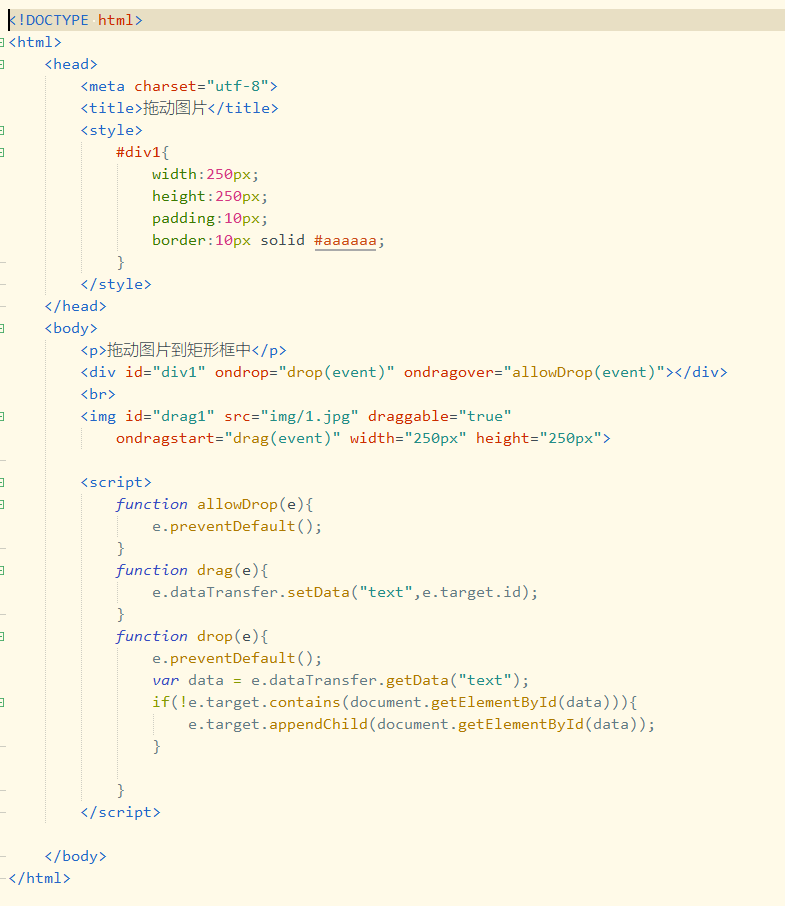
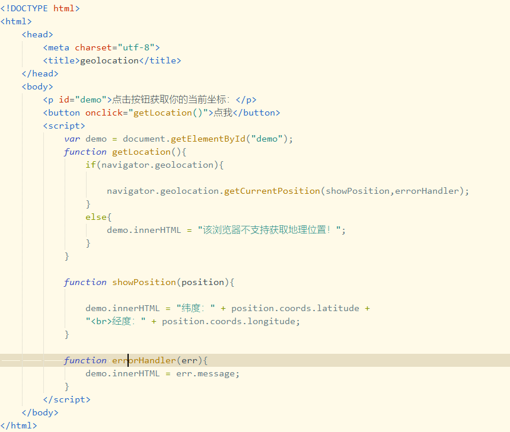

# 三、HTML


## HTML5

### HTML5新元素

- canvas

- 新多媒体元素

  - audio
  - video
  - source
  - embed
  - track

- 新表单元素

  - datalist
  - keygen
  - output

- 新的语义和结构元素

  - article
  - aside
  - bdi
  - command
  - details
  - dialog
  - figure
  - footer
  - header
  - mark
  - meter
  - nav
  - progress
  - ruby
  - section
  - time
  - wbr

- 已移除的元素

  以下的HTML4.01元素在HTML5中被删除：

  - acronym
  - applet
  - basefont
  - big
  - center
  - dir
  - font
  - frame
  - frameset
  - noframes
  - strike
  - tt


#### `<canvas>`

##### 什么是canvas

- 标签定义图形，比如图表和其它图像。该标签基于JavaScript的绘图API。
- 在画布上(canvas)画一个红色矩形、渐变矩形、彩色矩形和一些彩色的文字。
- HTML5元素用于图形的绘制，通过脚本（通常是JavaScript）来完成。
- 标签只是图形容器，必须使用脚本来绘制图形。
- 可以通过多种方法使用canvas绘制路径、盒、圆、字符以及添加图像。

##### 创建一个画布(canvas)

- 一个画布在网页中是一个矩形框，通过< canvas >元素来绘制。

- 注意：默认情况下< canvas >元素没有边框和内容。

- < canvas >简单实例如下：

  ```html
  <canvas id="myCanvas" width="200" height="100"></canvas>
  ```

- 注意：标签通常需要指定一个id属性，width和height属性定义画布大小。

- 提示：你可以在HTML页面中使用多个< canvas >元素。

- 使用style属性来添加边框：

  ```html
  <canvas id="myCanvas" width="200" height="100"
  style="border:1px solid #000000;">
  </canvas>
  ```

##### 使用JavaScript来绘制图像

- canvas元素本身没有绘图能力。所有的绘制工作必须在JavaScript内完成。

  ```javascript
  <scirpt>
  var c = document.getElementById("myCanvas");
  var ctx = c.getContext("2d");
  ctx.fillStyle = "#FF0000"；
  ctx.fillRect(0,0,150,75);
  </script>
  ```

##### canvas - 坐标

- canvas是一个二维网格。
- 左上角坐标为(0,0)。
- 上面的fillRect方法拥有参数x,y,width,height。
- 意思是在画布上绘制150x75的矩形，从左上角(0,0)开始。

##### canvas - 路径

- 在canvas上画线，使用以下两种方法：

  - moveTo(x,y)定义线条开始坐标。
  - lineTo(x,y)定义线条结束坐标。

- 绘制线条必须使用到"ink"的方法，如stroke()。

  ```javascript
  #定义开始坐标(0,0)和结束坐标(200,100)。然后使用stroke()方法来绘制线条：
  var c = document.getElementById("myCanvas");
  var ctx = c.getContext("2d");
  ctx.moveTo(0,0);
  ctx.lineTo(200,100);
  ctx.stroke();
  ```

- 在canvas中绘制圆形，我们将使用以下方法：

  - arc(x,y,r,start,stop)

- 绘制圆形也必须使用到"ink"的方法，如stroke()或fill()。

  ```javascript
  #使用arc()方法绘制一个圆
  var c = document.getElementById("myCanvas");
  var ctx = c.getContext("2d");
  ctx.beginPath();
  ctx.arc(95,50,40,0,2*Math.PI);
  ctx.stroke();
  ```

##### canvas - 文本

- 使用canvas绘制文本，重要的属性和方法如下：

- 使用fillText()：

  ```javascript
  #使用"Arial"字体在画布上绘制一个高30px的文字（实心）：
  var c = document.getElementById("myCanvas");
  var ctx = c.getContext("2d");
  ctx.font = "30px Arial";
  ctx.fillText("Hello World",10,50);
  ```

##### canvas - 渐变

- 渐变可以填充在矩形、圆形、线条、文本等，各种形状可以自定义不同的颜色。

- 以下有两种方式来设置canvas渐变：

  - createLinearGradient(x,y,x1,y1) - 创建线条渐变。
  - createRadialGradient(x,y,r,x1,y1,r1) - 创建一个径向/圆渐变。

- 当使用渐变对象，必须使用两种或两种以上的停止颜色。

- addColorStop()方法指定颜色停止，参数使用坐标来描述，可以是0~1.

- 使用渐变，设置fillStyle或者strokeStyle的值为渐变，然后绘制形状，如矩形、文本或线条。

- 使用createLinearGradient()创建一个线性渐变：

  ```javascript
  #创建一个线性渐变，使用渐变填充矩形：
  var c = document.getElmentById("myCanvas");
  var ctx = c.getContext("2d");
  
  //Create gradient
  var grd = ctx.createLinearGradient(0,0,200,0);
  grd.addColorStop(0,"red");
  grd.addColorStop(1,"white");
  
  //Fill with gradient
  ctx.fillStyle = grd;
  ctx.fillRect(10,10,150,80);
  ```

- 使用createRadialGradient()创建一个径向/圆渐变：

  ```javascript
  #创建一个径向/圆渐变，使用渐变填充矩形：
  var c = document.getElmentById("myCanvas");
  var ctx = c.getContext("2d");
  
  //Create gradient
  var grd = ctx.createRadialGradient(75,50,5,90,60,100);
  grd.addColorStop(0,"red");
  grd.addColorStop(1,"white");
  
  //Fill with gradient
  ctx.fillStyle = grd;
  ctx.fillRect(10,10,150,80);
  ```

- 当使用< canvas >元素创建径向渐变时，context.createRadialGradient(x, y, r, x1, y1, r1)括号内的参数有如下含义：

  - x：表示渐变的开始圆的x坐标。
  - y：表示渐变的开始圆的y坐标。
  - r：表示开始圆的半径。
  - x1：表示渐变的结束圆的x坐标。
  - y1：表示渐变的结束圆的y坐标。
  - r1：表示结束圆的半径。

##### canvas - 图像

- 把一幅图像放置在画布上，使用以下方法：

  - drawImage(image,x,y)

- 把一幅图像放置到画布上：

  ```javascript
  var c = document.getElementById("myCanvas");
  var ctx = c.getContext("2d");
  var img = document.getElementById("img1");
  ctx.drawImage(img,10,10);
  ```


### HTML5 内联SVG

- SVG表示可缩放矢量图形，是基于可扩展标记语言，用于描述二维矢量图形的一种图形格式，在2003年1月14日成为W3C推荐标准。

#### **什么是SVG?**

- 指可伸缩矢量图形(Scalable Vector Graphics)
- 用于定义用于网络的基于矢量的图形
- 使用XML格式定义图形
- 图像在放大或改变尺寸的情况下其图形质量不会损失
- 是万维网联盟的标准
- 与DOM和XSL之类的W3C标准是一个整体

#### **SVG优势**

- 与其他图像格式相比（比如JPEG和GIF），使用SVG的优势在于：
  - SVG图像可通过文本编辑器来创建和修改
  - SVG图像可被搜索、索引、校本化或压缩
  - SVG是可伸缩的
  - SVG图像可在任何的分辨率下被高质量地打印
  - SVG可在图像质量不下降的情况下被放大

#### **把SVG直接嵌入HTML页面**

- 在HTML5中，能够将SVG元素直接嵌入HTML页面中：

- 
```html
<!DOCTYPE html>
  <html>
  	<head>
  		<meta charset="utf-8">
  		<title>SVG</title>
  	</head>
  	<body>
  		<svg xmlns="http://www.w3.org/2000/svg" version="1.1" height="190">
  			<polygon points="100,10 40,180 190,60 10,60 160,180"
  			style="fill:lime;stroke:purple;stroke-width:5;fill-rule:evenodd;" />
  		</svg>
  	</body>
  </html>
```
  <svg xmlns="http://www.w3.org/2000/svg" version="1.1" height="190">
    <polygon points="100,10 40,180 190,60 10,60 160,180"
    style="fill:lime;stroke:purple;stroke-width:5;fill-rule:evenodd;" />
  </svg>

#### **SVG与Canvas的区别**

- SVG是一种使用XML描述2D图形的语言。
- Canvas通过Javascript来绘制2D图形。
- SVG基于XML，这意味着SVG DOM中每个元素都是可用的。可以为某个元素附加JavaScript事件处理器。
- 在SVG中，每个被绘制的图形均被视为对象。如果SVG对象的属性发生变化，那么浏览器能够自动重现图形。
- Canvas是逐像素进行渲染的。在canvas中，一旦图形被绘制完成，它就不会继续得到浏览器的关注。如果其位置发生变化，那么整个场景也需要重新绘制，包括任何或许已被图形覆盖的对象。

| Canvas                                             | SVG                                                   |
| -------------------------------------------------- | ----------------------------------------------------- |
| 依赖分辨率                                         | 不依赖分辨率                                          |
| 不支持事件处理器                                   | 支持事件处理器                                        |
| 弱的文本渲染能力                                   | 最适合带有大型渲染区域的应用程序（比如谷歌地图）      |
| 能够以.png或.jpg格式保存结果图像                   | 复杂度高会减慢渲染速度（任何过度使用DOM的应用都不快） |
| 最适合图像密集型的游戏，其中的许多对象会被频繁重绘 | 不适合游戏应用                                        |


### HTML5 MathML

- 在文档中可以使用MathML元素，对应的标签是`<math>...</math>`。

- MathML是数学标记语言，是一种基于XML（标准通用标记语言的子集）的标准，用来在互联网上书写数学符号和公式的置标语言。

- 例：
  $$
  a^2+b^2=c^2
  $$

  ```html
  <math xmlns="http://www.w3.org/1998/Math/MathML">
                 
           <mrow>
              <msup><mi>a</mi><mn>2</mn></msup>
              <mo>+</mo>
                                 
              <msup><mi>b</mi><mn>2</mn></msup>
              <mo>=</mo>
                                 
              <msup><mi>c</mi><mn>2</mn></msup>
           </mrow>
                     
  </math>
  ```

- 更多实例参考：https://www.runoob.com/html/html5-mathml.html


### HTML5 拖放

#### **拖放**

- drag和drop是HTML5标准的组成部分。即任何元素都能够拖放。

#### **实例**



#### **详解**

- 设置元素为可拖放
  - 首先，为了让元素可拖动，把draggable属性设置为true。
  - ``

- 开始拖动元素
  - ondragstart事件，规定当元素被拖动时，会发生什么。此处绑定drag函数。
  - 在drag函数中，使用event.dataTransfer.setData()方法设置被拖动元素的数据的数据类型和值。
  - 此处设置id，以便之后用id获取dom元素。
- 放到何处
  - ondragover事件，规定在何处放置被拖动的元素。此处绑定allowDrop函数。
  - 默认无法将数据/元素放置到其他元素中。如果需要设置允许放置，必须阻止对元素的默认处理方式。
  - 通过event.preventDefault()方法来阻止默认行为。
- 进行放置
  - ondrop事件，规定放置被拖元素时，会发生什么。此处绑定drop函数。
  - drop函数代码解释：
    - 调用event.preventDefault()来避免浏览器对元素的默认行为。（drop事件的默认行为是以链接形式打开）
    - 通过dataTransfer.getData("text")方法获得被拖元素的数据。该方法返回在setData()中设置为相同类型的任何数据。
    - 通过dom操作获取被拖元素：document.getElementById(data)。
    - 把被拖元素添加为放置元素的子元素：event.target.appendChild()


### HTML5  地理定位

#### **Geolocation**

- HTML5 Geolocation（地理定位）用于定位用户的位置。
- Geolocation通过请求一个位置信息，用户同意后，浏览器会返回一个包含经度和纬度的位置信息。

#### **定位用户位置**

- HTML5 Geolocation API用于获取用户的地理位置。
- 鉴于该特性<u>可能侵犯用户隐私</u>，除非用户同意，否则用户位置信息是不可用的。

#### **HTML5 - 使用地理定位**

- 使用getCurrentPosition()方法来获得用户的位置。

- 下例是一个简单的地理定位实例，可返回用户位置的经度和纬度：

  

- 解析：

  - 检测是否支持地理定位。
  - 如果支持，则运行getCurrentPosition()方法。如果不支持，则向用户显示一段消息。
  - 如果getCurrentPosition()运行成功，则向参数showPosition中规定的函数返回一个coordinates对象。
  - showPosition()函数获得并显示经度和纬度。

- 上述例子是一个非常基础的地理定位脚本，不含错误处理

- 提示：geolocation的位置信息来源可以包含GPS、IP地址、RFID、WIFI和蓝牙的MAC地址，以及GSM/CDMS的ID等。

- 错误处理和拒绝

  - getCurrentPosition()方法的第二个参数用于错误处理。它规定当获取用户位置失败使运行的函数。

