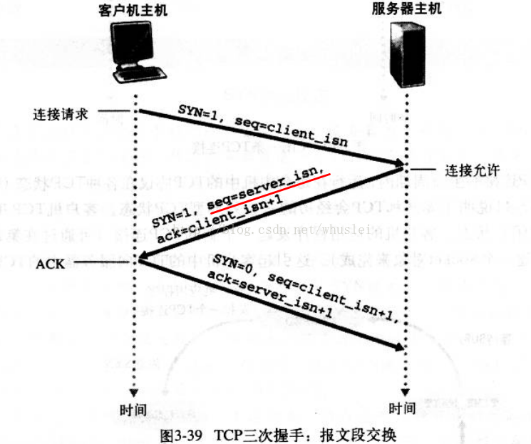
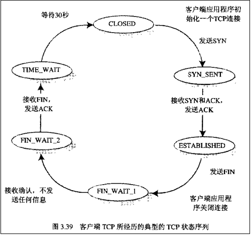
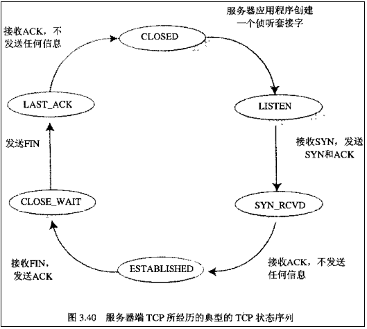
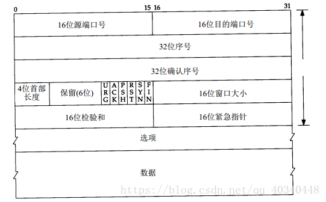
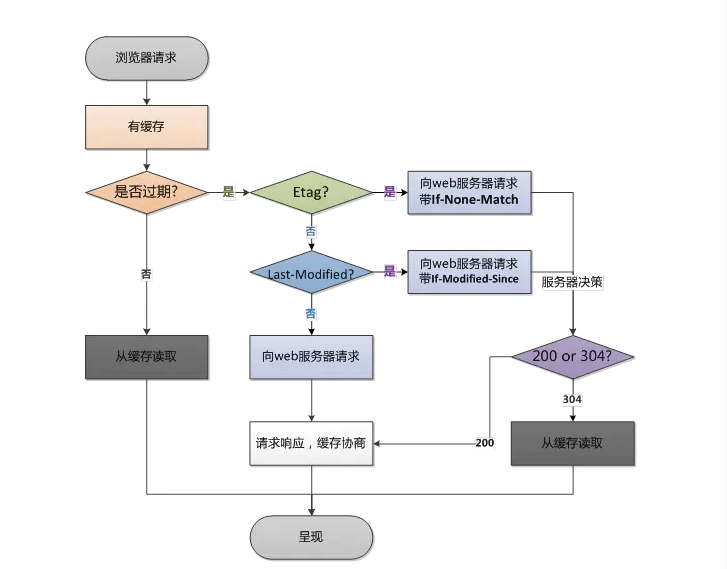

# 一、互联网

## 互联网如何运作

### OSI七层协议

应用层、表示层、会话层、传输层、网络层、数据链路层、物理层。


### TCP

面向连接、可靠的、基于字节流的传输层通信协议。

#### 三次握手



#### 四次挥手


##### 客户端



##### 服务端



#### 报文段首部



#### 快速重传

3个冗余ACK表示报文丢失。

#### 流量控制

让发送方发送速率与接收方接收速率相匹配，防止接收方缓存溢出。

发送方维护一个接收窗口，接收方在报文段接收窗口字段放入当前可用缓存数rwnd。

#### 拥塞控制

发送方跟踪一个拥塞窗口cwnd。

**慢启动**：起初，cwnd为1个MSS，且每过1个RTT，成指数增长。

当触发丢包事件，发送方将cwnd设为1并重启慢启动。

另，cwnd = ssthresh时，结束慢启动并进入拥塞避免。

**拥塞避免**：每个RTT让cwnd加1MSS。触发丢包事件时，ssthresh被设置为当前cwnd的一半。


### cookie/session

#### cookie

- HTTP是**无状态**的协议（对于事务处理没有记忆能力，每次客户端和服务端会话完成时，服务端不会保存任何会话信息）：每个请求都是完全独立的，服务端无法确认当前访问者身份信息，无法分辨上一次的请求发送者和这一次的发送者是否是同一个人。所以服务器与浏览器为了进行会话跟踪（知道谁在访问我），就必须主动去维护一个状态，该状态用于告知服务端前后两个请求是否来自同一浏览器。而这个状态需要通过cookie或者session来实现。

- cookie储存在**客户端**：cookie是服务器发送到用户浏览器并保存在本地的一小块数据，它会在浏览器下次向同一服务器再次发起请求时被携带并发送到服务器上。

- cookie是**不可跨域**的：每个cooke都会绑定单一的域名，无法在别的域名下获取使用，一级域名和二级域名之间是允许共享使用的。（靠的是domain）

- cookie重要的属性

  - name=value：键值对，设置cookie的名称及想对应的值，都必须是字符串类型。如果值为Unicode字符，需要为字符编码；如果值为二进制数据，则需要使用BASE64编码。
  - domain：指定cookie所属域名，默认是当前域名path指定cookie在哪个路径（路由）下生效，默认是'/'。如果设置为，则只有/abc下的路由可以访问到该cookie，如：/abc/read。
  - maxAgecookie：失效的时间，单位为秒。如果是整数，则该cookie在maxAge秒后失效；如果为负数，该cookie为临时cookie，关闭浏览器即失效，浏览器也不会以任何形式保存该cookie；如果为0，表示删除该cookie。<u>默认为-1。</u> 比expires好用。
  - expires：过期时间。在设置的某个时间点后该cookie就会失效。一般浏览器的cookie都是默认储存的，当关闭浏览器结束该会话时，这个cookie也会被删除。
  - secure：该cookie是否仅被使用安全协议传输。安全协议有HTTPS，SSL等，在网络上传输数据前先将数据加密。默认为false。当secure值为true时，cookie在HTTP中是无效的，在HTTPS中才有效。
  - httpOnly：如果给某个cookie设置了httpOnly属性，则无法通过JS脚本读取到该cookie的信息，但还是能通过Application中手动修改cookie，所以只是在一定程度上可以防止<u>XSS攻击</u>，不是绝对的安全。
  - https://baike.baidu.com/item/cookie/1119?fr=aladdin

- **CSRF攻击**：跨站请求伪造。攻击者可能利用网页中的恶意代码强迫受害者浏览器向被攻击的web站点发送伪造的请求，篡夺受害者的认证Cookie等身份信息，从而假冒受害者对目标站点执行指定的操作。浏览器使用单进程/双进程机制，但不同的窗口或标签之间仍会共享会话数据。因此，用户同时打开多个浏览器窗口或标签访问互联网资源时，为CSRF攻击篡夺用户会话cookie创造了条件。另外，如果一个Web站点提供持久化cookie，CSRF攻击将更直接、更容易。

  - 利用了web中用户身份验证的一个漏洞：简单的身份验证只能保证请求发自某个用户的浏览器，却不能保证**请求本身是用户自愿发出的**。
  - 利用了网站对用户浏览器的信任。
  - **防御措施**：
    - 检查Referer字段：Referer字段应和请求的地址位于同一域名下。CSRF攻击的Referer字段会包含恶意网站的地址。但会被篡改Referer的可能。
    - 添加校验token：token是伪随机数。服务器将其生成并附加在窗体中，客户端通过窗体提交请求时，token也一并提交供服务端校验。

  - https://baike.baidu.com/item/%E8%B7%A8%E7%AB%99%E8%AF%B7%E6%B1%82%E4%BC%AA%E9%80%A0/13777878

#### session

- 是另一种记录服务器和客户端会话状态的机制。
- 基于cookie实现，储存在服务器端，sessionId会被储存到客户端的cookie中。
- **认证流程**：
  - 用户第一次请求服务器时，服务器根据用户提交的信息，创建对应的session。
  - 请求返回时，服务器将此session的唯一标识sessionId返回给浏览器。
  - 浏览器接收到sessionId后，将其存入cookie中，同是cookie记录此sessionId属于哪个域名。
  - 当用户第二次访问服务器时，请求会自动判断此域名下是否存在cookie信息。如果存在，则自动将cookie信息也发送给服务端，服务端会从cookie中获取sessionId，在根据sessionId查找对应的session信息；如果没找到，说明用户没有登录或登录失败。如果找到session证明用户已经登录，可执行后面操作。
- sessionId是连接cookie和session的一道桥梁，大部分系统也是根据此原理来验证用户登录状态。

#### cookie和session的区别

- 安全性：session（存在服务端）比cookie（存在客户端）安全。
- 存取值的类型不同：cookie只支持存字符串数据，想要设置其他类型的数据，需要转换成字符串。session可以存任意类型数据。
- 有效期不同：cookie可以设置为长时间保持，比如默认登录功能。session一般失效时间较短，客户端关闭（默认情况下）或者session超时都会失效。
- 储存大小不同：单个cookie保存的数据不能超过4K，session可储存数据远高于cookie，但是当访问量过多，会占用过多的服务器资源。


### IP地址

#### IPv4

32位地址，如 `119.003.238.064`，因此地址空间只有2^32

#### IPv6

128位地址，如 `2001:0DB8:0000:0023:0008:0800:200C:417A`，因此地址空间有2^128，约3.4e38个地址。


## HTTP/HTTPS

### HTTP

超文本传输协议(HyperText Transfer Protocol)。处于计算机网络中的应用层，建立在TCP协议上，所以HTTP协议的瓶颈和优化技巧都是基于TCP协议本身的特性，比如TCP的3次握手/4次挥手和每次建立连接带来的RTT延迟时间。

- 网络优化？影响HTTP网络请求的因素主要有两个：带宽和延迟。
  - 带宽：如果说我们还停留在拨号上网的阶段，带宽可能会成为一个比较严重影响请求的问题，但是现在网络基础建设已经使得带宽得到极大的提升，我们不再会担心由带宽而影响网速，那么就只剩下延迟了。
  - 延迟：
    - 1、浏览器阻塞（HOL blocking）：浏览器会因为一些原因阻塞请求。浏览器对于同一个域名，同时只能有4个连接（根据浏览器内核不同有所差异），超过浏览器最大连接数限制，后续请求就会被阻塞。
    - 2、DNS查询：浏览器需要知道目标服务器的IP才能建立连接。将域名解析为IP的系统就是DNS。通常可以利用DNS缓存结果来减少时间。
    - 3、建立连接：HTTP是基于TCP协议的，浏览器最快也要在第三次握手时才能携带HTTP请求报文，达到真正的建立连接。但是这些连接无法复用，导致每次请求都要经历三次握手和慢启动。三次握手在高延迟的场景下影响较明显，慢启动则对文件类大请求影响较大。

#### 请求行

请求方法+请求URL+HTTP协议及版本

##### 请求方法

- POST：在Request-URI所标识的资源后附加新的数据。

- GET：请求获取由Request-URI所标识的资源。 

- PUT：请求服务器储存一个资源，并用Request-URI作为其标识。 

- DELETE：请求服务器删除由Request-URI所标识的资源。 

- HEAD：请求获取由Request-URI所标识的资源的响应消息报头。

- OPTIONS：请求查询服务器的性能，或查询与资源相关的选项和需求。

- TRACE：请求服务器回送收到的请求信息，主要用于测试或诊断。

##### 请求URL

它和报文头的Host属性组成完整的请求URL。


#### 请求头

**Accpet**: MIME类型，如text/plain

**Referer**: 请求是从哪个URL过来的，如http://www.google.com

Accept-Language: 浏览器支持的语言，如zh-cn

User-Agent: 浏览器信息，如Mozilla/4.0 (...)

Content-Type: 客户端实际返回内容的类型，如application/x-www-form-urlencoded

Host: 主机名，如localhost:8088

Content-Length: 内容字节数

Connection: 连接状态，如Keep-Alive

**Cache-Control**: 对缓存进行控制。如no-cache

**Cookie**: 传给服务端jsessionid，字符串键值对。


#### 响应状态行

HTTP协议版本+状态码+状态描述


#### 响应头

Location：用于重定向接收者到一个新的位置。

Server：包含1服务器用来处理请求的软件信息，如Apacha-Coyote/1.1

Content-Encoding：描述了资源的自然语言。

Content-Type：发送给接收者的实体正文的媒体（MIME）类型

Expires：响应过期的日期和时间。


### HTTP1.0 与 HTTP1.1

- **区别**：

  1. 缓存处理：

     - HTTP1.0中主要使用header中的If-Modified-Since, Expires来作为缓存判断的标准。

     - HTTP1.1中引入Entity tag, If-Unmodified-Since, If-Match, If-None-Match等更多缓存控制策略和缓存头。

  2. 带宽优化和网络连接：

     - HTTP1.0中存在浪费带宽的现象，例如客户端只是需要某个对象的一部分，而服务端将整个对象传过来，且不支持断点续传。

     - HTTP1.1中在请求头中引入range头域，允许只请求资源的某个部分，即返回码是206(Partial Content)，方便开发者自由的选择以便于充分利用带宽和连接。

  3. 错误通知的管理：

     - HTTP1.1中新增了24个错误状态响应码，如409(Conflict)表示请求的资源与资源的当前状态发生冲突；410(Gone)表示服务器上的某个资源被永久性删除。

  4. Host头处理：

     - HTTP1.0中认为每台服务器都绑定一个唯一的IP地址，因此，请求消息中的URL并没有传递主机名。

     - 但随着虚拟主机技术的发展，<u>在一台物理服务器上可以存在多个虚拟主机</u>(Multi-homed Web Servers)，并且他们共享一个IP地址。

     - HTTP1.1的请求消息和相应消息都应支持Host头域，且请求消息中如果没有Host头域会报错(400 Bad request)。

  5. 长链接：

     - HTTP1.1支持长链接和请求的流水线处理。在一个TCP连接上可以传送多个HTTP请求和相应，减少了建立和关闭连接的消耗和延迟。默认开启Connection: keep-alive，一定程度上弥补了HTTP1.0每次请求都要创建连接的缺点。

- **问题**：

  1. HTTP1.x在传输数据时，每次都要重新建立连接，增加了大量延迟时间，特别在移动端。

  2. HTTP1.x在传输数据时，所有传输的内容都是明文，客户端和服务器端都无法验证对方的身份，无法保证数据安全。

  3. HTTP1.x的header携带的内容过大，增加了传输成本，并且每次请求header基本不变，特别在移动端增加了用户流量。

  4. 虽然HTTP1.x支持了keep-alive，来弥补多次创建连接产生的延迟。但是keep-alive使用多了同样会给服务端带来大量的性能压力。并且对于单个文件被不断请求的服务（如图片存放网站），keep-alive可能会极大的影响性能，因为它在文件被请求后还长时间地保持了不必要的连接。

### HTTPS

- 需要到CA申请证书，一般免费证书很少，需要交费。
- 运行在SSL/TLS之上，SSL/TLS运行在TCP之上，所有传输的内容都经过加密。
- 使用与HTTP完全不同的连接方式，用的端口也不一样。HTTP用80，HTTPS用443。
- 可以有效防止运营商劫持。

### SPDY

2012年google提出SPDY方案，综合了HTTPS和HTTP两者优点的传输协议。

- 降低延迟：采取<u>多路复用</u>。多个请求stream共享一个TCP连接，解决了浏览器阻塞问题，降低了延迟，同时提高了带宽的利用率。
- 请求优先级：多路复用带来的新问题是，在连接共享的基础上有可能导致关键请求被阻塞。SPDY允许给每个request设置优先级，这样重要的请求就会优先被响应。比如html应该优先展示，之后是各种静态资源、脚本文件等加载。
- header压缩：选择合适的压缩算法减小包的大小和数量。
- 基于HTTPS的加密协议传输
- **服务端推送**。例如我的网页有一个 sytle.css 的请求，在客户端收到 sytle.css 数据的同时，服务端会将 sytle.js 的文件推送给客户端，当客户端再次尝试获取 sytle.js 时就可以直接从缓存中获取到，不用再发请求了。

SPDY 位于 HTTP 之下，TCP 和 SSL 之上，这样可以轻松兼容老版本的 HTTP 协议 (将 HTTP1.x 的内容封装成一种新的 frame 格式)，同时可以使用已有的 SSL 功能。

### HTTP2.0

- 二进制格式：HTTP1.x的解析是基于文本。基于文本协议的格式解析存在天然缺陷，文本的表现形式有多样性，要做到健壮性考虑的场景必然很多，二进制则不同，只认 0 和 1 的组合。基于这种考虑 HTTP2.0 的协议解析决定采用二进制格式，实现方便且健壮。
- 多路复用：即连接共享。每个request都是用作连接共享机制的。一个request对应一个id，这样一个连接上可以由多个request，每个连接的request可以随机的混杂在一起，接收方可以根据request的id将request再归属到各自不同的服务端请求中。
- header压缩：使用encoder减少需要传输的header大小，通讯双方各自cache一份header fields表，既避免重复header的传输，又减小传输大小。
- 服务端推送

### HTTP3.0(QUIC)

快速UDP互联网连接（Quick UDP Internet Connections）

- **线头阻塞(HOL)问题的解决更为彻底**：
  - 基于TCP的HTTP/2，尽管从逻辑上讲，不同的流之间互相独立，不会互相影响，但实际传输时，数据还是要一帧一帧地发送和接收。一旦某一个流的数据丢包，则同样会阻塞在它之后传输的流的数据传输。
  - 而基于UDP的QUIC协议则可以更为彻底地解决这个问题，让不同的流之间真正实现互相独立传输，互不干扰。
  
- **切换网络时的连接保持**
  - 当前移动端的应用环境，用户的网络可能会经常切换，比如位置变动，WIFI断开，网络切换为3G或4G。基于TCP协议，由于切换网络后，IP会改变，因而之前的连接不可能继续保持。
  - 基于UDP的QUIC协议，则可以内建与TCP不同的连接标识方法，从而在网络完成切换之后，恢复之前与服务器的连接。


### HTTP缓存策略

<a href="https://www.cnblogs.com/shangxiaofei/p/6214560.html">参考博客</a>

3个部分：缓存存储策略、缓存过期策略、缓存对比策略

#### 缓存存储策略

Cache-Control：public、private、no-cache、no-store、max-age

指明响应内容是否可以被客户端存储。

Cache-Control字段含义：

- public

  表明响应可以被任何对象（发送请求的客户端、CDN等代理服务器等）缓存。

- private

  表明响应只能被单个用户缓存，不能作为共享缓存（代理服务器不能缓存它）。

- no-cache

  可以在本地进行缓存。但每次发请求时，都要向服务器进行验证。如果服务器允许，才能使用本地缓存。（即：**需要协商缓存**）

- no-store

  不可以在本地进行缓存。禁止缓存客户端请求或服务器响应的内容，每次都需重新请求服务器拿内容。

- max-age

  设置缓存存储的最大周期，若超过该时间，缓存被视为过期。

#### 缓存过期策略

Cache-Control: no-cache、max-age，Expires，Last-Modified

客户端用来确认存储在本地的缓存数据是否已经过期，进而决定是否要向服务端发送请求以获取数据。

注意：

- Cache-Control 中指定的缓存过期策略优先级高于 Expires。

- Cache-Control: no-cache 和 Cache-Control: max-age=0 相当。而 Cache-Control: max-age=xxx 相当于：

  ```javascript
  Cache-Control: public/private
  Expires: 当前客户端时间 + maxAge
  ```

#### 缓存对比策略

ETags，If-Modified-Since，If-None-Match

将缓存在客户端的数据标识发给服务端，服务端通过标识来判断客户端缓存数据是否仍有效，进而决定是否重发数据。

#### 缓存逻辑流程图

<a href="https://www.jianshu.com/p/c78b5de7a889">参考博客</a>



#### 强缓存 和 协商缓存（对比缓存）

http 根据是否要向服务器发送请求，将缓存规则分为了两类：强缓存 和 协商缓存。

简单来说，浏览器在处理 http 请求时，

- 先看了看本地缓存是否过期，没过期就从缓存中读取——命中强缓存。
- 缓存过期了，就拿着缓存对比标志去向服务器请求资源——强缓存未命中，走协商缓存。

当 Cache-Control 头部字段的值为 no-cache 时，跳过强缓存，直接走协商缓存。

##### 强缓存

直接从缓存数据库中取出资源，无需发送请求到服务器上。

http中用`Expires`和`Cache-Control`两个头部信息来判断<u>是否命中强缓存</u>。

强缓存的状态码为200，但 chrome 的 network 中，状态码后会多一个注释，内容为以下2种之一：

- from memory cache
- from disk cache

1. **from memory cache**：缓存资源在<u>内存</u>中。浏览器（或页面标签）关闭后内存中的缓存就会被释放，重新打开页面取不到该缓存。
2. from disk cache：缓存资源在<u>硬盘</u>中。浏览器（或页面标签）关闭后硬盘中的缓存不会消失，下次进入页面还能从硬盘中获取。

> 如果不想从强缓存中获取资源，可以强制刷新页面：windows电脑可以通过`ctrl + f5`，mac os 可以通过`shift + command + r`。刷新后你可以看到资源不会出现 from disk(or memory) cache了。

##### 协商缓存

需要经过服务器确认是否使用缓存的机制。服务器根据资源是否被更改，决定响应码为200或304。

客户端需要带着**缓存对比标志**，通常有2种：

- Last-Modified / If-Modified-Since
- Etag / If-None-Match

1. **Last-Modified / If-Modified-Since**：当浏览器第一次访问资源时，服务器会在响应头中包含`Last-Modified`字段，代表该资源<u>最后的修改时间</u>。当浏览器再次请求该资源时，会在请求头中包含`If-Modified-Since`字段，值为上次请求时服务器返回的`Last-Modified`字段的值；服务器根据该值确认资源在这段时间内是否更改过，如果没有，返回304，如果有，返回200和最新的资源。
2. **Etag / If-None-Match**：机制类似，但`Etag`是通过一个<u>校验码</u>来对比资源是否更改过，而非资源的修改时间。当一个资源修改时，其校验码也会更改。当浏览器请求资源时，服务器会返回`Etag`字段。当浏览器再次请求资源时，会带上`If-None-Match`，值为上次请求时服务器返回的`Etag`字段的值；服务器根据该值，对比校验码，决定返回304或200。

Etag 的优先级比 Last-Modified 高，原因如下：

- 一些文件也许会周期性的更改，但是他的内容并不改变(仅仅改变的修改时间)，这个时候我们并不希望客户端认为这个文件被修改了，而重新GET；

- 某些文件修改非常频繁，比如在秒以下的时间内进行修改，(比方说1s内修改了N次)，If-Modified-Since能检查到的粒度是s级的，这种修改无法判断(或者说UNIX记录MTIME只能精确到秒)；

- 某些服务器不能精确的得到文件的最后修改时间。


## DNS原理

DNS是一个分布式数据库，上面记录了域名和其IP地址的对应关系。在浏览器输入网址时，浏览器首先连接DNS服务器，获取到该域名的IP地址后，浏览器在连接访问该IP的服务器。

若之后服务器IP地址有了变化，重新绑定域名和新IP地址就可以了。


## CDN原理

暂无