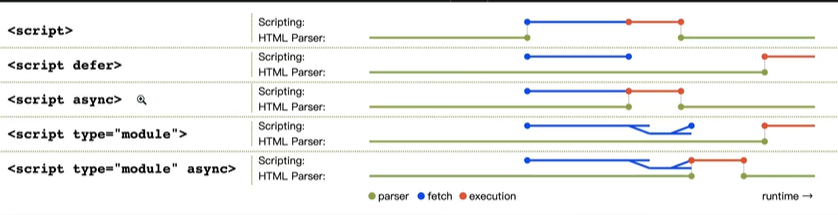
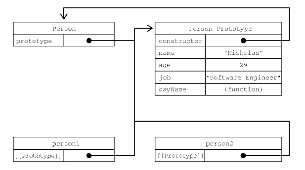

**参考资料**：JavaScript高级程序设计（第4版）	Matt Frisbie 著	李松峰 译


## `<script>`元素

- src

  - 没有这个属性，表示包含行内JS代码
  - 有这个属性，用于指定要加载的外部JS文件
- type

  - 在浏览器中，值始终是"text/javascript"
  - 如果加载或包含ES模块代码，值为"module"
- nomodule

  - 兼容不支持ES6的浏览器，主要是IE11
- **async**
  - 立即异步下载脚本并执行。
  - 多个设置了async的`script`标签，谁先加载完谁执行。
  - DOMContentLoaded事件不影响其执行。
- **defer**
  - 立即异步下载脚本，但延迟到整个页面解析完毕后再执行。
  - 多个设置了defer的`script`标签，会按照列出的顺序执行。
  - 在文档渲染完毕后，DOMContentLoaded事件调用前执行。



- crossorigin

  - 基本概念
    - Cross Origin Resource Share 涉及如下元素：
      - < script >
      - < link >
      - < img >
      - < audio >
      - < video >
    - Origin由三部分组成：
      - 协议protocol
      - 域名domain
      - 端口port
    - 使用CORS的请求
  - 如果是跨域请求，可以用来设置“凭据模式”（credentials mode）

- integrity

  - Subresource integrity

  - 例

    ```javascript
    <scirpt crossorign="anonymous" integrity="sha384-AQhQSZGQWTMJhb/..." src="https://lib.baomilu.com/jquery/3.5.0/jquery.js"></script>
    ```

  - 浏览器在加载带有integrity属性的< script >或< link >标签时，在下载完文件后，会先比较自己计算的数列值与integrity属性的值，如果不相等，则返回网络错误。

- charset

- language


## 变量

#### let

- 块级作用域
- 没有提升，有TDZ（Temporal Dead Zone）
- 不能重复声明
- 混用var和let，重复声明会报错
- 全局声明不是window对象的属性

#### const

- 声明同时必须初始化
- 初始化后不能修改
- 不能修改仅限于常量的引用
- 不能用于声明会自增的迭代变量

#### var

- 函数级作用域
- 作用域提升
- 重复声明不报错
- 全局声明的变量成为window对象的属性


## 数据类型

#### typeof操作符

返回下列字符串之一：

- "undefined"
- "boolean"
- "string"
- "number"
- "object"表示对象（非函数）**或null**
- "function"表示函数
- "symbol"表示符号


#### Undefined类型

undefined

- 声明未初始化的变量被赋值为undefined
- 对声明未初始化的变量/未声明的变量调用typeof返回undefined
- 假值


#### Null类型

null

- `typeof null` 返回"object"

- `null == undefined` 返回true
- 假值


#### Boolean类型

true/false

- 调用Boolean()转型函数，把其他类型的值转换成布尔值

| 数据类型  | 转换为true的值         | 转换为false的值 |
| --------- | ---------------------- | --------------- |
| Boolean   | true                   | false           |
| String    | 非空字符串             | ""（空字符串）  |
| Number    | 非零数值（包括无穷值） | 0、NaN          |
| Object    | 任意对象               | null            |
| Undefined | /                      | undefined       |


#### Number类型

整数、浮点数

- 整数：八进制以`0`开头，十六进制以`0x`开头，八进制在严格模式下无效。

- 浮点数：内存空间是整数值的两倍。如果数值本身是整数，只是小数点后跟着0或没有数字，则会被转换为整数。如`1.`和`1.0`会被转换成`1`。

- 科学记数法：一个数值+e+一个要乘的10的多少次幂，如`3.125e7`等于`31250000`。

- 精度问题：浮点数的精确度最高为17位小数。会出现精度问题，如`0.1 + 0.2`返回`0.300 000 000 000 000 04`而非`0.3`。

- 值的范围：`Number.MIN_VALUE` 可以表示的最小值`5e-324`；`Number.MAX_VALUE`可以表示的最大值`1.7976931348623157e+308`。超出范围以-Infinity和Infinity表示，不能用于任何计算。用`isFinite()`检测是不是有限大。

- **NaN**

  - 0、+0、-0相除返回NaN

  - 分子非0，分母是0、+0、-0，返回Infinity或-Infinity

  - 涉及NaN的任何计算返回NaN

  - `NaN == NaN` 返回 false

  - isNaN()函数判断参数是否“不是数值“：传入参数后，函数会尝试把它转换为数值。

    ```javascript
    console.log(isNaN("10")); // false,可以转换为数值10
    console.log(isNaN("blue")); // true，不可以转换为数值
    ```

- 数值转换：

  - **Number()**
    - 布尔值，true转换为1，false转换为0
    - 数值，直接返回
    - **null，返回0**
    - undefined，返回NaN
    - 字符串：
      - 包含数值字符，包括数值字符前面带+/-，转换为十进制数值。忽略前面的零。
      - 包含有效浮点数，转换为浮点数。忽略前面的零。
      - 包含有效十六进制格式，转换为对应的十进制整数值。
      - **空字符串，返回0**。
      - 其他，返回NaN。
    - 对象：调用valueOf()方法，按上述规则转换返回的值，若转换结果为NaN，则调用toString()方法，再按照转换字符串的规则转换。
  - **parseInt()**
    - 从第一个非空格字符开始转换。如果第一个字符不是数值字符、+、-，返回NaN。（因此**空字符串返回NaN**）
    - 如果第一个字符是数值字符、+、-，继续依次检测每个字符，直到非数值字符或末尾。
    - 能识别不同的整数格式（八进制、十六进制）
    - 第二个参数，指定进制数。
  - **parseFloat()**
    - 类似parseInt()，但第二次出现的小数点无效。`22.34.5`转换成`22.34`
    - 忽略字符串开头的零，因此只解析十进制，没有第二个参数。
    - 如果字符串表示整数，返回整数。


#### String类型

- 可以使用双引号（ " ）、单引号（ ' ）和反引号（ ` ）

- 字符字面量

  | 字面量 | 含义                                                         |
  | ------ | ------------------------------------------------------------ |
  | \n     | 换行                                                         |
  | \t     | 制表                                                         |
  | \b     | 退格                                                         |
  | \r     | 回车                                                         |
  | \f     | 换页                                                         |
  | \ \    | 反斜杠                                                       |
  | \ '    | 单引号，在字符串以单引号标示时使用                           |
  | \ "    | 双引号，在字符串以双引号标示时使用                           |
  | \ `    | 反引号，在字符串以反引号标示时使用                           |
  | \xnn   | 以十六进制编码nn表示的字符（其中n是十六进制数字0~F，例如\x41等于"A"） |
  | \unnnn | 以十六进制编码nnnn表示的Unicode字符（其中n是十六进制数字0~F），例如\u03a3等于希腊字符"Σ" |

- 不可变的(immutable)，一旦创建，值不能变。要修改字符串，先要销毁原始字符串，将新字符串保存到该变量。

- 字符串转换

  - **toString()**
    - null和undefined没有该方法
    - 传入参数，表示进制数
  - **String()**
    - 可以转换null和undefined，并转换为"null"和"undefined"

- 模板字面量：反引号，会保持内部的空格和换行。

- 字符串插值：`${}`，所有插入的值都会调用`toString()`强制转型为字符串。（可以利用这一特点自定义插入的对象的`toString()`函数，返回想要的值）

- 模板字面量标签函数(tag function)

  - 本身是常规函数，通过前缀到模板字面量来应用自定义行为。

  - 接收参数依次是，原始字符串数组和对每个表达式求值的结果。

    ```javascript
    let a = 6;
    let b = 9;
    
    function zipTag(strings, ...expressions) {
    	return strings[0] + 
    	       expressions.map((e, i) => `${e}${strings[i+1]}`).join('');
    }
    
    let taggedResult = zipTag`${a} + ${b} = ${a+b}`;
    
    console.log(taggedResult); // "6 + 9 = 15"
    ```

- 原始字符串

  - 获取未被转义的字符

  - 默认的String.raw标签函数

    ```javascript
    console.log(String.raw`\u00A9`); // \u00A9
    ```

  - 也可以通过标签函数的第一个参数的.raw属性

    ```javascript
    function printRaw(stirngs){
    	for(const rawString of strings.raw){
    		console.log(rawString);
    	}
    }
    
    printRaw`\u00A9${'and'}\n`;
    // \u00A9
    // \n
    ```


#### Symbol类型

ES6新增。符号实例唯一、不可变。

- 调用`Symbol()`函数初始化，可传入一个字符串参数作为对符号的描述，但与其定义或标识无关。

  ```javascript
  let genericSymbol = Symbol();
  let otherGenericSymbol = Symbol();
  
  let fooSymbol = Symbol('foo');
  let otherFooSymbol = Symbol('foo');
  
  console.log(genericSymbol == otherGenericSymbol); // false
  console.log(fooSymbol == otherFooSymbol); // false
  ```

- 对符号实例使用typeof，返回symbol。

- 不能用new关键字创建实例。

- 调用`Symbol.for()`函数，使用**全局符号注册表**。可以用一个字符串作为键，在全局符号注册表中创建并重用符号。

  ```javascript
  let fooGlobalSymbol = Symbol.for('foo'); // 创建新符号
  let otherFooGlobalSymbol = Symbol.for('foo'); // 重用已有符号
  console.log(fooGlobalSymbol == otherFooGlobalSymbol); // true
  ```

- 调用`Symbol()`和`Symbol.for()`的符号实例并不等同，即使使用同样的字符串描述。

- 调用`Symbol.keyFor()`查询符号实例在全局注册表对应的字符串键。

- 可以使用符号<u>作为对象的属性</u>，包括对象字面量属性和`Object.defineProperty()/Object.defineProperties()`定义的属性。

  ```javascript
  let s1 = Symbol('foo');
  let s2 = Symbol('bar');
  let s3 = Symbol('baz');
  let s4 = Symbol('qux');
  
  let o = {
  	[s1]: 'foo val'
  }
  //也可以: o[s1] = 'foo val';
  console.log(o);	// {Symbol(foo): foo val}
  
  Object.defineProperty(o, s2, {value: 'bar val'});
  console.log(o); // {Symbol(foo): foo val, Symbol(bar): bar val}
  
  Object.defineProperties(o, {
      [s3]: {Value: 'baz val'},
      [s4]: {Value: 'qux val'}
  });
  console.log(o);
  // {Symbol(foo): foo val, Symbol(bar): bar val,
  //  Symbol(baz): baz val, Symbol(qux): qux val}
  ```

  - 调用`Object.getOwnPropertyNames()`返回对象实例的常规属性数组。
  - 调用`Object.getOwnPropertySymbols()`返回对象实例的符号数形数组。
  - 调用`Object.getOwnPropertyDescriptors()`返回同时包含常规和符号属性描述的<u>对象</u>。
  - 调用`Reflect.ownKeys()`返回两种类型的<u>键</u>。

- **常用内置符号**（well-known symbol）

  - 是全局函数Symbol的普通字符串属性。不可写、不可枚举、不可配置。

  - `Symbol.asyncIterator`    表示实现异步迭代器API的函数，由for-await-of语句使用。

  - `Symbol.hasInstance`    表示“一个方法，该方法决定一个构造器对象是否认可一个对象是它的实例，由instanceof操作符使用”。

  - `Symbol.isConcatSpreadable`    表示“一个布尔值，如果是true，则意味着对象应该用Array.prototype.concat()打平其数组元素"。

  - `Symbol.iterator`    表示实现迭代器API的函数，由for-of语句使用。

  - `Symbol.match`    表示”一个正则表达式方法，该方法用正则表达式去匹配字符串，由String.prototype.match()方法使用“。

  - `Symbol.replace`    表示“一个正则表达式方法，该方法替换一个字符串中匹配的子串，由String.prototype.replace()方法使用”。

  - `Symbol.search`表示“一个正则表达式方法，该方法返回字符串中匹配正则表达式的索引，由String.prototype.search()方法使用”。

  - `Symbol.species `   表示“一个函数值，该函数作为创建派生对象的构造函数”。用Symbol.species定义静态的获取器(getter)方法，可以<u>覆盖新创建实例的原型定义</u>。

    ```javascript
    class Baz extends Array {
    	static get [Symbol.species](){
    		return Array; //覆盖新创建实例的原型为Array
    	}
    }
    
    let baz = new Baz();
    console.log(baz instanceof Array); // true
    console.log(baz instanceof Baz); // true
    baz = baz.concat('baz'); // concat()函数会返回新实例
    console.log(baz instanceof Array); // true
    console.log(baz instanceof Baz)l // false
    ```

  - `Symbol.split`    表示“一个正则表达式方法，该方法在匹配正则表达式的索引位置拆分字符串，由String.prototype.split()方法使用”。

  - `Symbol.toPrimitive`    表示“一个方法，该方法将对象转换为相应的原始值，由ToPrimitive抽象操作使用”。

  - `Symbol.toStringTag`    表示“一个字符串，该字符串用于创建对象的默认字符串描述，由内置方法Object.prototype.toString()使用”。

  - `Symbol.unscopables`    表示“一个对象，该对象所有的以及继承的属性，都会从关联对象的with环境绑定中排除”。


#### Object类型

- `let o = new Object()`
- Object是派生其他对象的基类。
- 每个Object实例都有如下属性和方法：
  - constructor：用于创建当前对象的函数。
  - hasOwnProperty(*propertyName*)：用于判断当前对象实例上是否存在给定的属性。属性名必须是字符串或符号。
  - isPrototypeOf(*object*)：当前对象是否为另一个对象的原型。
  - propertyIsEnumerable(*propertyName*)：用于判断给定的属性是否可以使用for-in语句枚举。属性名必须是字符串。
  - toLocaleString()：返回对象的字符串表示，反应对象所在的本地化执行环境。
  - toString()：返回对象的字符串表示。
  - valueOf()：返回对象对应的字符串、数值或布尔值表示。通常与toString()的返回值相同。


## 操作符

#### 一元操作符

1. 递增/递减操作符 `++/--`

   - 前缀，变量的值都会在语句被求值之前改变。即`++age/--age`的结果取操作后的值。

     ```javascript
     let age = 29;
     let anotherAge = --age + 2;
     console.log(age); // 28
     console.log(anotherAge); // 30
     ```

   - 后缀，在语句被求值后改变。即`age++/age--`的结果取操作前的值。

     ```javascript
     let age = 29;
     let anotherAge = age-- + 2;
     console.log(age); // 28
     console.log(anotherAge); // 31
     ```

2. 一元加/减`+/-`

   - `+`应用到非数值，会执行与Number()转换函数一样的类型转换。

     ```javascript
     let s1 = "01";
     let s2 = "1.1";
     let s3 = "z";
     let b = false;
     let f = 1.1;
     let o = {
     	valueOf(){
     		reuturn -1;
     	}
     };
     
     s1 = +s1: // 数值1
     s2 = +s2; // 数值1.1
     s3 = +s3; // NaN
     b = +b; // 数值0
     f = +f; // 不变，还是1.1
     o = +o; // 数值-1
     ```

   - `-`应用到非数值时，会先遵循和`+`一样的类型转换规则，再取负值。

#### 位操作符

ECMAScript中的所有数值都以IEEE 754 64位格式存储，但位操作并不直接应用到64位表示，而是先**把值转换为32位整数**，再进行位操作，之后再把结果转换为64位。

##### 有符号整数

使用32位的前32位表示整数值。第32位是**符号位**，表示数值的符号，0表示正，1表示负。

- 正值以真正的二进制格式存储，即31位中的每一位都代表2的幂。不足的位以0填充。

- 负值以**二补数（补码）**的二进制编码存储。由以下3个步骤得到：

  1. 确定绝对值的二进制表示。（如，对于-18，先确定18的二进制表示）
  2. 找到数值的一补数（反码），即每个0变成1，每个1变成0。
  3. 给结果加1。

  如-18的二进制表示：

  1. 确定18的二进制表示：

     ```javascript
     0000 0000 0000 0000 0000 0000 0001 0010
     ```

  2. 计算一补数（反码），即反转每一位二进制值：

     ```javascript
     1111 1111 1111 1111 1111 1111 1110 1101
     ```

  3. 最后给一补数（反码）加1

     ```
     1111 1111 1111 1111 1111 1111 1110 11
     ```

     则-18的二进制表示如上。

- 而在把负值输出为一个二进制字符串时，会得到有减号的绝对值。如：

  ```javascript
  let num = -18;
  console.log(num.toString(2)); // "-10010"
  ```

  注意到，`10010`是18的二进制表示。

- 特殊值NaN和Infinity在位操作中都会被当成0。


1. 按位非`~`

   - 返回数值的一补数（反码）。

2. 按位与`&`

   - 两个操作数，对两个数的每一位进行与操作。

3. 按位或`|`

   - 两个操作数，对两个数的每一位进行或操作。

4. 按位异或`^`

   - 两个操作数，对两个数的每一位进行异或操作。

     | 第一个数的位 | 第二个数的位 | 结果 |
     | ------------ | ------------ | ---- |
     | 1            | 1            | 0    |
     | 1            | 0            | 1    |
     | 0            | 1            | 1    |
     | 0            | 0            | 0    |

5. 左移`<<`

   - 按指定的位数将数值的所有位向左移动。右端空出的位以0填充。

     ```javascript
     let oldVal = 2; // 二进制10
     let newVal = oldVal << 5; //二进制1000000，即十进制64
     ```

   - 保留数值的符号。

6. 有符号右移`>>`

   - 左移的逆运算。按指定的位数将数值的所有位向右移动，同时保留符号。正值左端空出的位以0填充，负值左端空出的位以1填充。

7. 无符号右移`>>>`

   - 按指定的位数将数值的所有位向右移动。左端空出的位以0填充。

详见  <a href="http://c.biancheng.net/view/5471.html">js位移运算符</a>

#### 布尔操作符

1. 逻辑非`!`

   遵循以下规则：

   - 操作数是对象，返回false。

   - 操作数是空字符串，返回true。
   - 操作数是非空字符串，返回false。
   - 操作数是数值0，返回true。
   - 操作数是非0数值（包括Infinity），返回false。
   - 操作数是NaN，返回true。
   - 操作数是null，返回true。
   - 操作数是undefined，返回true。

2. 逻辑与`&&`

   有操作数不是布尔值时，遵循以下规则：

   - 第一个操作数是对象，返回第二个操作数。
   - 第二个操作数是对象，只有第一个操作数求值为true时才返回该对象。
   - 两个操作数都是对象，返回第二个操作数。
   - 有一个操作数是null，返回null。
   - 有一个操作数是NaN，返回NaN。
   - 有一个操作数是undefined，返回undefined。

3. 逻辑或`||`

   有操作数不是布尔值时，遵循以下规则：

   - 第一个操作数是对象，返回第一个操作数。
   - 第一个操作数求值为false，返回第二个操作数。
   - 两个操作数都是对象，返回第一个操作数。
   - 两个操作数都是null，返回null。
   - 两个操作符都是NaN，返回NaN。
   - 两个操作符都是undefined，返回undefined。

   第一个操作数求值为true时，第二个操作数就不会被求值。

#### 乘性操作符

1. 乘法操作符`*`
   - 操作数都是数值，则执行常规的乘法运算。如果ECMAScript不能表示乘积，则返回Infinity或-Infinity。
   - 任一操作数是NaN，则返回NaN。
   - Infinity乘以0，则返回NaN。
   - Infinity乘以非0的有限数值，则根据第二个操作数的符号返回Infinity或-Infinity。
   - Infinity乘以Infinity，则返回Infinity。
   - 有不是数值的操作数，先在后台用Number()将其转换为数值，再应用以上规则。
2. 除法操作符`/`
   - 操作数都是数值，则执行常规的除法运算。如果ECMAScript不能表示商，则返回Infinity或-Infinity。
   - 任一操作数是NaN，则返回NaN。
   - Infinity除以Infinity，则返回NaN。
   - 0除以0，则返回NaN。
   - 非0的有限值除以0，则根据第一个操作数的符号返回Infinity或-Infinity。
   - Infinity除以任何数值，则根据第二个操作数的符号返回Infinity或-Infinity。
   - 有不是数值的操作数，先在后台用Number()将其转换为数值，再应用以上规则。
3. 取余操作符`%`
   - 操作数是数值，则执行常规除法运算，返回余数。
   - 被除数是无限值，除数是有限值，则返回NaN。
   - 被除数是有限值，除数是0，则返回NaN。
   - Infinity除以Infinity，则返回NaN。
   - 被除数是有限值，除数是无限值，则返回被除数。
   - 被除数是0，除数不是0，则返回0。
   - 有不是数值的操作数，先在后台用Number()将其转换为数值，再应用以上规则。

#### 指数操作符 `**`

`Math.pow(a, b)` 等价于 `3 ** 2`。

#### 加性操作符

1. 加法操作符`+`

   - 两个操作数都是数值，则执行加法运算并返回结果。

   - 任一操作数是NaN，则返回NaN。
   - Infinity加Infinity，则返回Infinity。
   - -Infinity加-Infinity，则返回-Infinity。
   - Infinity加-Infinity，则返回NaN。
   - +0加+0，则返回+0。
   - -0加+0，则返回+0。
   - -0加-0，则返回-0。

   有一个操作数是字符串时，应用如下规则：

   - 两个操作数都是字符串，则将第二个字符串**拼接**到第一个字符串后面。
   - 只有一个操作数是字符串，则将另一个操作数转换为字符串，再将两个字符串拼接。

   有任一操作数是对象、数值或布尔值，则调用toString()方法获取字符串，再应用以上规则。对于null和undefined，则调用String()函数。

2. 减法字符串`-`

   - 两个操作数都是数值，则执行减法运算并返回结果。

   - 任一操作数是NaN，则返回NaN。
   - Infinity减Infinity，则返回NaN。
   - -Infinity减-Infinity，则返回NaN。
   - Infinity减-Infinity，则返回Infinity。
   - -Infinity减Infinity，则返回-Infinity。
   - *+0减+0，则返回+0。*
   - *+0减-0，则返回+0。*
   - *-0减+0，则返回-0。*
   - *-0减-0，则返回+0。*（实测，与书中有偏差）

   - 有任一操作符是字符串、布尔值、null或undefined，则先在后台使用Number()将其转换为数值，再根据以上规则执行数学运算。如果转换结果是NaN，则减法计算的结果是NaN。
   - 如果任一操作符是对象，则调用其valueOf()方法取得数值。如果该值是NaN，则减法计算的结果是NaN。如果对象没有valueOf()方法，则调用其toString()方法，再将得到的字符串转换成数值。

   ```
   let result1 = 5 - true; // true转换为1，结果为4
   let result2 = NaN - 1; // NaN
   let result3 = 5 - 3; // 2
   let result4 = 5 - ""; // ""转换为0，结果为5
   let result5 = 5 - "2"; // "2"转换为2，结果为3
   let result6 = 5 - null; // null转换为0，结果为5
   ```

#### 关系操作符

执行比较两个值的操作，包括小于`<`、大于`>`、小于等于`<=`、大于等于`>=`，返回布尔值。

- 操作数都是数值，则执行数值比较。
- 任一操作数是数值，则**逐个**比较字符串中对应字符的**编码**。
- 任一操作数是数值，则将另一个操作数转换为数值，执行数值比较。
- 任一操作数是对象，则调用其valueOf()方法，取得结果后再根据以上规则执行比较。如果没有valueOf()操作符，则调用toString()方法，取得结果后再根据以上规则执行笔记。
- 任一操作符是布尔值，则将其转换为数值再执行比较。

##### 比较字符串

注意：逐个比较字母的编码。

```javascript
let result1 = "Brick" < "alphabet"; // true
let result2 = "23" < "3"; // true
```

##### 与NaN比较

涉及比较NaN时都返回false。

```javascript
let result1 = NaN < 3; // false
let result2 = NaN >=3; // false
```

#### 相等操作符

1. 等于`==`和不等于`!=`

   先进行类型转换，再确定操作数是否相等：

   - 任一操作数是布尔值，则将其转换为数值再比较。false转换为0，true转换为1.
   - 一个操作数是字符串，另一个是数值，则尝试将字符串转换为数值，再比较。
   - 一个操作数是对象，另一个不是，则调用对象的valueOf()方法取得原始值，再根据以上规则比较。

   进行比较时，遵循如下规则：

   - null和undefined相等。
   - null和undefined不能转换为其他类型的值再进行比较。
   - 任一操作数是NaN，则`==`返回false，`!=`返回true。（**NaN不等于NaN**）
   - 两个操作数都是对象，则比较它们是不是同一个对象。如果两个操作数都指向同一个对象，则`==`返回true，否则，两者不相等。

2. 全等`===`和不全等`!==`

   不转换操作数。

   null和undefined不全等。

#### 条件操作符 ` ?:`

```javascript
variable = boolean_expression ? true_value : false_value;
```

#### 赋值操作符

1. 简单赋值`=`

   将右侧的值赋给左侧的变量。

2. 符合赋值

   乘性、加性或位操作符后跟`=`，用于简写，不会提升性能。

   - 乘后赋值`*=`
   - 除后赋值`/=`
   - 取余后赋值`%=`
   - 加后赋值`+=`
   - 减后赋值`-=`
   - 左移后赋值`<<=`
   - 右移后赋值`>>=`
   - 无符号右移后赋值`>>>=`

#### 逗号操作符 `,`

- 在一条语句中执行多个操作，常用：声明多个变量

  ```javascript
  let num1 = 1, num2 = 2, num3 = 3;
  ```

- 赋值时使用`,`分隔值，最终会返回表达式中最后一个值：

  ```javascript
  let num = (5, 1, 4, 8, 0); // num的值是0
  ```


## 语句

#### `for-in`语句

用于枚举对象中的<u>非符号键属性</u>

```javascript
for (const propName in window) {
	document.write(propName);
}
```

该例子使用for-in循环显示了window的所有属性，但不保证顺序。


#### `for-of`语句

用于遍历<u>可迭代对象</u>的元素

```javascript
for (const el of [2,4,6,8]) {
	document.write(el);
}
```

- for-of循环会按照可迭代对象的next()方法产生值的顺序迭代元素。


#### `with`语句

将代码作用域设置为特定的对象

```javascript
with(location){
	let qs = search.substring(1);
	let hostName = hostname;
	let url = href;
}
```

with语句用于连接location对象。在语句内部，每个变量首先会被认为是局部变量。若没有找到该局部变量，则搜索location对象的同名属性。

- 严格模式不允许使用with语句。


## 执行上下文与作用域

#### 执行上下文

- 每个上下文都有一个关联的变量对象，而这个上下文中定义的所有变量和函数都存在于这个对象上。

- 上下文在其所有代码都执行完毕后会被销毁，包括定义在上面的所有变量和函数。

- 全局上下文

  - 最外层的上下文。浏览器中，全局上下文是window对象，因此通过var定义的全局变量和函数都会成为window对象的属性和方法。

  - 使用let和const的顶级声明不会定义在全局上下文中，但在作用域链解析上效果是一样的。

- 函数上下文

  - 每个函数调用都有自己的上下文。

  - 当代码执行流进入函数时，函数的上下文被推到一个上下文栈上。在函数执行完之后，上下文栈会弹出该函数上下文，将控制权返还给之前的执行上下文。

#### 作用域链 scope chain

- 上下文中的代码在执行时，会创建变量对象的一个作用域链。这个作用域链决定了各级上下文中的代码在访问变量和函数时的顺序。

- 代码正在执行的上下文的变量对象始终位于作用域链最前端。

- 如果上下文是函数，则其活动对象（activation object）用作变量对象。活动对象最初只有一个定义变量: arguments。

- 作用域链中的下一个变量对象来自包含上下文，在下一个对象来自再下一个包含上下文。以此类推直至全局上下文。

- 全局上下文的变量对象始终是作用域链的最后一个变量对象。

- 代码执行时的标识符解析是通过作用域链逐级搜索标识符名称完成的。搜索过程始终从作用域链的最前端开始，然后逐级往后，直至找到标识符。

#### 作用域链增强

- 导致在作用域链前端临时添加一个上下文。

- try/catch语句的catch块

- with语句

#### 标识符查找

- 当在特定上下文中为读取或写入而引用一个标识符时，必须通过搜索确定这个标识符表示什么。

- 搜索开始于作用域链前端，以给定的名称搜索对应的标识符。

- 如果在局部上下文中找到该标识符，则搜索停止，变量确定；如果没有找到变量名，则继续沿作用域链搜索。

- 注意：作用域链中的对象也有一个原型链，因此搜索可能涉及每个对象的原型链。


## 垃圾回收

#### 标记清理(mark-and-sweep)

- JS最常用的垃圾回收策略。
- 垃圾回收程序运行时，会标记内存中存储的所有变量。然后将所有在上下文中的变量和被这些变量引用的变量的标记去掉。剩下有标记的变量就是待删除的。随后垃圾回收程序做一次**内存清理**，销毁带标记的所有值并回收它们的内存。

#### 引用计数(reference counting)

- 没那么常用。
- 对每个值记录被引用的次数。当引用数为0，垃圾回收程序下次运行时就会释放其内存。
- **问题**：循环引用。
  - 对象A和对象B通过各自的属性互相引用。
  - 解决方案：在不使用时，把变量（的属性）置为null。（**解除引用**）

#### 主动触发垃圾回收

- IE中，window.CollectGarbage()，立即触发垃圾回收。
- Opera7及以上，window.opera.collect()，启动垃圾回收程序。

#### 内存泄漏

- 意外声明全局变量（没有使用任何关键字声明变量）。
- 定时器的回调函数通过<u>闭包</u>引用了外部变量。
- 使用JS闭包（内部闭包一直引用外层函数的变量）。

#### 对象池和静态分配

- 为了垃圾回收探测不那么频繁运行。

- 使用对象池：初始化一组可回收的对象作为对象池，每次向池中请求一个对象，设置其属性、使用它，操作完成后归还。
- 静态分配：对象池可以用数组来实现。但JS数组长度是动态的，调用添加/删除操作会先删除原先的数组，新建新长度的数组。因此，初始化一个大小够用的数组。


## Array

#### 创建

- 给构造函数传入数值，表示传入初始长度；否则表示初始值。

```javascript
let arr = new Array();
let arr1 = new Array(20); // 创建一个初始长度为20的数组
let arr2 = new Array("red","blue","green"); // 创建一个包含"red","blue","green"三个字符串的数组
```

- 数组字面量

```javascript
let colors = ["red","blue","green"];
```

- ES6新增创建数组的静态方法：from()和of()。from()用于将<u>类数组结构</u>转换为数组，而of()用于将一组<u>参数</u>转换为数组。

  ```javascript
  const iter = {
  	*[Symbol.iterator](){
  		yield 1;
  		yield 2;
  		yield 3;
  		yield 4;
  	}
  }
  console.log(Array.from(iter)); //[1,2,3,4]
  ```

  - 对数组使用from()方法可以浅复制。

  ```javascript
  const a1 = [1,2,3,4]
  const a2 = Array.from(a1); //浅复制
  ```

  - Array.from()还接收第二个可选的映射函数参数，用于增强新数组的值，类似于map()方法。还接收第三个可选参数，用于指定映射函数中this的值。

    ```javascript
    const a = Array.from(a1, function(x){ return x**this.exponent }, { exponent:2 })
    ```

#### 数组空位

使用数组字面量初始化数组时，可以用一串逗号来创建空位。空位的值为undefined。

#### 数组索引

- 使用中括号`[]`取得或设置数组的值

- length属性不仅可读，还可以通过修改，添加或删除数组末尾元素。

#### 检测数组

判断一个对象是否是数组，有以下两个方法：

- `value instanceof Array`  假定只有一个全局上下文，只有一个版本的Array构造函数。
- `Array.isArray(value) ` 不用管在哪个全局执行上下文创建。

#### 迭代器方法

- `keys()、values()、entries()`分别返回数组索引的迭代器、数组元素的迭代器和索引/值对的迭代器。
- 用for...of对迭代器进行迭代

#### 复制和填充方法

- `copyWithin()`批量复制，`fill()`填充数组。

- `copyWithin()`按照浅复制数组的[开始索引，结束索引)，然后插入到指定索引开始的位置。后两个参数可选。

  - copyWithin( 插入位置，开始索引，结束索引 )

  ```javascript
  let ints = [0,1,2,3,4,5,6,7,8,9];
  ins.copyWithin(2,0,6); // 复制索引[0,6]的元素并插入到索引2开始的位置
  alert(ints); // [0,1,0,1,2,3,4,5,8,9]
  ```

- `fill()`向数组的[开始索引，结束索引)，插入相同的值。后两个参数可选。

  - fill( 指定值，开始索引，结束索引 )

  ```javascript
  const zeroes = [0,0,0,0,0];
  zeroes.fill(7,1,3);
  console.log(zeroes); // [0,7,7,0,0]
  ```

#### 转换方法

- `toLocaleString()、toString()和valueOf()`，`join()`
- `toString()`返回数组每个值调用`toString()`返回值拼接而成的，逗号分隔的字符串；`valueOf()`返回数组本身；`toLocaleString()`返回数组每个值调用`toLocaleString()`返回值拼接而成的，逗号分隔的字符串
- `join()`可传入分隔符，表示字符串由分隔符分隔。

#### 向数组末尾添加/删除

- `push()、pop()`

#### 向数组开头添加/删除

- `unshift()、shift()`

#### 排序方法

- `reverse()、sort()`
- `sort()`默认把数值转换成字符串再比较排序，所以有`10<5`，不符合常理。因此可以接收一个比较函数。

#### 操作方法

- `concat()`：将传入参数添加到当前数组的副本末尾，并返回新数组。若传参为数组，则打平；否则不打平，直接添加对象。
- `slice()`：返回[ 开始索引，结束索引 )的子数组。参数1：开始索引。参数2（可选）：结束索引。
- `splice()`：3种用法。返回值为删除的元素数组，未删除元素时则为空数组。
  - 删除。传2个参数：要删除的第一个元素位置和要删除的元素数量。如`splice(0,2)`删除前两个元素。
  - 插入。传3个参数：开始位置、0（要删除的元素数量）和要插入的元素（可多个）。如`splice(2,0,"red","green")`会从数组位置2开始插入字符串"red"和"green"。
  - 替换。传3个参数：开始位置、要删除元素的数量和要插入的元素（可多个）。如`splice(2,1,"red","green")会从数组位置2开始插入字符串"red"和"green"。 

#### 搜索和位置方法

- `indexOf()、lastIndexOf()和includes()`，其中`includes()`为ES7新增。

  - `indexOf()`和`includes()`从头开始搜索，`lastIndexOf()`从尾开始搜索。
  - 都接收2个参数：要查找的元素和一个可选的起始搜索位置。
  - 返回要查找元素在数组中的位置，没找到返回-1。比较时使用===。

- `find()、findIndex()`按照断言函数搜索数组。

  - 断言函数接收3个参数：元素、索引和数组本身

  - `find()`返回第一个匹配的元素，`findIndex()`返回第一个匹配元素的索引。

    ```javascript
    const people = [ 
    	{name:"Matt", age:27},
        {name:"Nicholas", age:29}
    ];
    
    alert(people.find(element, index, array) => element.age < 28); // {name:"Matt", age:27}
    alert(people.findIndex(element, index, array) => element.age < 28); // 0
    ```

#### 迭代方法

每个方法<u>的函数</u>接收3个参数：数组元素、元素索引和数组本身。

- `every()`：对数组每一项都运行传入的函数，如果对每一项，函数都返回true，则该方法返回true。
- `filter()`：对数组每一项都运行传入的函数，函数返回true的项会组成数组之后返回。
- `forEach()`：对数组每一项都运行传入的函数，没有返回值。
- `map()`：对数组每一项都运行传入的函数，返回由每次函数调用的结果构成的数组。
- `some()`：对数组每一项都运行传入的函数，如果有一项函数返回true，则该方法返回true。

```javascript
let numbers = [1,2,3,4,5,4,3,2,1];

let filterResult = numbers.filter((item, index, array) => item > 2);
alert(filterResult); // 3,4,5,4,3

let mapResult = numbers.map((item, index, array) => item * 2);
alert(mapResult); // 2,4,6,8,10,8,6,4,2
```

#### 归并方法

每个方法都接收2个参数：对每一项都运行的归并函数，以及可选的归并起点的初始值。

- `reduce()`：从头到尾遍历，构建一个返回值。
- `reduceRight()`：从尾到头遍历。

```javascript
let values = [1,2,3,4,5];

let sum = values.reduce((prev, cur, index, array) => prev + cur);
alert(sum); // 15
```


## Map（映射）

#### Map

- ES6以前用Object保存键值对，但有缺点，如在使用`for...in`迭代Object对象实例obj的属性时，要依赖`obj.hasOwnProperty('属性名')`

- Map是ES6新增特性

- 在创建同时初始化实例，可以给Map构造函数传入一个<u>可迭代对象</u>，需要包含键值对数组。

  - 使用嵌套数组初始化    

    ```javascript
    const m1 = new Map(["key1", "val1"], ["key2", "val2"]);
    ```

  - 使用自定义迭代器初始化    

    ```javascript
    const m2 = new Map({ [Symbol.iterator] : function*() { yield ["key1", "val1"]; yield ["key2", "val2"]; } })
    ```

  - 映射期待的键值对，无论是否提供

    ```javascript
    const m3 = new Map([]);
    
    alert(m3.has(undefined); // true
    
    alert(m3.get(undefined); // undefined
    ```

    即不提供键值对时，储存`[undefined, undefined]`。Map甚至可以把NaN当键。

- 通过`set()`方法添加键值对。通过`get()`和`has()`进行查询。通过`size`属性获取键值对数量。通过`delete()`和`clear()`删除或清空映射。

- Object只能使用数值、字符串或符号作为键。Map可以使用任何JS数据类型作为键。

- Map内部使用 `SameValueZero` 比较操作。(类似于===，也有所不同)

  - 比较时不会发生类型转换

  - -0和+0视为相等（-0会被转换成0）

  - NaN和NaN视为相等（平时NaN != NaN），可以作为键，也可查询。

- 顺序与迭代

  - Map实例会维护键值对的插入顺序，根据此顺序进行迭代。

  - 实例提供一个迭代器 Iterator，能以插入顺序生成`[key, value]`形式的数组。`entries()`方法或`Symbol.iterator`属性取得迭代器。

  - `entries()`是默认迭代器，所以可以直接对实例使用扩展操作(`...`)

  - **注意**：用`forEach()`方法进行迭代时，传入参数的顺序为`(val, key)`。这是为了保持和数组forEach的语义相同。

#### WeakMap

- “弱映射”，键只能是Object或继承自Object的类型。非对象设置键会报错typeError。

- 键不属于正式的引用，<u>不会阻止垃圾回收</u>。即如果外部没有对键的引用，该键就会在代码执行完毕后被垃圾收集。

- 没有迭代器，不能直接迭代。


## Set（集合）

#### set

- ES6新增集合类型

- 创建同时初始化，可以给Set构造函数传入一个可迭代对象，和Map一样。

- 使用`add()`增加值，使用`has()`查询，通过`size`取得元素数量，通过`delete()`和`clear()`删除元素。

- Set可以包含任何JS数据类型作为值，与Map类似。

- Set也使用`SameValueZero`比较值。

- 顺序与迭代

  - 维护插入时的顺序，支持按顺序迭代。
  - 通过`values()`方法（`keys()`变成了它的别名）或`Symbol.iterator`属性取得迭代器。
  - `values()`是默认迭代器。
  - `entries()`方法的行为很奇怪：它返回一个迭代器，每次产生一个包含两个元素的数组`[val, val]`，每个元素都是'值' 。
  - 使用`forEach()`方法和`entries()`同理，传入参数用于接收两个相同的'值' `(val, dupVal)`

#### WeakSet

- 与Map一样，值只能是对象。

- 对值不属于正式的引用，不会阻止垃圾回收。

- 没有迭代器方法。


## 迭代器

#### 迭代器模式

- 可迭代对象接口iterable，迭代器接口iterator。

- 任何实现Iterable接口的数据结构都可以被实现Iterator接口的结构“消费”。

  ```javascript
  interface Iterable {
  	[Symbol.iterator](): Iterator;
  }
  
  interface Iterator {
  	next(): IteratorResult;
  }
  
  interface IteratorResult {
  	done: boolean;
  	value: any;
  }
  ```

#### 可迭代协议（可迭代对象）

- 实现Iterable接口要求同时具备：支持迭代的自我识别能力和创建实现Iterator接口的对象的能力。即暴露一个属性作为“默认迭代器”，这个属性必须使用特殊的`Symbol.iterator`作为键。这个默认迭代器属性必须引用一个迭代器工厂函数，调用这个工厂函数必须返回一个新迭代器。

- **检查是否存在默认迭代器属性**可以暴露这个工厂函数。

  ```javascript
  let num = 1;
  //没有实现迭代器工厂函数
  console.log(num[Symbol.iterator]); // undefined
  
  let str = 'abc';
  //实现了迭代器工厂函数
  console.log(str[Symbol.iterator]); // f values() { [native code] }
  ```

- 调用该工厂函数会生成一个迭代器。

  ```javascript
  console.log(str[Symbol.iterator]()); // StringIterator{}
  ```

- 实现了Iterable接口的内置类型：

  - 字符串
  - 数组
  - 映射Map
  - 集合Set
  - arguments对象
  - NodeList等DOM集合类型

- 接收可迭代对象的原生语言特性：

  - for-of循环
  - 数组结构
  - 扩展操作符
  - Array.from()
  - 创建集合
  - 创建映射
  - Promise.all()接收由期约组成的可迭代对象
  - Promise.race()接收由期约组成的可迭代对象
  - yield*操作符，在生成器中使用

- 这些远胜于言结构会在后台调用 提供的可迭代对象的 工厂函数，从而创建一个迭代器。

  ```javascript
  let arr = ["foo","bar","baz"]
  for (let el of arr) {
  	console.log(el);
  }
  //"foo"
  //"bar"
  //"baz"
  ```

#### 迭代器协议（迭代器）

- 迭代器是一种一次性使用的对象，用于迭代与其关联的可迭代对象。
- 使用`next()`方法遍历可迭代对象的数据。每次成功调用`next()`，都会返回一个`IteratorResult`对象，包括两个属性`done`和`value`。

  - `done`是一个布尔值，表示是否还可以再次调用next()取得下一个值
  - `value`包含可迭代对象的下一个值（`done`为false），或者undefined（`done`为true）

#### 自定义迭代器

```javascript
class Counter {
	constructor(limit) {
		this.limit = limit;
	}
	
	[Symbol.iterator]() {
		let count = 1, limit = this.limit;
        return {
        	next(){
				if(count <= limit){
					return { done:false, value:count++ };
				}
				else {
					return { done:true, value:undefined };
				}
			}
        };
	}
}
```

- 利用了闭包，长期保存了计数器变量`count`，每次都创建了不同的迭代器，且计数器变量每次都从头开始。

#### 提前终止迭代器

- 实现可选的`return()`方法，用于指定在迭代器提前关闭时执行的逻辑。返回一个有效的`IteratorResult`对象。

- 可能的情况包括：

  - for-of循环通过break/continue/return或throw提前退出。
  - 解构操作并未消费所有值。

- 注意：如果迭代器没有关闭，则还可以继续从上次离开的地方继续迭代。比如数组的迭代器不能关闭。

  ```javascript
  let a = [1,2,3,4,5];
  let iter = a[Symbol.iterator](); //数组的迭代器
  
  // 第一次for...of遍历时中断
  for(let i of iter) {
  	console.log(i);
  	if(i > 2) break;
  }
  // 1
  // 2
  // 3
  
  // 第二次for..of会接在第一次结果后遍历
  for(let i of iter){
  	console.log(i);
  }
  
  // 4
  // 5
  ```


## 生成器

ES6新增结构，拥有在一个函数块内暂停和恢复代码执行的能力。

- 生成器的形式是一个函数，函数名称前面加一个星号（*）表示表示它是一个生成器。

  ```javascript
  // 生成器函数声明
  function* generatorFn() {}
  // 生成器函数表达式
  let generatorFn = function* () {}
  // 作为对象字面量方法的生成器函数
  let foo = {
      * generatorFn() {}
  }
  //作为类实例方法的生成器函数
  class Foo {
      * generatorFn() {}
  }
  // 作为类静态方法的生成器函数
  class Bar {
      static * generatorFn() {}
  }
  ```

  - 箭头函数不能用来定义生成器函数。

- 调用生成器函数会产生一个**生成器对象**。生成器对象一开始处于暂停执行（suspended）状态，调用`next()`方法会让生成器开始或恢复执行。

- `next()`方法的返回值类似于迭代器，有`done`和`value`属性。

  - 函数体为空的生成器函数，调用一次`next()`就会让生成器达到`done:true`
  - `value`是生成器函数的**返回值**，默认为undefined，可以通过返回值指定。
  - 生成器函数只会在初次调用`next()`方法后开始执行。

- 生成器对象既实现了Iterator接口，也实现了Iterable接口，<u>迭代器是它本身</u>。

  ```javascript
  function* generatorFn(){}
  const g = generatorFn();
  console.log(g == g[Symbol.iterator]()); // true
  ```


#### 通过**yield**中断执行

- 生成器函数遇到yield关键字后，执行会停止，函数作用域会保留，直到通过调用next()方法来恢复执行。

- **yield关键字生成的值会出现在next()方法返回的对象里。通过yield关键字退出的生成器函数处于done: false状态；通过return关键字退出的生成器函数处于done: true状态**。

- yield关键字只能在生成器函数内部使用，直接位于生成器函数内部。

- 生成器对象本身可作为可迭代对象，可以放在for..of中使用。

  ```javascript
  for(const x of generatorFn()) {
  	console.log(x)
  }
  ```

#### 使用yield实现输入输出

- 上一次让生成器函数暂停的yield关键字会接收到传给next()方法的第一个值。

- **第一次通过next()传入的值会被忽略**。

  ```javascript
  function* generatorFn(initial) {
  	console.log(initial);
  	console.log(yield);
  	console.log(yield);
  }
  
  let generatorObject = generatorFn('foo'); // initial为'foo'
  
  //第一次next()，执行console.log(initial)，并在函数第二行暂停。
  // 但通过next()传入的'bar'被忽略
  generatorObject.next('bar'); //foo
  // 传给第一个yield关键字‘baz’，执行console.log(yield)
  generatorObject.next('baz'); //baz
  generatorObject.next('qux'); // qux
  ```

- yield关键字可以同时用于输入和输出。

  ```javascript
  function* generatorFn() {
  	return yield 'foo';
  }
  
  let generatorObject = generatorFn();
  
  console.log(generatorObject.next()); // {done: false, value: 'foo'}
  console.log(generatorObject.next('bar')); // {done: false, value: 'bar'}
  ```

- **使用星号（*）增强yield的行为，让它能产生一个可迭代对象。**

```javascript
function* generatorFn() {
	yield* [1,2,3];
}
// 等价于
function* generatorFn() {
	for (const x of [1,2,3]) {
		yield x;
	}
}

let generatorObject = generatorFn();
for(const x of generatorFn()) {
    console.log(x);
}
//1
//2
//3
```

#### 使用生成器作为默认迭代器

- 生成器函数和默认迭代器被调用后都产生迭代器。

  ```javascript
  class Foo {
  	constructor() {
  		this.values = [1,2,3];
  	}
  	
      // 使用yield关键字控制每次迭代返回的值，而不用实现迭代器协议一样实现next()方法并返回IteratorResult对象
  	* [Symbol.iterator]() {
  		yield* this.values;
  	}
  }
  ```

#### 提前终止生成器

- 可选的return()方法和<u>throw()方法</u>，都可以用于强制关闭生成器。

- **return()方法**

  - 提供给return()方法的值，就是终止迭代器对象的值：

    ```javascript
    function* generatorFn() {
    	for(const x of [1,2,3]) {
    		yield x;
    	}
    }
    
    const g = generatorFn();
    console.log(g); // generatorFn(<suspended>)
    console.log(g.return(4)) // {done:true, value:4}
    console.log(g); // generatorFn(<closed>)
    ```

  - **所有生成器对象都有return()方法**。

- **throw()方法**

  - 会在暂停时将一个提供的错误注入到生成器对象中。若错误未被处理，生成器就会关闭。反之则不会关闭，且错误处理会跳过对应的yield。

    ```javascript
    function* generatorFn() {
    	for(const x of [1,2,3]){
    		try{
    			yield x;
    		}
    		catch(e){}
    	}
    }
    
    const g = generatorFn();
    console.log(g.next()); // {done: false, value:1}
    g.throw('foo'); // 错误处理，跳过当前yield，这里跳过了2这个值
    console.log(g.next()); // {done: false, value:3}
    ```


## 对象

#### 合并对象

`Object.assign()` 方法。

- 接收一个目标对象和一/多个源对象作为参数。将每个源对象中可枚举（Object.propertyIsEnumerable() 返回 true）和自有（Object.hasOwnProperty() 返回 true）的属性复制到目标对象。

```javascript
let dest, src, result;

dest = {};
result = Object.assign(dest, {a:'foo'}, {b:'bar'});
console.log(result); // {a: foo, b: bar}
```

- 执行的是浅复制。如果多个源对象有相同的属性，是用最后一个复制的值。
- 如果赋值期间出错，会中止并退出，并抛出错误。尽力而为。

#### 对象标识及相等判定

`Object.is()`方法。

- 和`===`很像，同时考虑以下边界情形：

  - 正确的0、-0、+0相等判定

  ```javascript
  console.log(Object.is(+0, -0)); // false
  console.log(Object.is(+0, 0)); // true
  console.log(Object.is(-0, 0)); // false
  ```

  - 正确的NaN相等判定 

  ```javascript
  console.log(Object.is(NaN, NaN)); // true
  ```

- 要检查超过两个值，递归地利用相等性传递即可：

  ```javascript
  function recursiveCheckEqual(x, ...rest){
  	return Object.is(x, rest[0]) && (rest.length < 2 || recursivelyCheckEqual(...rest));
  }
  ```

#### 属性值简写

属性名和变量名一样时，可以只是用变量名。如`name:name`简写为`name`

#### 可计算属性

动态属性赋值。中括号包围的对象属性键告诉运行时将其作为JavaScript表达式而不是字符串来求值。

```javascript
const nameKey = 'name';
let person = {
	[nameKey]: 'Matt'
};
console.log(person); // {name: 'Matt'}
```

- 可计算属性本身也可以是复杂的表达式。但抛出任何错误都会中断对象创建。

#### 简写方法名

简写对象中的方法名：`sayName:function(name){}`简写为`sayName(name){}`。

- 对获取函数get和设置函数set也适用。
- 与可计算属性键兼容。

#### 对象解构

使用与对象匹配的结构来实现对象属性赋值。

- 完整形式：

```javascript
let person = {
	name: 'Matt',
	age: 27
};
let { name: personName, age: personAge } = person;

console.log(personName); // Matt
console.log(personAge); // 27
```

- 可以让变量直接使用属性的名称，此时可以简写 `let {name, age} = person`
- 可以定义默认值。
- **嵌套解构**：可以使用嵌套解构来匹配嵌套的属性。
- **部分解构**：解构赋值是顺序化操作。当赋值出错，会抛出错误并中止。
- **参数上下文匹配**：在函数参数列表中也可以进行解构赋值。


## 工厂模式

按照特定接口创建对象：

```javascript
function createPerson(name, age, job){
	let o = new Object();
	o.name = name;
	o.age = age;
	o.job = job;
	o.sayName = function(){
		console.log(this.name);
	};
	return o;
}

let person1 = createPerson("Nicholas", 29, "Software Engineer");
let person2 = createPerson("Greg", 27, "Doctor");
```

- 虽然解决了创建多个类似对象的问题，但没有解决对象标识问题（即新创建的对象是什么类型，因为类型仍然都是Object）。


## 构造函数

```javascript
function Person(name, age, job){
	this.name = name;
	this.age = age;
	this.job = job;
	this.sayName = function(){
		console.log(this.name);
	};
}

let person1 = new Person("Nicholas", 29, "Software Engineer");
let person2 = new Person("Greg", 27, "Doctor");
```

- 实例对象都有一个**constructor属性**指向构造函数，如`person1.constructor == Person`

- 使用instanceof操作符确定对象类型，如`person1 instanceof Person`
- 构造函数也可以写成函数表达式。
- 构造函数也是函数，也可以当做普通函数调用。

#### new操作符

使用`new`操作符调用构造函数时，会执行如下操作：

1. 在内存中创建一个新对象。
2. 这个新对象内部的 [[Prototype]] 特性被赋值为构造函数的prototype属性。
3. 构造函数内部的this被赋值为这个新对象（即 this 指向新对象）。
4. 执行构造函数内部的代码（给新对象添加属性）。
5. 如果构造函数返回非空对象，则返回该对象；否则，返回刚创建的新对象。

#### 问题

其定义的方法会在每个实例上都创建一遍。

```javascript
console.log(person1.sayName == person2.sayName); // false
```

- 可以把方法定义在构造函数外，但这样会扰乱全局作用域：

```javascript
function Person(name, age, job){
	...
	this.sayName = sayName;
}
function sayName(){
	console.log(this.name);
}
```

- 此问题可以通过原型来解决。


## 原型

每个函数都会创建一个prototype属性，指向原型对象。原型对象是通过调用<u>构造函数</u>创建的对象的原型。默认情况下，所有原型对象自动获得一个名为constructor的属性，指回与之关联的构造函数。




在原型对象上定义的属性和方法可以被对象实例**共享**。

```javascript
function Person(){}

Person.prototype.name = "Nicholas";
Person.prototype.age = 29;
Person.prototype.job = "Software Engineer";
Person.prototype.sayName = function(){
	console.log(this.name);
};

let person1 = new Person();
person1.sayName(); //"Nicholas"

let person2 = new Person();
person2.sayName(); //"Nicholas"

console.log(person1.sayName == person2.sayName); // true
```

#### 理解原型

- **构造函数的prototype属性和实例内部的[[Prototype]]特性都指向原型对象，而`_proto_`是浏览器对[[Prototype]]特性的暴露。**

- 正常的原型链都会终止于 Object 的原型对象（因为每个原型对象都是Object的实例，所以`_proto_`属性指向Object的原型）。Object的原型对象是null。

  ```javascript
  console.log(Person.prototype._proto_ === Object.prototype); //true
  console.log(Person.prototype._proto_.constructor === Object); // true
  console.log(Person.prototype._proto_._proto_ === null);
  ```

- 实例通过`_proto_`连接到原型对象，实际上指向隐藏特性[[Prototype]]。

- 调用`isPrototypeOf()`方法确定一个对象是否是另一个对象的原型（一个对象是否被另一个对象的内部特性[[Prototype]]引用）。

- Object类型上有两个方法`Object.getPrototypeOf()`和`Object.setPrototypeOf()`，分别可以获取一个实例的原型对象，和设置一个实例的原型对象（改变实例私有特性[[Prototype]]的值）

#### hasOwnProperty()方法

确定某个属性是否在实例本身上。

```javascript
person1.hasOwnProperty("name");
```

#### in操作符

判断属性是否可以通过对象访问。<u>无论该属性是在对象本身还是原型上</u>。

格式：属性名 in 对象

```javascript
"name" in person1
```


## 原型链与继承

每个构造函数都有一个原型对象，原型有一个属性constructor指回构造函数。而实例有一个内部指针指向原型。

#### 原型链继承

- **<u>如果原型是另一个类型的实例</u>**，就意味着原型有一个内部指针[[Prototype]]指向另一个原型。以此类推，直到指向Object类型的原型null。这就是原型链。

- 实现原型链继承的方法：SuperType的实例赋值给SubType的原型；SubType的原型的constructor属性指回SubType构造函数。

  ```
  SubType.prototype = new SuperType();
  ```
  
  这样，SubType的实例不仅能从SuperType的实例中继承属性和方法，还能与SuperType的原型挂钩。
  
- 问题1：原型中包含<u>引用值</u>时，会在实例间**共享**。比如原型上的colors属性是一个字符串，那么实例的colors属性都是和原型这个属性一样。

- 问题2：子类在实例化时不能给父类的构造函数传参。

##### 默认原型

**所有引用类型都继承自Object**，所以任何函数的默认原型都是一个Object的实例。

- 使用instanceof操作符，判断一个实例的原型链上是否出现过相应的构造函数。

  ```javascript
  instance instanceof Object
  ```


#### 盗用构造函数

在子类构造函数中调用父类构造函数。可以使用`apply()`和`call()`方法以新创建的对象为上下文执行构造函数。

- 解决原型包含引用值导致的继承问题。

```javascript
function SubType(){
	//继承SuperType
	SuperType.call(this);
}
```

- 优点：相比于原型链，盗用构造函数可以在子类构造函数中向父类构造函数传参。
- 问题：必须在构造函数中定义方法，因此函数不能重用（和构造函数一样的问题）；子类不能访问父类原型上定义的方法。


#### 组合继承（伪经典继承）

综合了原型链和盗用构造函数。

使用原型链继承<u>原型上的属性和方法</u>，通过盗用构造函数继承<u>实例属性</u>。

```javascript
function SubType(name, age){
	//继承属性
	SuperType.call(this, name);
	
	this.age = age;
}
// 继承方法
SubType.prototype = new SuperType();
```

- 问题1：和原型链一样，原型上的属性会在实例对象间共享。
- 问题2：效率问题，父类构造函数始终会被**调用两次**：一次在创建子类原型时`SubType.prototype = new SuperType();`，另一次在子类构造函数中`SuperType.call(this, name)`。因此子类的实例的属性会遮蔽子类原型上的同名属性。


#### 原型式继承

ES5增加`Object.create()`。接收两个参数：作为新对象原型的对象，以及给新对象定义额外属性的对象（可选）。

```javascript
let person = {
	name: "Nicholas",
	friends: ["Shelby", "Court", "Van"]
};

let anotherPerson = Object.create(person);
anotherPerson.name = "Greg";
anotherPerson.friends,push("Rob");

let yetAnotherPerson = Object.create(person);
yetAnotherPerson.name = "Linda";
yetAnotherPerson.friends,push("Barbie");

console.log(person.friends); // "Shelby,Court,Van,Rob,Barbie"
```

- 适合不需要单独创建构造函数，但仍然需要在对象间共享信息的场合。
- 但属性中包含的<u>引用值</u>会在对象间共享，和原型一样。


#### 寄生式继承

寄生构造函数+工厂模式：创建一个实现继承的函数，以某种方式增强对象，然后返回这个对象。

```javascript
function createAnother(original){
	let clone = object(original); // 通过调用函数创建一个新对象
	clone.sayHi = function(){ // 以某种方式增强这个对象
		console.log("hi");
	}
	return clone: // 返回这个对象
}
```

- 同样适合主要关注对象，而不在乎类型和构造函数的场景。object() 函数不是寄生式继承所必需的，任何返回新对象的函数都可以。
- 问题：给对象添加函数会导致函数难以重用，与构造函数类似。


#### 寄生组合式继承

通过盗用构造函数继承属性，但使用混合式原型链继承方法。

- 核心函数：不通过调用父类构造函数给子类原型赋值。而是取得父类原型的一个副本。

```javascript
function inheritPrototype(subType, superType) {
	let prototype = Object(superType.prototype); //创建对象
    prototype.constructor = subType; //增强对象
    subType.prototype = prototype; //赋值对象
}
```

- 用核心函数替换组合继承的`SubType.prototype = new SuperType()`一行。
- 这样只调用了一次SuperType的构造函数，避免了SubType.prototype上不必要也用不到的属性。而且原型链仍然保持不变，因此 instanceof 操作符和 isPrototypeof() 方法正常有效。是引用类型继承的最佳模式。

完整代码：

```javascript
function SuperType(name) {
	this.name = name;
	this.colors = ["red", "blue", "green"]
}

SuperType.prototype.sayName = function() {
	console.log(this.name);
};

function SubType(name, age){
	SuperType.call(this, name);
	this.age = age;
}

inheritPrototype(SubType, SuperType); //核心函数

SubType.prototype.sayAge = function() {
	console.log(this.age);
};
```


## 类

ES6 class关键字，是新的基础性语法糖结构，背后使用的仍然是<u>原型+构造函数</u>

#### 定义

- 类定义不能声明提升。
- 建议：首字母大写。

#### 构造函数

- `constructor`关键字
- 不定义构造函数相当于将构造函数定义为空函数。
- 使用`new`调用类的构造函数会执行如下操作：
  - 在内存中创建一个新对象。
  - 这个新对象内部的[[ Prototype ]]指针被赋值为构造函数的prototype属性。
  - 构造函数内部的this被赋值为这个新对象（this指向新对象）。
  - 执行构造函数内部的代码（给新对象添加属性）。
  - **如果构造函数返回非空对象，则返回该对象**；否则，返回刚创建的新对象。
- 如果返回的不是this对象，而是其他对象，那么该对象不会通过`instanceof`操作符检测出跟类有关联。
- 类中的代码默认是**严格模式**，且必须使用`new`操作符调用类构造函数。如果忘记使用`new`会抛出错误。

#### 实例、原型和类成员

- 为了在实例间共享方法，类定义语法**把在类块中定义的方法作为原型方法**。

- 可以把方法定义在类构造函数或类块中，但不能在类块中给原型添加原始值或对象作为成员函数。

- 类定义支持获取和设置<u>访问器</u>。访问器定义在原生对象上。

  ```javascript
  class Person {
  	set name(newName){
  		this._name = newName;
  	}
  	get name(){
  		return this._name;
  	}
  }
  let p = new Person();
  p.name = 'Jake';
  console.log(p.name); // Jake
  ```

- 可以在类上定义静态方法，`static`关键字，不特定于实例的操作，定义在类本身上。

- 迭代器与生成器方法：可以通过添加一个默认的迭代器，把类实例变成可迭代对象。

  ```javascript
  class Person {
  	constructor(){
  		this.nicknames= ['Jack','Jake','J-Dog'];
  	}
  	*[Symbol.iterator](){
  		yield *this.nicknames.entries(); //Person类有可迭代对象
  	}
  }
  let p = new Person();
  for(let [idx, nickname] of p){
  	console.log(nickname);
  }
  // Jack
  // Jake
  // J-Dog
  ```

#### 继承

- ES6新增extends关键字，不仅可以继承一个类，也可以**继承普通的构造函数**。
- 类和原型上定义的方法会带到派生类。但this的值会反映调用该方法的实例或类（超类中的this反映超类的实例，派生类中的this反映派生类的实例）。
- extends关键字可以在类表达式中使用，因此`let Bar = class extends Foo {}`有效。

##### `super`关键字

- 在实例方法中，super引用父类原型，可以通过它调用父类原型上的方法。
- 在类方法（静态方法）中，super引用父类，可以调用父类的静态方法。
- 在构造函数中，super是父类构造函数的别名，通过它可以调用父类构造函数，并**将返回的实例赋值给this**（所以，在派生类中必须先调用super()，在操作this，否则会报错）。
- 如果没有定义构造函数，在实例化时会解释器自动调用super()。
- 如果定义了构造函数，要么必须调用super()，要么必须在其中返回一个对象。

##### 抽象基类

- 非完整实现的类，可用于定义抽象方法并限制派生类必须实现其定义的抽象方法。
- 也可以预定义/实现一些公共方法，供派生类继承。
- 只定义抽象方法的抽象基类，也称为“特型“(trait)，即只规定子类的接口名称。
- 在实例化时要用`new.target`检测是不是抽象基类，是则要返回错误。

##### 继承内置类

- 有些内置类型的方法会返回新实例。默认情况下，返回实例的类型与原始实例的类型一致。

- 如果想覆盖这个默认行为，则可以覆盖Symbol.species访问器。

  ```javascript
  class SuperArray extends Array {
  	static get [Symbol.species]() {
  		return Array;
  	}
  }
  let a1 = new SuperArray(1,2,3,4,5);
  let a2 = a1.filter(x => !!(x%2)); //filter()方法会返回新实例。
  
  console.log(a1); // [1,2,3,4,5]
  console.log(a2); // [1,3,5]
  console.log(a1 instanceof SuperArray); //true
  console.log(a2 instanceof SuperArray); //false 此时是Array类型
  ```

##### 类混入和组合模式composition

- 把不同类的行为集中到一个类。ES6没有显示支持多类继承。

- extends 关键字后可以跟一个Js表达式。任何可以解析为一个类或一个构造函数的表达式都是有效的。这个表达式会在求值类定义时被求值：

  ```javascript
  class Vehicle {}
  
  function getParentClass(){
  	console.log('evaluated expression');
  	return Vehicle;
  }
  
  class Bus extends getParentClass(){}
  // 可求值的表达式
  ```

- 混入模式可以通过在一个表达式中连缀多个混入元素来实现，这个表达式最终会解析为一个可以被继承的类。

  - 如Person类需要组合A、B、C，则需要实现B继承A，C继承B，而Person再继承C，从而把A、B、C组合到这个超类中。
  - 一个策略是定义一组“可嵌套”的函数，每个函数分别接收一个超类作为参数，而将混入类定义为这个参数的子类，并返回这个类。这些组合函数可以连缀调用，最终组合成超类表达式。

  ```javascript
  class Vehicle {}
  let FooMixin = (Superclass) => class extends Superclass {
  	foo() {
  		console.log('foo');
  	}
  };
  let BarMixin = (Superclass) => class extends Superclass {
  	bar() {
  		console.log('bar');
  	}
  };
  let BazMixin = (Superclass) => class extends Superclass {
  	baz() {
  		console.log('baz');
  	}
  };
  
  class Bus extends FooMixin(BarMixin(BazMixin(Vehicle))) {}
  
  let b = new Bus();
  b.foo(); // foo
  b.bar(); // bar
  b.baz(); // baz
  ```

- “能组合，不继承”


## 闭包

#### 定义

**引用了另一个函数作用域中变量的函数，通常是在嵌套函数中实现的**。

- **外部函数的活动对象是内部函数作用域上的第二个对象**。这个作用域链一直向外串起了所有包含函数的活动对象，直到全局执行上下文。
- 函数执行时，每个执行上下文中都会有一个包含其中变量的对象。

  - 全局上下文中叫<u>变量对象</u>
  - 函数局部上下文中叫<u>活动对象</u>
  - 在<u>定义函数时</u>，就会为他创建作用域链，预装载全局变量对象，并保存在内部的[[Scope]]中。在<u>调用该函数时</u>，会创建相应的执行上下文，然后通过复制函数的[[Scope]]来创建其作用域链。接着会创建函数的活动对象（用作变量对象）并将其推入作用域链的前端。
  - 将变量赋值为null，解除对函数的引用，可以让垃圾回收程序将内存释放。

#### **this对象**

- this对象会在运行时绑定到执行函数的上下文。

- 全局函数中调用，则this在非严格模式下等于window，在严格模式下等于undefined。

- 作用某个对象的方法调用，**则this等于这个对象**。但是，**匿名函数**在这种情况下，不会绑定到某个对象，而是**指向window**，在严格模式下指向undefined。

  ```javascript
  window.identity = "The Window";
  
  let object = {
  	identity: 'My Object',
  	getIdentityFunc(){
  		return function(){ //匿名函数
  			return this.identity; //this指向window
  		}
  	}
  }
  
  console.log(object.getIdentityFunc()()); //'The Window'
  ```

  - 每个函数在被调用时都会自动创建两个特殊变量：this和arguments。**内部函数永远不可能直接访问外部函数的这两个变量**。除非把this保存到闭包可以访问的另一个变量。

    ```javascript
    ...
    getIdentityFunc(){
    	let that = this;
    	return function(){
    		return that.identity; //间接访问外部函数的this
    	}
    }
    ... //'My Object'
    ```

- 调用函数的语法不同，会影响this的值。比如：

  ```javascript
  window.identity = 'The Window';
  
  let object = {
  	identity: 'My Object',
  	getIdentity(){
  		return this.identity;
  	}
  }
  
  object.getIdentity(); // 'My Object'
  (object.getIdentity)(); // 'My Object'
  (object.getIdentity = object.getIdentity)(); // 'The Window'
  ```

  - 第三种调用方式，执行了一次赋值，然后再调用赋值后的结果。因为赋值表达式的值是函数本身，**this值不再与任何对象绑定**，所以返回的是"The Window"。


## 代理与反射

ES6新增，提供了拦截并向基本操作嵌入额外行为的能力。可以给目标对象定义一个关联的代理对象，而该代理对象可以作为抽象的目标对象使用。

#### 创建空代理

传入两个参数，target和handler。target表示被代理的对象，handler表示处理程序对象。

```javascript
const target = {
	id:'target',
};
const handler = {};
const proxy = new Proxy(target, handler);

//id属性会访问同一个值
console.log(target.id);
console.log(proxy.id);

//给目标属性赋值会反映到两个对象上
//因为两个对象访问同一个值
target.id = "foo";
console.log(target.id); //foo
console.log(proxy.id); //foo

//给代理属性赋值会反映到两个对象上
//因为这个赋值会转移到目标对象上
proxy.id = "bar";
console.log(target.id); //bar
console.log(proxy.id); //bar

//hasOwnProperty()方法在两个地方
//都会应用到目标对象
console.log(target.hasOwnProperty('id')); //true
console.log(target.hasOwnProperty('id')); //true

//Proxy.prototype是undefined
//因此不能使用instanceof操作符
console.log(target instanceof Proxy); //TypeError: Function has non-object prototype 'undefined' in instanceof check
console.log(proxy instanceof Proxy); //TypeError: Function has non-object prototype 'undefined' in instanceof check

//严格相等可以区分代理和目标
console.log(target === proxy); // false
```

#### 定义捕获器(trap)

捕获器：在处理程序对象中定义的“基本操作的拦截器”。每个处理程序对象可以包含0或多个捕获器。

```javascript
const target = {
	foo: 'bar'
};
const handler = {
	get(){
		return 'handler override';
	}
};
const proxy = new Proxy(target, handler);
```

- 当通过代理对象执行 get() 操作时，就会触发定义的 get() 捕获器。
- `proxy[property]`、`proxy.property` 或 `Object.create(proxy)[property]`等操作都会触发基本的 get() 操作以获取属性。这些操作都会触发 get() 捕获器。
- **注意**：只有在代理对象上执行这些操作才会触发捕获器。在目标对象上执行这些操作仍然会产生正常行为。

#### 捕获器参数和反射API

所有捕获器都有参数。比如 get() 捕获器会接收到三个参数：目标对象、要查询的属性和代理对象。

```javascript
const target = {
	foo: 'bar'
};
const handler = {
	get(trapTarget, property, receiver){
		console.log(trapTarget === target);
		console.log(property);
		console.log(receiver === proxy);
	}
};
const proxy = new Proxy(target, handler);

proxy.foo;
//true
//foo
//true
```

所有捕获器都可以基于自己的参数重建原始操作，但并非所有捕获器行为都像get()那么简单。因此，通过手动写码如法炮制是不现实的。

- 可以通过全局`Reflect`对象上的同名方法来轻松重建。

- 如果真想创建一个可以捕获所有方法，然后将每个方法转发给对应反射API的空代理，那么不需要定义处理程序对象(handler):

```javascript
const target = {
	foo: 'bar'
};

const proxy = new Proxy(target, Reflect);

console.log(proxy.foo); // bar
console.log(target.foo); //bar
```

#### 捕获器不变式

捕获处理程序的行为必须遵循“捕获器不变式”（trap invariant）。因方法不同而异。限制捕获器。

#### 可撤销代理

Proxy的revocable()方法，支持撤销代理对象与目标对象的关联。

revoke() 撤销函数

```javascript
const target = {
	foo: 'bar'
};

const handler = {
	get(){
		return 'intercepted';
	}
};

const {proxy, revoke} = Proxy.revocable(target, handler);

console.log(proxy.foo); //intercepted
console.log(target.foo); //bar

revoke();

console.log(proxy.foo); //TypeError
```

#### 实用反射API（Reflect API）

1. 反射API与对象API

   - 反射API并不限于捕获处理程序，如：获取一个对象上不可枚举的属性数组

   - 大多数反射API方法在Object类型上也有对应的方法。

     ```javascript
     Reflect.ownKeys(Reflect); // Reflect作为静态对象，其属性都是不可枚举的
     // 等效于
     Object.getOwnPropertyNames(Reflect);
     ```

2. 状态标记

   - 很多反射方法的返回值是称作“状态标记”的布尔值，表示意图执行的操作是否成功。可以代替哪些操作失败后抛出错误的方法。
   - 以下反射方法都会提供状态标记：
     - Reflect.defineProperty()
     - Reflect.preventExtensions()
     - Reflect.setPrototypeOf()
     - Reflect.set()
     - Reflect.deleteProperty()

3. 用一等函数替代操作符

   - 以下反射方法提供只有通过操作符才能完成的操作：
     - Reflect.get()：可以替代对象属性访问操作符。
     - Reflect.set()：可以替代=赋值操作符。
     - Reflect.has()：可以替代in操作符或with()。
     - Reflect.deleteProperty()：可以替代delete操作符。
     - Reflect.construct()：可以替代new操作符。

4. 安全地应用函数

   - 通过apply方法调用函数时，被调用的函数可能也定义了自己的apply属性。可以使用Reflect.apply来避免：

     ```javascript
     Reflect.apply(myFunc, thisVal, argumentsList);
     ```

#### 代理另一个代理

可以在一个目标对象上构建多层拦截网。

```javascript
const target = {
	foo: 'bar'
};
const firstProxy = new Proxy(target, {
	get(){
		console.log('first Proxy');
		return Reflect.get(...arguments);
	}
});

const secondProxy = new Proxy(firstProxy, {
	get(){
		console.log('second Proxy');
		return Reflect.get(...arguments);
	}
});

console.log(secondProxy.foo);
// second Proxy
// first Proxy
// bar
```

#### 代理的不足

1. 代理中的this

   - 方法中的this指向调用这个方法的对象，如proxy.method()中的this指向proxy对象。

   - 但是，如果目标对象target依赖于对象标识，就会碰到意料之外的问题。

     ```javascript
     const wm = new WeakMap();
     class User {
     	constructor(userId){
     		wm.set(this, userId);
     	}
     	set id(userId){
     		wm.set(this, userId);
     	}
     	get id(){
     		return wm.get(this);
     	}
     }
     ```

     这个实现依赖User实例的对象标识，在<u>这个实例被代理</u>时会出现问题：

     ```javascript
     const user = new User(123);
     console.log(user.id); //123
     
     const userInstanceProxy = new Proxy(user, {});
     console.log(userInstanceProxy.id); //undefined
     ```

     - 因为User实例一开始使用目标对象作为WeakMap的键，代理对象却尝试从**自身**取得这个实例。解决方法是，把代理User实例改为代理User类本身。

     ```javascript
     const userClassProxy = new Proxy(User,{});
     const proxyUser = new UserClassProxy(456);
     console.log(proxyUser.id);
     ```

2. 代理与内部槽位

   - 典型的例子是Date类型。Date类型方法的执行依赖this值上的内部槽位[[NumberDate]]。而代理对象上不存在这个内部槽位，该槽位也不能通过普通的get()和set()操作访问。

     ```javascript
     const target = new Date();
     const proxy = new Proxy(target, {});
     
     console.log(proxy instanceof Date);
     proxy.getDate(); // TypeError: 'this' is not a Date object
     ```


#### 代理捕获器与反射方法

##### get()

在获取属性值时被调用。对应的反射API为`Reflect.get()`。

```javascript
const myTarget = {};
const proxy = new Proxy(myTarget, {
	get(target, property, receiver) {
		console.log('get()');
		return Reflect.get(...arguments)
	}
});

proxy.foo;
// get()
```

1. **返回值**

   无限制

2. **拦截的操作**

   - proxy.property
   - proxy[property]
   - Object.create(proxy)[property]
   - Reflect.get(proxy, property, receiver)

3. **捕获器处理程序参数**

   - target：目标对象。
   - property：引用的目标对象上的字符串键属性。
   - receiver：代理对象或继承代理对象的对象。

4. **捕获器不变式**

   - 如果target.property不可写且不可配置，则处理程序返回的值必须与target.property匹配。
   - 如果target.property不可配置且[[Get]]特性为undefined，处理程序的返回值也必须是undefined。

##### set()

在设置属性值时被调用。对应的反射API为`Reflect.set()`。

```javascript
const myTarget = {};
const proxy = new Proxy(myTarget, {
	set(target, property, receiver) {
		console.log('set()');
		return Reflect.set(...arguments)
	}
});

proxy.foo = 'bar';
// set()
```

1. **返回值**

   返回true表示成功；返回false表示失败，严格模式下抛出TypeError。

2. **拦截的操作**

   - proxy.property = value
   - proxy[property] = value
   - Object.create(proxy)[property] = value
   - Reflect.set(proxy, property, value, receiver)

3. **捕获器处理程序参数**

   - target：目标对象。
   - property：引用的目标对象上的字符串键属性。
   - value：要赋给属性的值。
   - receiver：接收最初赋值的对象。

4. **捕获器不变式**

   - 如果target.property不可写且不可配置，则不能修改目标属性的值。
   - 如果target.property不可配置且[[Set]]特性为undefined，则不能修改目标属性的值。在严格模式下，处理程序中返回false会抛出TypeError。

##### has()

在`in`操作符中被调用。对应的反射API为`Reflect.has()`。

```javascript
const myTarget = {};
const proxy = new Proxy(myTarget, {
	has(target, property) {
		console.log('has()');
		return Reflect.has(...arguments)
	}
});

'foo' in proxy;
// has()
```

1. **返回值**

   必须返回布尔值，表示属性是否存在。返回非布尔值会被转换成布尔值。

2. **拦截的操作**

   - property in proxy
   - property in Object.create(proxy)
   - with(proxy) { (property); }
   - Reflect.has(proxy, property)

3. **捕获器处理程序参数**

   - target：目标对象。
   - property：引用的目标对象上的字符串键属性。

4. **捕获器不变式**

   - 如果target.property存在且不可配置，则处理程序必须返回true。
   - 如果target.property存在且不可扩展，则处理程序必须返回true。

##### defineProperty()

在Object.defineProperty()中被调用。对应的反射API为`Reflect.defineProperty()`。

```javascript
const myTarget = {};
const proxy = new Proxy(myTarget, {
	get(target, property, descriptor) {
		console.log('defineProperty()');
		return Reflect.defineProperty(...arguments)
	}
});

Object.defineProperty(proxy, 'foo', {value: 'bar'});
// defineProperty()
```

1. **返回值**

   必须返回布尔值，表示属性是否成功定义。返回非布尔值会被转换。

2. **拦截的操作**

   - Object.defineProperty(proxy, property, descriptor)
   - Reflect.defineProperty(proxy, property, descriptor)

3. **捕获器处理程序参数**

   - target：目标对象。
   - property：引用的目标对象上的字符串键属性。
   - descriptor：包含可选的enumerable、configurable、writable、value、get 和 set 定义的对象。

4. **捕获器不变式**

   - 如果目标对象不可扩展，则无法定义属性。
   - 如果目标对象有一个可配置的属性，则不能添加同名的不可配置属性。
   - 如果目标对象有一个不可配置的属性，则不能添加同名的可配置属性。

##### getOwnPropertyDescriptor()

在Object.getOwnPropertyDescriptor()中被调用。对应的反射API为`Reflect.getOwnPropertyDescriptor()`。

```javascript
const myTarget = {};
const proxy = new Proxy(myTarget, {
	getOwnPropertyDescriptor(target, property) {
		console.log('getOwnPropertyDescriptor()');
		return Reflect.getOwnPropertyDescriptor(...arguments)
	}
});

Object.getOwnPropertyDescriptor(proxy, 'foo');
// getOwnPropertyDescriptor()
```

1. **返回值**

   必须返回对象，或者在属性不存在时返回undefined。

2. **拦截的操作**

   - Object.getOwnPropertyDescriptor(proxy, property)
   - Reflect.getOwnPropertyDescriptor(proxy, property)

3. **捕获器处理程序参数**

   - target：目标对象。
   - property：引用的目标对象上的字符串键属性。

4. **捕获器不变式**

   - 如果自有的target.property存在且不可配置，则处理程序必须返回一个表示该属性存在的对象。
   - 如果自有的target.property存在且target不可扩展，则处理程序必须返回一个表示该属性存在的对象。
   - 如果target.property不存在且target不可扩展，则处理程序必须返回undefined表示该属性不存在。
   - 如果target.property不存在，则处理程序不能返回表示该属性可配置的对象。

##### deleteProperty()

在`delete` 操作符中被调用。对应的反射API为`Reflect.deleteProperty()`。

```javascript
const myTarget = {};
const proxy = new Proxy(myTarget, {
	deleteProperty(target, property) {
		console.log('deleteProperty()');
		return Reflect.deleteProperty(...arguments)
	}
});

delete proxy.foo;
// deleteProperty()
```

1. **返回值**

   必须返回布尔值，表示删除属性是否成功。返回非布尔值会被转换。

2. **拦截的操作**

   - delete proxy.property
   - delete proxy[property]
   - Reflect.deleteProperty(proxy, property)

3. **捕获器处理程序参数**

   - target：目标对象。
   - property：引用的目标对象上的字符串键属性。

4. **捕获器不变式**

   - 如果自有的target.property存在且不可配置，则处理程序不能删除这个属性。

##### ownKeys()

##### getPrototypeOf()

##### setPrototypeoOf()


## 代理模式

#### 跟踪属性访问

#### 隐藏属性

#### 属性验证

#### 函数与构造函数参数验证

#### 数据绑定与可观察对象


## Promise（期约）

#### promise状态机

- promise可能处于以下3种状态之一：
  - pending（待定）
  - fulfilled（兑现）
  - rejected（拒绝）

- `pending`是promise的最初始状态，可以在未来确定为`fulfiiled`或`rejected`两种状态之一。确定为哪种状态都是不可逆的。同时，也不能保证promise一定会脱离pending状态。
- 契约的状态是**私有**的，不能直接通过JS检测到，也不能被外部JS代码修改。

##### 通过执行函数来控制promise的状态

```javascript
let p = new Promise(function(resolve, reject) {
	setTimeout(function(){
		if(Math.random() > 0.5) {
			resolve('random success');
		}
		else {
			reject(new Error('random failure'));
		}
	}, 1000);
});
p.then(res => console.log(res));
p.catch(err => console.log(err));
```

- executor（执行函数）：new Promise()时转入的匿名函数function。
- resolver（解决函数）：匿名函数的第一个参数resolve，在解决的逻辑分支中传出了一个字符串'random success'。
- fulfillment（兑现值）：字符串'random success'。
- rejectot（拒绝函数）：匿名函数的第二参数reject，在拒绝的逻辑分支中传出了一个错误new Error('random failure')。
- rejection（拒绝理由）：new Error中的字符串'random failure'。


#### 接口和API

```javascript
new Promise(executor)

promise.then([fulfillment],[rejection])
promise.catch([rejection])
promise.finally(handler)

Promise.resolve([value|promise])
Promise.reject([reason])
Promise.all(iterable)
Promise.race(iterable)
Promise.allSettled(iterable)
```

##### Promise.prototype.then()

- 为promise添加处理程序，接收两个可选参数：onResolved和onRejected，分别在promise进入兑现和拒绝状态时执行。`Promise.prototype.then(onResolved, onRejected)`

```
function onResolved(id) {
	setTimeout(console.log, 0, id, 'resolved');
}
function onRejected(id) {
	setTimeout(console.log, 0, id, 'rejected');
}

let p1 = new Promise((resolve, reject) => setTimeout(resolve, 3000));
let p2 = new Promise((resolve, reject) => setTimeout(reject, 3000));

p1.then(() => onResolved('p1'), () => onRejected('p1')); //传入两个处理程序
p2.then(() => onResolved('p2'), () => onRejected('p2'));
// (3秒后)
// p1 resolved
// p2 rejected
```

- 返回一个新的promise实例，基于onResolved 处理程序的<u>返回值</u>构建：如果有返回值，则用Promise.resolve()包装它；如果没有返回值，则包装默认返回值undefined；如果没有该处理程序，则包装上一个promise解决之后的值。

##### Promise.prototype.catch()

- 语法糖，实际是`Promise.prototype.then(null, onRejected)`

##### Promise.prototype.finally()

- onFinally处理程序无法知道promise的状态是解决还是拒绝，所以主要用于添加<u>清理代码</u>。


##### Promise.resolve()

- 实例化一个已解决的promise，等同于`new Promise((resolve,reject) => resolve())`

- 幂等

  ```javascript
  let p = Promise.resolve(7);
  console.log(p === Promise.resolve(p)); // true
  console.log(p === Promise.resolve(Promise.resolve(p))); // true
  ```

##### Promise.reject()

- 实例化一个已拒绝的promise并抛出一个异步错误，该错误不能通过 try/catch 捕获，只能通过拒绝处理程序捕获。等同于`new Promise((resolve,reject) => reject())`

- 不幂等，而是把传入的promise作为返回的拒绝理由

  ```javascript
  console.log(Promise.reject(Promise.resolve()));
  // Promise <rejected>: Promise <resolved>
  ```


#### 非重入promise

- 在一个解决promise上调用then()会把onResolved处理程序推进消息队列。但这个处理程序**在当前线程上的同步代码执行完成前不会执行**。
- 非重入适用于 onResolved/onRejected 处理程序、catch() 处理程序和 finally() 处理程序。


#### 期约连锁与期约合成

##### 期约连锁

因为每个promise实例的方法都会返回一个新的promise对象，所以可以把promise逐个串联起来。

- 让每个执行器都返回一个promise实例，这样可以让每个promise都等待之前的promise，即串行化异步任务：

```javascript
let p1 = new Promise((resolve, reject) => {
	console.log('p1 executor');
	setTimeout(resolve, 1000);
});
p1.then(() => new Promise((resolve, reject) => {
    console.log('p2 executor');
    setTimeout(resolve, 1000);
}))
.then(() => new Promise((resolve, reject) => {
    console.log('p3 executor');
    setTimeout(resolve, 1000);
}))
.then(() => new Promise((resolve, reject) => {
    console.log('p4 executor');
    setTimeout(resolve, 1000);
}));

// p1 executor (1秒后)
// p2 executor (2秒后)
// p3 executor (3秒后)
// p4 executor (4秒后)
```

##### Promise.all()

- 静态方法，创建的promise会在一组promise全部解决之后在解决。
- 接收一个可迭代对象，返回一个新promise。

##### Promise.race()

- 静态方法，返回一个包装promise，是一组集合中最先解决或拒绝的promise的镜像。
- 接收一个可迭代对象，返回一个新promise。

##### 串行期约合成

后续promise使用之前promise的返回值.

- 可以提炼出一个通用的合成函数，把任意多个函数作为处理程序合成一个连续传值的promise连锁：

```javascript
function addTwo(x){ return x+2; }
function addThree(x){ return x+3; }
function addFive(x){ return x+5; }

function compose(...fns){
	return (x) => fns.reduce((promise, fn) => promise.then(fn), Promise.resolve(x))
}

let addTen = compose(addTwo, addThree, addFive);
addTen(8).then(console.log); //18
```


#### 期约扩展

很多第三方期约库实现了ECMAScript规范未涉及的两个特性：期约取消和进度追踪。

##### 期约取消

- 第三方库，如 Bluebird
- 进行一种临时性封装：“取消令牌”（cancel token）

```javascript
class CancelToken {
	constructor(cancelFn) {
		this.promise = new Promise((resolve, reject) => {
			cancelFn(resolve);
		});
	}
}
```

- CancelToken 类包装了一个promise，把解决方法暴露给了 cancelFn 参数。这样，外部代码就可以向构造函数中传入一个函数，控制什么情况下可以取消promise。

```javascript
<button id="start">Start</button>
<button id="cancel">Cancel</button>

<script>
class CancelToken {
	constructor(cancelFn){
		this.promise = new Promise((resolve, reject) => {
			cancelFn(()=>{
				setTimeout(console.log, 0, "delay cancelled");
				resolve();
			});
		});
	}
}

const startButton = document.querySelector('#start');
const cancelButton = document.querySelector('#cancel');

function cancellableDelayedResolve(delay) {
	setTimeout(console.log, 0, "set delay");
	return new Promise((resolve, reject) => {
		const id = setTimeout(() => {
			setTimeout(console.log, 0, "delayed resolve");
			resolve();
		}, delay);
		
		const cancelToken = new CancelToken((cancelCallback) => cancelButton.addEventListener("click", cancelCallback));
		
		cancelToken.promise.then(() => clearTimeout(id));
	})
}

startButton.addEventListener("click", () => cancellableDelayedResolve(1000));
</script>
```

- 每次单击"Start"按钮都会开始计时，并实例化一个新的CancelToken的实例。此时，"Cancel"按钮一旦被点击，就会触发令牌实例中的promise解决。而解决之后，单击"Start"按钮设置的超时也会被取消。

##### 期约进度通知

扩展 Promise 类，为它添加 notify() 方法：

```javascript
class TrackablePromise extends Promise {
	constructor(executor) {
		const notifyHandlers = [];
		super((resolve, reject) => {
			return executor(resolve, reject, (status) => {
				notifyHandlers.map((handler) => handler(status));
			});
		});
		this.notifyHandlers = notifyHandlers;
	}
	
	notify(notifyHandler) {
		this.notifyHandlers.push(notifyHandler);
		return this;
	}
}
```

- 这样，TrackablePromise 就可以在执行函数中使用 notify() 函数了。以下使用这个函数来实例化一个promise：

```javascript
let p = new TrackablePromise((resolve, reject, notify) => {
	function countdown(x) {
		if (x > 0) {
			notify(`${20 * x}% remaining`);
			setTimeout(() => countdown(x - 1), 1000);
		} else {
			resolve();
		}
	}
	countdown(5);
});

p.notify((x) => setTimeout(console.log, 0, 'progress:', x));
p.then(() => setTimeout(console.log, 0, 'completed'));
// （约1 秒后）80% remaining
// （约2 秒后）60% remaining
// （约3 秒后）40% remaining
// （约4 秒后）20% remaining
// （约5 秒后）completed
```

- notify()函数会返回期约，所以可以连缀调用，连续添加处理程序。多个处理程序会针对收到的每条消息分别执行一遍，如下所示：

```javascript
...
p.notify((x) => setTimeout(console.log, 0, 'a:', x))
.notify((x) => setTimeout(console.log, 0, 'b:', x));
p.then(() => setTimeout(console.log, 0, 'completed'));
// （约1 秒后） a: 80% remaining
// （约1 秒后） b: 80% remaining
// （约2 秒后） a: 60% remaining
// （约2 秒后） b: 60% remaining
// （约3 秒后） a: 40% remaining
// （约3 秒后） b: 40% remaining
// （约4 秒后） a: 20% remaining
// （约4 秒后） b: 20% remaining
// （约5 秒后） completed
```


### async/await（异步函数）

ES8新增，让我们能以同步代码的形式编写异步代码。

##### async

用于声明异步函数。可以用在函数声明、函数表达式、箭头函数和方法上。

- async 关键字让函数由异步特征，但其代码仍然是同步求值。在参数或闭包方面，异步函数仍然具有JS函数的正常行为。
- 但，如果异步函数使用了 **return 关键字**返回了值，会被 Promise.resolve() 包装成一个promise对象。异步函数始终返回promise对象。

```javascript
async function foo(){
	console.log(1);
	return 3;
}
foo().then(console.log);
console.log(2);
//1
//2
//3
```

- 直接返回一个promise对象，效果是一样的。
- 在异步函数中抛出( throw )错误会返回拒绝的promise。但其中拒绝的promise的错误不会被异步函数捕获。

```javascript
async function foo() {
	console.log(1);
	Promise.reject(3);
}
// Attach a rejected handler to the returned promise
foo().catch(console.log);
console.log(2);
// 1
// 2
// Uncaught (in promise): 3
```

##### await

异步函数主要针对不会马上完成的任务，所以需要一种暂停和恢复执行的能力。

使用 await 关键字可以**暂停异步函数代码的执行**，等待期约解决。

```javascript
async function foo() {
	let p = new Promise((resolve, reject) => setTimeout(resolve, 1000, 3));
	console.log(await p);
}
foo();
// 3
```

- 注意：await 关键字会暂停执行异步函数后面的代码，让出JS运行时的执行线程。这和生成器中的 yield 一样。
- await 关键字尝试“解包”对象的值，然后将该值传给表达式，再异步恢复异步函数的执行。

```javascript
// 异步打印"bar"
async function bar() {
	return await Promise.resolve('bar');
}
bar().then(console.log);
// bar

// 1000 毫秒后异步打印"baz"
async function baz() {
	await new Promise((resolve, reject) => setTimeout(resolve, 1000));
	console.log('baz');
}
baz();
// baz（1000 毫秒后）
```

- 对拒绝的promise使用 await 会释放（unwrap）错误值（将拒绝期约返回）：

```javascript
async function foo() {
	console.log(1);
	await Promise.reject(3);
	console.log(4); // 这行代码不会执行
}
// 给返回的期约添加一个拒绝处理程序
foo().catch(console.log);
console.log(2);
// 1
// 2
// 3
```

- await 关键字必须在异步函数中使用。


## 事件

JS与HTML的交互是通过事件实现的，事件代表文档或浏览器窗口中某个有意义的时刻。可以使用仅在事件发生时执行的**监听器**（也叫处理程序）订阅事件。

“观察者模式”：这里JS是观察者，DOM对象是被观察者。JS通过为DOM对象绑定事件处理函数，订阅DOM对象的事件。当DOM对象事件触发时，会通知JS调用事件处理函数（程序）。


#### 事件流

捕获阶段（由外到内）+ 到达目标 + 冒泡阶段 （由内到外）

捕获阶段→**事件拦截**：在事件到达目标对象之前先获取事件对象。

冒泡阶段→**事件委派**：可以在父元素上注册事件处理程序，监听所有子元素的事件。比如在表单上注册change事件处理程序，监听表单所有子元素（输入框）的change事件。


#### 事件处理程序

1. 直接调用事件处理程序，很多以on开头。缺点是一个事件只能绑定一个处理程序。

2. 调用`addEventListener`，可以绑定多个处理程序，有三个参数：
   - 事件名，如`click`。
   - 事件处理程序，以function关键字定义时，this指向调用`addEventListener`方法的对象。
   - 布尔值，true表示事件处理程序在捕获阶段执行，false表示事件处理程序在冒泡阶段执行。


#### 事件对象

event对象是传给事件处理程序的唯一参数，常用的两个属性是：

- event.type    事件类型
- event.target   触发事件的DOM对象

以下是event对象的公共属性和方法：

| 属性/方法                  | 类型         | 读/写 | 说明                                                         |
| -------------------------- | ------------ | ----- | ------------------------------------------------------------ |
| bubbles                    | 布尔值       | 只读  | 表示事件是否冒泡                                             |
| cancelable                 | 布尔值       | 只读  | 表示是否可以取消事件的默认行为                               |
| currentTarget              | 元素         | 只读  | 当前事件处理程序所在的元素                                   |
| defaultPrevented           | 布尔值       | 只读  | true表示已经调用preventDefault()方法                         |
| detail                     | 整数         | 只读  | 事件相关的其他信息                                           |
| eventPhase                 | 整数         | 只读  | 表示调用事件处理程序的阶段：1代表捕获阶段，2代表到达目标，3代表冒泡阶段 |
| **preventDefault()**       | 函数         | 只读  | 用于取消事件的默认行为。只有cancelable为true才可以调用       |
| stopImmediatePropagation() | 函数         | 只读  | 用于取消所有后续事件捕获或事件冒泡，并阻止调用<u>任何</u>后续事件处理程序 |
| **stopPropagation()**      | 函数         | 只读  | 用于取消所有后续事件捕获或事件冒泡。只有bubbles为true才可以调用 |
| target                     | 元素         | 只读  | 事件目标                                                     |
| trusted                    | 布尔值       | 只读  | true表示事件是由浏览器生成的。false表示事件时开发者通过JS创建的 |
| type                       | 字符串       | 只读  | 被触发的事件类型                                             |
| View                       | AbstractView | 只读  | 与事件相关的抽象视图。等于事件所发生的window对象。           |


# 网络请求与远程资源

- 处理 XMLHttpRequest 对象
- 处理 XMLHttpRequest 事件
- 源域 Ajax 限制
- Fetch API
- Stream API


## XMLHttpRequest

IE5是第一个引入 XHR 对象的浏览器。所有现代浏览器都原生支持 XHR 对象：

```javascript
let xhr = new XMLHttpRequest();
```

### 使用

#### open()

不会实际发送请求，只是为发送请求做好准备。

- 接收3个参数：请求类型（get/post 等）、请求 URL 、表示请求是否异步的布尔值。

```javascript
xhr.open("get", "example.php", false);
```

#### send()

发送定义好的请求到服务器。

- 接收1个参数：作为请求体发送的数据。如果不需要发送请求体，需传入 `null` 。


收到响应后， XHR 对象的以下属性会被填充：

- responseText：作为响应体返回的文本。
- responseXML：如果响应的内容类型是 "text/xml" 或 "application/xml" ，那就是包含响应数据的 XML DOM 文档。
- status：响应的 HTTP 状态。
- statusText：响应的 HTTP 状态描述。


收到响应后，第一步要检查 status 属性来确保响应成功：`2xx`表示成功，此时 responseText 或 responseXML 属性会有内容；`304`表示资源未修改，是从浏览器缓存中直接拿的。

```javascript
if((xhr.status >= 200 && xhr.status < 300) || xhr.status == 304){
    alert(xhr.responseText);
}
else{
    alert("Request was unsuccessful: " + xhr.status);
}
```

#### readyState属性

表示当前处在请求/响应过程的哪个阶段。可能值如下：

- 0：未初始化（Uninitialized）。尚未调用 `open()` 方法。
- 1：已打开（Open）。已调用 `open()` 方法，尚未调用 `send()` 方法。
- 2：已发送（Sent）。已调用 `send()` 方法，尚未收到响应。
- 3：接收中（Receiving）。已经收到部分响应。
- 4：**完成（Complete）**。已经收到所有响应，可以使用。

该属性的值发生改变，会触发 `readystatechange` 事件。`onreadystatechange`事件处理程序应该在调用 `open()` 之前赋值。

```javascript
let xhr = new XMLHttpRequest();
xhr.onreadystatechange = function(){
	if(xhr.readyState == 4){
		if((xhr.status > 200 && xhr.status < 300) || xhr.status == 304){
			alert(xhr.responseText);
		}
		else{
			alert("Request was unsuccessful: " + xhr.status);
		}
	}
};
xhr.open("get", "example.txt", true);
xhr.send(null);
```

- `onreadystatechange`事件处理程序不会收到 `event` 对象。且使用 `this` 对象可能导致错误。

#### abort()

在收到响应之前取消异步请求。

- 调用该方法后，XHR 对象会停止触发事件，并阻止访问这个对象上任何与响应相关的属性。

- 中断请求后，应取消对 XHR 对象的引用。


### HTTP头部

XHR 请求会发送以下头部字段：

- Accept：浏览器可以处理的内容类型。
- Accept-Charset：浏览器可以显示的字符集。
- Accept-Encoding：浏览器可以处理的压缩编码类型。
- Accept-Language：浏览器使用的语言。
- Connection：浏览器与服务器的连接类型。
- Cookie：页面中设置的Cookie。
- Host：发送请求的页面所在的域。
- Referer：发送请求的页面的URI。
- User-Agent：浏览器的用户代理字符串。

#### setRequestHeader()

发送额外的<u>请求</u>头部。

- 接收2个参数：头部字段的名字和值。
- 为保证请求头部被发送，必须在 `open()`之后，`send()`之前调用：

```javascript
xhr.open("get", "example.php", true);
xhr.setRequestHeader("MyHeader", "MyValue");
xhr.send(null);
```

- 有些浏览器允许重写默认头部，有些浏览器不允许。

#### getResponseHeader()

从 XHR 对象获取<u>响应</u>头部。

- 接收1个参数：要获取的头部的名称。

#### getAllResponseHeaders()

返回包含所有<u>响应</u>头部的字符串。

- 通常返回类似如下字符串：

```javascript
Date: Sun, 14 Nov 2004 18:04:03 GMT
Server: Apache/1.3.29 (Unix)
Vary: Accept
X-Powered-By: PHP/4.3.8
Connection: close
Content-Type: text/html; charset=iso-8859-1
```


### GET请求

用于向服务器查询信息，需要在 URL 后添加查询字符串参数。

- 查询字符串中每个名和值都必须使用`encodeURIComponent()`编码。所有名/值对必须以和号`&`分隔：

```javascript
xhr.open("get", "example.php?name1=value1&name2=value2", true);
```

- 可以使用以下函数，将查询字符串参数添加到 URL 末尾：

```javascript
function addURLParam(url, name, value) {
	url += (url.indexOf("?") == -1 ? "?" : "&");
	url += encodeURIComponent(name) + "=" + encodeURIComponent(value);
	return url;
}
```

- 首先，这个函数会检查 URL 中是否已经包含问号（以确定是否已经存在其他参数）。如果没有，则加上一个问号；否则就加上一个和号。然后，分别对参数名和参数值进行编码，并添加到 URL 末尾。最后返回更新后的 URL 。


### POST请求

用于向服务器发送应该保存的数据，在请求体中携带提交的数据。

- 在`open()`方法的第一个参数传入 "post" ，在`send()`方法中传入要发送的数据。

#### 模拟表单提交

1. 把 `Content-Type` 头部设置为 "application/x-www-formurlencoded"，表示表单内容类型。
2. 创建对应格式的字符串。如果网页中确有一个表单需要序列化并通过 XHR 发送到服务器，可以使用`serialize()`函数来创建相应的字符串：

```javascript
xhr.open("post", "postexample.php", true);
xhr.setRequestHeader("Content-Type", "application/x-www-form-urlencoded");
let form = document.getElementById("user-info");
xhr.send(serialize(form));
```


### XMLHttpRequest Level 2

#### FormData 类型

便于表单序列化。

```javascript
let data = new FormData();
data.append("name", "Nicholas");
```

- `append()`接收2个参数：键和值，相当于表单字段名称和该字段的值。
- 也可以直接在构造函数中传入一个表单元素：

```javascript
let data = new FormData(document.forms[0]);
```

- 不需要给 XHR 对象显式设置请求头部。（因为 XHR 对象能识别作为 FormData 实例传入的数据类型并自动配置相应的头部）

#### timeout 属性

XHR 对象增加了 timeout 属性，用于表示发送请求后等待多少毫秒，如果响应不成功就中断请求。

- 给该属性设置了一个时间，且在该时间过后没有收到响应时，对象会触发 timeout 事件，调用 `ontimeout` 事件处理程序：

```javascript
xhr.timeout = 1000; // 设置1秒超时
xhr.ontimeout = function() {
	alert("Request did not return in a second.");
};
```

- 在超时之后访问 status 属性会发生错误，所以应该把检查 status 属性的代码封装在 `try/catch` 语句中。

#### overrideMimeType()

用于重写 XHR 响应的 MIME 类型。

- 假设服务器实际发送了XML 数据，但响应头设置的MIME 类型是`text/plain`。结果就会导致虽然数据是 XML ，但 responseXML 属性值是 `null`。此时调用 `overrideMimeType()` 可以保证将响应当成 XML 而不是纯文本来处理：

```javascript
xhr.overrideMimeType("text/xml");
```

- 为了正确覆盖响应的MIME 类型，必须在调用`send()`之前调用`overrideMimeType()`。


## 进度事件

Progress Events 定义了客户端-服务器通信。这些事件最初只针对 XHR，现在推广到了其他类似API。有以下6个事件：

- loadstart：在接收到响应的第一个字节时触发。
- progress：在接收响应期间反复触发。
- error：在请求出错时触发。
- abort：在调用 `abort()` 终止连接时触发。
- load：在成功接收完响应时触发。
- loadend：在通信完成时，且在 error、abort 或 load 之后触发。

每次请求都会首先触发 `loadstart` 事件，之后是一个或多个 `progress` 事件，接着是 `error`、`abort` 或 `load` 中的一个，最后以 `loadend` 事件结束。


## 跨源资源共享（CORS）

定义了浏览器与服务器如何实现跨源通信。

- 基本思路就是使用自定义的 HTTP 头部允许浏览器和服务器互相了解，以确实请求或响应应该成功还是失败。
- 简单请求的`origin`头部包含发送请求的页面的源（**协议、域名和端口**）。
- 如果服务器决定响应请求，应发送`Access-Control-Allow-Origin`头部，包含相同的源或`*`（表示资源公开）。

### 预检请求

preflighted request，服务器验证机制，允许使用自定义头部、除 GET 和 POST 之外的方法，不同请求体内容类型。

- 在要发送涉及上述某种高级选项的请求时，会先向服务器发送一个“预检”请求。这个请求使用`OPTIONS`方法发送，包含以下头部： 
  - Origin：与简单请求相同。
  - Access-Control-Request-Method：请求希望使用的方法。
  - Access-Control-Request-Headers：（可选）要使用的逗号分隔的<u>自定义</u>头部列表。

- 请求发送后，服务器可以确定是否允许这种类型的请求，在响应中发送如下头部：
  - Access-Control-Allow-Origin：与简单请求相同。
  - Access-Control-Allow-Methods：允许的方法。
  - Access-Control-Allow-Headers：服务器允许的头部。
  - Access-Control-Max-Age：缓存预检请求的秒数。

- 预检请求返回后，结果会按响应指定的时间缓存一段时间。

### 凭据请求

跨源请求默认不提供凭据。（ cookie、HTTP 认证和客户端 SSL 证书 ）

- 可以通过将 `withCredentials` 属性设为 true 来表明请求发送凭据。
- 服务器可以在响应中包含如下 HTTP 头部允许带凭据的请求：

```javascript
Access-Control-Allow-Credentials: true
```

- 如果发送了凭据请求而服务器返回的响应中没有该头部，则浏览器不会把响应交给 JS。


## 替代性跨源技术

不使用 XHR 对象发送跨源请求。

### 图片探测

利用``标签实现跨域通信。

- 任何页面都可以跨域加载图片而不受限制。通过监听 `onload` 和 `onerror` 事件接收响应。

```javascript
let img = new Image();
img.onload = img.onerror = function(){
	alert('Done!');
};
img.src = "http://www.example.com/test?name=Nicholas";
```

- 设置完`src`属性后，请求就开始了。
- 缺点：只能发送 GET 请求，且无法获取服务器相应的内容。（单向通信）

### JSONP

JSON with padding，Web 服务上流行的一种 JSON 变体。

- 包含2个部分：回调和数据。
  - 回调：在页面接收到响应之后应该调用的函数。
  - 数据：作为参数传给回调函数的 JSON 数据。
- 通过动态创建 `<script>`元素并为 `src` 属性指定跨域 URL 实现，此时 `<script` 元素不受跨域限制。回调函数会在响应被加载完成后立即执行。

```javascript
function handleResponse(response) {
	console.log(`
		You're at IP address ${response.ip}, which is in ${response.city}, ${response.region_name}`);
}
let script = document.createElement("script");
script.src = "http://freegeoip.net/json/?callback=handleResponse";
document.body.insertBefore(script, document.body.firstChild);
```

- 实现了浏览器和服务器的双向通信。
- 缺点：不可信的域可能会在响应中加入恶意内容；不好确定 JSONP 请求是否失败。


## Fetch API

代替 XMLHttpRequest 对象，暴露在全局作用域中（直接调用 `fetch()` 函数），浏览器会向给定 URL 发送请求。

#### 分派请求

- 只要一个必须的参数，多数情况下，是要获取资源的**URL**。

- 返回一个**promise对象**：

  ```
  let r = fetch('/bar');
  console.log(r); //Promise <pending>
  ```

- 使用 promise 的 `then()` 方法，解决一个 response 对象：

  ```javascript
  fetch('bar.txt')
  	.then((response) => {
  		console.log(response);
  	});
  // Response {type: "basic", url: ...}
  ```

#### 读取响应

- 调用 response 的 `text()`方法，取得纯文本格式内容，返回一个 promise 对象，会解决为取得资源的完整内容。

```javascript
fetch('bar.txt')
	.then((response) => {
		response.text().then((data) => {
			console.log(data);
		});
	});
```


#### 处理状态码

- 通过response的status（状态码）和statusText（状态文本）检查响应状态。
- 成功获取响应的请求通常产生200状态码，请求不存在的资源通常产生404状态码，请求的URL如果抛出服务器错误产生500状态码。
- 然而跟随重定向不是300~399状态码，而是<u>响应对象的redirected属性被置为true，而状态码仍为200</u>。
- 也可以检查response的ok属性检查请求是否成功。


#### 自定义选项

cache

redirect


#### 如何发送数据

注意设置请求体头部的Content-Type的MIME类型。

1. 发送JSON数据

   ```javascript
   let payload = JSON.stringify({
   	foo: 'bar'
   });
   
   let jsonHeaders = new Headers({
   	'Content-Type':'application/json'
   });
   
   fetch('/send-me-json',{
   	method: "POST",  //发送请求体时必须使用一种HTTP方法
   	body: payload,
   	headers: jsonHeaders
   });
   ```

2. 在请求体中发送参数

   ```javascript
   let payload = "foo=bar&baz=qux";
   ...
   'Content-Type':'application/x-www-form-urlencoded; charset=UTF-8'
   ...
   ```

3. 发送文件

   因为请求体支持`FormData`实现，所以fetch()可以序列化并发送文件字段中的文件：

   ```javascript
   let imageFormData = new FormData();
   let imageInput = document.querySelector("input[type='file']");
   
   imageFormData.append('image', imageInput.files[0]);
   
   fetch('/img-upload',{
   	method: 'POST',
   	body: imageFormData
   });
   ```

   也可以支持多个文件。

4. 加载Blob文件

   响应对象上暴露了`blob()`方法，返回一个promise，解决为一个Blob的实例。可以将该实例传入`URL.createObjectUrl()`：

   ```javascript
   const imageElement = document.querySelector('img');
   
   fetch('my-image.png')
   	.then(res => res.blob())
   	.then(blob => {
   		imageElement.src = URL.createObjectURL(blob);
   	});
   ```

5. 发送跨域请求

   从不同的源请求资源，需要服务器响应包含 **CORS** 头部（'Access-Control-Allow-Origin' header）才能保证浏览器收到响应，否则请求会失败并抛出错误。

6. 中断请求

   - 支持通过 `AbortController / AbortSignal` 中断请求，可用于中断超时的请求。

   - 需要在请求体的signal属性中传入实例的signal属性。调用abort()方法中断请求。 

   ```javascript
   let abortController = new AbortController();
   
   fetch('wikipedia.zip', {
   	signal: abortController.signal
   })
   .catch(() => console.log('aborted'));
   
   // 10毫秒后中断请求
   setTimeout(() => abortController.abort()， 10)
   ```


## Web Socket

通过一个长连接实现与服务器全双工、双向的通信。

- 在 JS 中创建Web Socket时，一个 HTTP 请求会发送到服务器以初始化连接。服务器响应后，连接使用 HTTP 的 `Upgrade` 头部从 HTTP 协议切换到 Web Socket 协议。因此Web Socket 必须使用支持该协议的专有服务器。
- 自定义协议：URL 方案要使用 `ws://` 和 `wss://`。
- 优点：客户端与服务器之间可以发送非常少的数据，不会对 HTTP 造成负担；更小的数据包，适合带宽和延迟问题明显的移动应用。
- 缺点：定义协议的时间比定义 JS API 要长。

### API

- 创建一个新的Web Socket：

```javascript
let socket = new WebSocket("ws://www.example.com/server.php");
```

​		构造函数内必须传入一个**绝对 URL** 

- 与 XHR 类似，WebSocket 也有一个 readyState 属性表示当前状态，可选值如下：
  - WebSocket.OPENING（0）：连接正在建立。
  - WebSocket.OPEN（1）：连接已经建立。
  - WebSocket.CLOSING（2）：连接正在关闭。
  - WebSocket.CLOSE（3）：连接已经关闭。

- WebSocket 没有 `readystatechange` 事件。
- 调用 `close()` 方法关闭连接。关闭连接后，readyState 立即变为2，并在关闭后变为3。

### 发送和接收数据

#### send()

向服务器发送数据。

- 传入1个参数：字符串、ArrayBuffer 或 Blob。

```javascript
let socket = new WebSocket("ws://www.example.com/server.php");

let stringData = "Hello world";
let arrayBufferData = Unit8Array.from(['f','o','o']);
let blobData = new Blob(['f','o','o']);

socket.send(stringData);
socket.send(arrayBufferData);
socket.send(blobData);
```

- 会触发 `message` 事件，可以通过 `event.data` 属性访问有效载荷：

```javascript
socket.onmessage = function(event){
	let data = event.data;
	// do something
};
```

### 事件

- open：在连接成功建立时触发。
- error：在发生错误时触发。连接无法存续。
- close：在连接关闭时触发。

监听事件（不支持DOM Level 2 事件监听器）：

```javascript
let socket = new WebSocket("ws://www.example.com/server.php");
socket.onopen = function(){
	alert("Connection established");
}
socket.onerror = function(){
	alert("Connection error");
}
socket.onclose = function(){
	alert("Connection closed");
}
```

- 只有 `close` 事件的 `event` 对象上有额外属性：
  - wasClean：布尔值，表示连接是否干净地关闭。
  - code：是一个来自服务器的数值状态码。
  -  reason：字符串，包含服务器发来的信息。

### 安全

#### 问题

1. 任何 Ajax 可以访问的 URL，也可以通过浏览器或服务器访问，比如如下URL：

```javascript
/getuserinfo.php?id=23
```

如果请求该 URL 能返回 ID 为23的用户信息，服务器必须知道访问者是否拥有访问数据的权限，否则就会泄露所有用户信息。

2. 未授权系统可以用 CSRF 攻击 Ajax 应用程序，按照服务器的要求伪装自己。

#### 解决方案

1. 要求通过 SSL 访问能够被 Ajax 访问的资源。
2. 要求每个请求都发送一个按约定算法计算好的令牌（**token**）。
3. 要求 POST 而非 GET 请求。（可能被修改请求方法）
4. 使用来源 URL 验证来源。（可能被伪造）
5. 基于 cookie 验证。（可能被伪造）

注意：最后3点对防护 CSRF 攻击无效。


# 客户端存储

- cookie
- 浏览器存储 API
- IndexedDB


## cookie

用于在客户端存储会话信息。

- 要求服务器在响应 HTTP 请求时，发送 `Set-Cookie` 的 HTTP 头部包含会话信息：

```json
HTTP/1.1 200 OK
Content-type: text/html
Set-Cookie: name=value
Other-header: other-header-value
```

- 浏览器会存储这些会话信息，并**在之后的每次请求中**都会通过 HTTP 头部 cookie 再将它们发回服务器：

```javascript
GET /index.jsl HTTP/1.1
Cookie: name=value
Other-header: other-header-value
```

### 限制

- 与特定域绑定。
- 浏览器限制（大致）：
  - 不超过 300 个 cookie。
  - 每个 cookie 不超过 4096 字节。
  - 每个域不超过 20 个 cookie。

### 构成

- 名称：唯一标识 cookie 的名称。
- 值：存储在 cookie 里的字符串值。
- 域：cookie 的有效域。发送到这个域的所有请求都会包含对应的 cookie。
- 路径：请求 URL 中包含这个路径才会把 cookie 发送到服务器。
- 过期时间：何时删除 cookie 的时间戳。默认在浏览器会话结束后删除所有 cookie。
- 安全标志：设置后，只在使用 SSL 安全连接（https）的情况下才会把 cookie 发送到服务器。

这些参数在 Set-Cookie 头部中使用分号加空格隔开：

```json
Set-Cookie: name=value; expires=Mon, 22-Jan-07 07:10:24 GMT; domain=.wrox.com
```

### JS中的cookie

接口：只有 BOM 的 `document.cookie`属性。

- 返回包含页面中所有有效 cookie 的字符串，以分号分隔：

```javascript
name1=value1;name2=value2;name3=value3
```

- 必须使用 `decodeURIComponent()` 解码。
- 可以设置新的 cookie 字符串，设置的格式与 `Set-Cookie` 头部格式一致。

### 注意

**HTTP-only 的 cookie**：HTTP-only 可以在浏览器设置，也可以在服务器设置，结果是只能在服务器上读取，而 JS 无法取得这种 cookie 的值。


## Web Storage

定义了2个对象：localStorage 和 sessionStorage。localStorage 是永久存储机制，sessionStorage 是跨会话存储机制。

### API

- clear()：删除所有值。
- getItem(*name*)：取得给定 name 的值。
- key(*index*)：取得给定数值位置的名称。
- removeItem(*name*)：删除给定 name 的名/值对。
- setItem(*name*, *value*)：设置给定 name 的值。

通过 length 属性确定 Storage 对象中保存了多少名/值对。

### sessionStorage 对象

只存储会话数据，数据**只会存储到浏览器关闭**。

- 数据不受页面刷新影响，但窗口。标签页或浏览器关闭后消失。
- 只能由最初存储数据的页面使用，在运行本地文件时不能使用。

### localStorage 对象

HTML5 中，locatStorage 对象取代了 globalStorage，作为在客户端持久存储数据的机制。

- 要访问同一个 localStorage 对象，页面必须来自同一个域、在相同的端口、使用相同的协议。

### 区别

- 存储在 localStorage 中的数据会保留到通过 JS 删除或者用户清除浏览器缓存。
- localStorage 数据不会因关闭窗口、标签页或重新启动浏览器而丢失。

### 存储事件

当Storage 对象发生变化时，会在文档上触发 storage 事件。该事件对象有4个属性：

- domain：存储变化对应的域。
- key：被设置或删除的键。
- newValue：键被设置的新值，若键被删除则为 null 。
- oldValue：键变化之前的值。

监听 storage 事件：

```javascript
window.addEventListener("storage",
(event) => alert('Storage changed for ${event.domain}'));
```

- sessionStorage 和 localStorage 上的任何更改都会触发该事件。


## IndexedDB

浏览器中存储结构化数据的一个方案，用于代替已经废弃的 Web SQL Database API。

- 大多数操作是异步执行的，要求添加 `onerror` 和 `onsucess` 事件处理程序。

### 数据库

使用对象存储而非表格保存数据。

- 调用 `indexedDB.open()` 方法，传入一个要打开的数据库名称。返回 IDBRequest 实例。
- 在这个实例上添加 `onerror` 和 `onsucess` 事件处理程序。

```javascript
let db, 
    request, 
    version = 1;
request = indexedDB.open("admin", version);
request.onerror = (event) =>
	alert(`Failed to open: ${event.target.errorCode}`);
request.onsuccess = (event) => {
	db = event.target.result;
};
```

- 事件处理程序中的 `event.target` 指向 `request`。

### 对象存储


### 事务

调用数据库对象的`transaction()` 方法创建。

-  有了事务的引用，可以使用`objectStore()`方法，传入对象存储的名称，以访问特定的对象存储。使用`add()`和`put()`方法添加和更新对象。使用`get()`方法取得对象。使用`delete()`方法删除对象。使用`clear()`方法删除所有对象。

```javascript
const transaction = db.transaction("users"),
      store = transaction.objectStore("users"),
      request = store.get("007");
request.onerror = (event) => alert("Did not get the object!");
request.onsuccess = (event) => alert(event.target.result.firstName);
```

- 事务的事件处理程序：`onerror`和`oncomplete`。


# 模块

模块系统的核心是<u>管理依赖</u>。指定依赖的模块与周围的环境会达成一种契约。本地模块向模块系统声明一组外部模块（依赖），这些外部模块对于当前模块正常运行是必需的。模块系统检视这些依赖，进而保证这些外部模块能够被加载并在本地模块运行时初始化所有依赖。


# Web Worker（工作者线程）

#### workerGlobalScope


#### 创建工作者线程

- 加载JS文件。把文件路径提供给Worker构造函数。

  ```javascript
  const worker = new Worker(location.href + 'emptyWorker.js');
  ```

- 因为线程安全限制，工作者线程的脚本文件只能从**与父页面相同的源**加载。


#### 使用Worker对象

支持以下事件处理程序属性：

- onerror：在工作者线程中发生ErrorEvent类型的错误事件时调用该属性的处理程序。
- onmessage：在工作者线程中发生MessageEvent类型的消息事件时调用该属性的处理程序。
- onmessageerror：在工作者线程中发生MessageEvent类型的错误事件时调用该属性的处理程序。

支持以下方法：

- postMessage()：用于通过异步消息事件向工作者线程发送消息。
- terminate()：用于立即终止工作者线程。没有为工作者线程提供清理的机会，脚本会突然停止。

- 只要工作者线程存在，与之关联的Worker对象就不会被当成垃圾收集掉。


#### 与专用工作者线程通信

- postMessage()
- 使用MessageChannel


#### 工作者线程数据传输

- 结构化克隆算法
- 可转移对象


### 接口请求

暂无


## DOM

**文档对象模型**（Document Object Model）是一个应用编程接口（API），用于在HTML中使用扩展的XML。DOM将整个页面抽象为一组分层节点。HTML或XML页面的每个组成部分都是一种节点，包含不同的数据。

DOM通过创建表示文档的树，让开发者可以随心所欲地控制网页的内容和结构。使用DOM API，可以轻松地删除、添加、替换、修改节点。

（摘自  第1章  什么是JavaScript  1.2.2 DOM）


## BOM

IE3和Netscape Navigator 3 提供了**浏览器对象模型**（BOM） API，用于支持访问和操作浏览器的窗口。使用BOM，开发者可以操控浏览器显示页面之外的部分。而BOM真正独一无二的地方，当然也是问题最多的地方，就是它是唯一一个没有相关标准的JavaScript实现。HTML5改变了这一局面，这个版本的HTML以正式规范的形式涵盖了尽可能多的BOM特性。由于HTML5的出现，之前很多与BOM有关的问题都迎刃而解了。

总的来说，BOM主要针对浏览器窗口好子窗口（frame），不过人们通常会把任何特定于浏览器的扩展都归在BOM的范畴内。比如，下面就是这样一些扩展：

- 弹出新浏览器窗口的能力
- 移动、缩放和关闭浏览器窗口的能力
- navigator对象，提供关于浏览器的详尽信息
- location对象，提供浏览器加载页面的详尽信息
- screen对象，提供关于用户屏幕分辨率的详尽信息
- performance对象，提供浏览器内存占用、导航行为和时间统计的详尽信息
- 对cookie的支持
- 其他自定义对象，如 XMLHttpRequest 和IE的 ActiveXObject

因为在很长时间内都没有标准，所以每个浏览器实现的都是自己的BOM。有一些所谓的事实标准，比如对于 window 对象和 navigator 对象，每个浏览器都会给它们定义自己的属性和方法。现在有了HTML5，BOM的实现细节应该会日趋一致。

（摘自  第1章  什么是JavaScript  1.2.3 BOM）


# ES标准

ES6 - ES12


## ES6

### let、const和块级作用域

#### let

- 块级作用域
- 没有提升，有TDZ（Temporal Dead Zone）
- 不能重复声明
- 混用var和let，重复声明会报错
- 全局声明不是window对象的属性

#### const

- 声明同时必须初始化
- 初始化后不能修改
- 不能修改仅限于常量的引用
- 不能用于声明会自增的迭代变量

#### 块级作用域


### 箭头函数

https://developer.mozilla.org/zh-CN/docs/Web/JavaScript/Reference/Functions/Arrow_functions

属于匿名函数的一种。

没有自己的`this`，`arguments`，`super`或`new.target`。

#### 更简洁

- 只有一个参数时，可以省略参数的圆括号；函数体只有一个return语句时，可以省略return关键字和函数体的花括号。

```javascript
elements.map(element => element.length);
```

#### this指向

箭头函数不会创建自己的`this`，它只会从自己的**作用域链的上一层继承this**。

```javascript
function Person(){
  this.age = 0;

  setInterval(() => {
    this.age++; // |this| 正确地指向 p 实例
  }, 1000);
}

var p = new Person();
```

#### 与严格模式的关系

鉴于 `this` 是词法层面上的，严格模式中与 `this` 相关的规则都将被忽略。严格模式的其他规则依然不变。

```
var f = () => { 'use strict'; return this; };
f() === window; // 或者 global
```

#### 通过call或apply调用

由于箭头函数没有自己的this指针，通过 `call()` *或* `apply()` 方法调用一个函数时，只能传递参数（不能绑定this），他们的第一个参数会被忽略。（这种现象对于bind方法同样成立）

#### 不绑定arguments

箭头函数不绑定Arguments对象（如果作用域上一层是函数，隐式绑定该函数的Arguments对象）。

#### 使用new操作符

不能作为构造器，和`new`一起用会抛出错误。

#### 使用prototype属性

没有`prototype`属性。

#### 使用yield关键字

`yield`关键字通常不能在箭头函数中使用。因此，箭头函数不能用作生成器。


### 模板字符串

用反引号( ` )包裹字符串的内容。

#### 字符串插值

`${ 变量名 }`单行或多行

```javascript
const str = "hello world"
const str1 = `String:${str}`
```

#### raw属性


### 对象字面量扩展语法

### 表达式解构

### 函数参数表达、传参

### 新的数据结构(Map，Set)

### 类（Class)

### 生成器（Generator）

### Promise

### 模块化

### Symbol

### Proxy


## ES7

### Array.prototype.includes()

查找数组中是否包含指定值，若包含返回true，否则返回false。

- 接收2个参数：要搜索的指定值和搜索的开始索引。 
- 可搜索是否包含`NaN`


### 求幂运算符 **

```javascript
3 ** 2 //9
//等效于
Math.pow(3,2)

var b = 3;
b **= 2;
console.log(b); //9
```


## ES8

<a href="https://www.jianshu.com/p/13c5d002478b">参考链接</a>

### async await

- async用于定义一个异步函数，该函数<u>返回一个promise</u>。 

- await用于一个异步操作之前，表示要“等待”这个异步操作的返回值，并把返回值赋值给变量。

- 是生成器(Generator)函数的语法糖。

  ```javascript
  let count = () => {
  	return new Promise((resolve, reject) => {
  		setTimeout(()=>{
  			resolve("hello");
  		}, 500);
  	});
  }
  
  let count = () => {
  	return new Promise((resolve, reject) => {
  		setTimeout(()=>{
  			resolve([1,2,3]);
  		}, 500);
  	});
  }
  
  let getList = async () => {
  	const c = await count(); //这样写count()和list()有先后顺序
  	const l = await list();
      let res = await Promise.all([count(),list()]); //这样写两个异步操作没有关联和先后顺序
  }
  
  //等效的生成器函数
  function* getList() {
      const c = yield count();
      const l = yield list();
      return 'end';
  }
  var gl = getList();
  console.log(gl.next()); // {value: Promise, done: false}
  console.log(gl.next()); // {value: Promise, done: false}
  console.log(gl.next()); // {value: 'end', done: true}
  ```


### Object.entries()

将一个对象中<u>可枚举</u>属性的键值对以二维数组形式返回。

- 若对象是数组，则键改成数组索引。

```javascript
Object.entries({one:1, two:2}); // [['one',1], ['two',2]]
Object.entries([1,2]); // [['0',1], ['1',2]]
```

- Symbol属性不可枚举，因此不会返回对象的Symbol属性。

### Object.values()

返回一个对象中可枚举属性的值。

### Object.keys()

返回一个对象中可枚举属性的键。


### 字符串填充 padStart()和padEnd()

指定字符串目标长度并填充指定字符串。

- `String.padStart(targetLength, padding)`。padStart()从头填充，padEnd()从尾填充。

```javascript
'React'.padEnd(10, 'Hello'); //'ReactHello'
```


### 函数参数列表结尾允许逗号


### Object.getOwnPropertyDescriptors()

返回目标对象中所有属性(包括常规属性和符号)的属性描述符


### 修饰器Decorator

类修饰器

方法修饰器


## ES9

### 异步迭代 for-await-of

引入异步迭代器，类似常规迭代器，只是next()方法会返回一个promise。因此await可以和for...of一起使用。

```javascript
async function process(array) {
	for await (let i of array) {
		doSomething(i);
	}
}
```


### Promise.finally()

无论promise运行成功还是失败，都运行相同的代码，例如清除，删除对话，关闭数据库连接。


### Rest/Spread属性

为对象解构提供了和数组一样的rest参数和展开操作符。


### 正则表达式命名捕获组（Regular Expression Named Capture Groups）

可以为捕获组命名，提高代码可读性。

- 允许使用`?<name>`，在打开捕获括号`(`后立刻命名

```javascript
const
  reDate = /(?<year>[0-9]{4})-(?<month>[0-9]{2})-(?<day>[0-9]{2})/,
  match  = reDate.exec('2018-04-30'),
  year   = match.groups.year,  // 2018
  month  = match.groups.month, // 04
  day    = match.groups.day;   // 30
```

- 任何匹配失败的命名组都将返回`undefined`。
- 命名捕获也可以使用在`replace()`方法中。


### 正则表达式反向断言（lookbehind）

目前JavaScript在正则表达式中支持先行断言（lookahead）。这意味着匹配会发生，但不会有任何捕获，并且断言没有包含在整个匹配字段中。例如从价格中捕获货币符号：

```javascript
const
  reLookahead = /\D(?=\d+)/,
  match       = reLookahead.exec('$123.89');

console.log( match[0] ); // $
```

ES2018引入以相同方式工作但是匹配前面的反向断言（lookbehind），这样我就可以忽略货币符号，单纯的捕获价格的数字：

```javascript
const
  reLookbehind = /(?<=\D)\d+/,
  match        = reLookbehind.exec('$123.89');

console.log( match[0] ); // 123.89
```


### 正则表达式`dotAll`模式

正则表达式中点`.`匹配除回车外的任何单字符，标记`s`改变这种行为，允许行终止符的出现，例如：

```javascript
/hello.world/.test('hello\nworld');  // false
/hello.world/s.test('hello\nworld'); // true
```


### 正则表达式Unicode转义

到目前为止，在正则表达式中本地访问 Unicode 字符属性是不被允许的。ES2018添加了 Unicode 属性转义——形式为`\p{...}`和`\P{...}`，在正则表达式中使用标记 `u` (unicode) 设置，在`\p`块儿内，可以以键值对的方式设置需要匹配的属性而非具体内容。例如：

```javascript
const reGreekSymbol = /\p{Script=Greek}/u;
reGreekSymbol.test('π'); // true
```

此特性可以避免使用特定 Unicode 区间来进行内容类型判断，提升可读性和可维护性。


### 非转义序列的模板字符串

ES2018 移除对 ECMAScript 在带标签的模版字符串中转义序列的语法限制。

不过，非法转义序列在"cooked"当中仍然会体现出来。它们将以 [`undefined`](https://developer.mozilla.org/zh-CN/docs/Web/JavaScript/Reference/Global_Objects/undefined) 元素的形式存在于"cooked"之中：

```javascript
function latex(str) {
 return { "cooked": str[0], "raw": str.raw[0] }
}

latex`\unicode`

// { cooked: undefined, raw: "\\unicode" }
```


## ES10

<a href="https://selvaganesh93.medium.com/javascript-whats-new-in-ecmascript-2019-es2019-es10-35210c6e7f4b">参考链接</a>

### Array .flat() & Array.flatMap()

数组实例的`flat()`

- 用于将嵌套的数组“拉平”，变成一维数组。
- 返回一个新数组。
- 参数`depth`表示要提取嵌套数组的结构深度，默认值为1。

```javascript
console.log([1,[2,[3,[4,5]]]].flat(2)); // [1,2,3,[4,5]]
console.log([1,2,][1,[2,[3,[4,5]]]].flat(Infinity)); // [1,2,3,4,5]
```

数组实例的`flatMap()`

- 首先对每个元素运行映射函数，然后将结果压缩成一个新数组。
- 与`map`方法+深度值为1的`flat`几乎相同，但效率更高。

```javascript
[1,2,3,4].flatMap(x => [x * 2]); // [2,4,6,8]
[1,2,3,4].flatMap(x => [[x * 2]]); // [[2], [4], [6], [8]]
```


### Object .fromEntries()

把键值对列表转换为一个对象，是`Obejct.entries()`的反函数。

- 只接收可迭代对象。

```javascript
let entries = new Map([
	['name','ben'],
	['age', 25],
]);

Object.fromEntries(entries); // {name: 'ben', age: 25}
```

- 配合`Object.entries()`可以浅复制对象。


### String .trimStart() & String .trimEnd()

`trimStart()`移除字符串开始的空格，`trimEnd()`移除字符串末尾的空格。


### 可选的catch binding

之前`catch`语句需要捕获一个错误，在ES10中，这个错误变量是可选的。

```javascript
try {
	throw new Error("some error");
}
catch { //注意这里没有error变量
	console.log("no params for catch");
}
```


### Function.toString()

函数有自己的toString()方法，而不再是从Object.prototype继承。

- 返回的字符串，表示函数的源代码。之前空格、换行和注释都会被移除，而现在被保留下来。

```javascript
function sayHello(text) {
	let name = text;
	//print name
	console.log(`Hello ${name}`);
}
console.log(sayHello.toString());
//function sayHello(text) {
//	let name = text;
//	//print name
//	console.log(`Hello ${name}`)
//}
```


### Symbol.description

ES5引入的Symbol，现在在ES10中可以通过`description`属性获取它的描述。其目的是为了避免调用Symbol.prototype.toString()方法间接获得描述。

```javascript
let symObj = Symbol('My Symbol');
console.log(symObj); // Symbol(My Symbol)
console.log(String(symObj)); // Symbol(My Symbol)
console.log(symObj.description); // My Symbol
```


### 格式良好的JSON.stringify()

不再将未配对的代理代码点作为单个 UTF-16 代码单元返回，而是用 JSON 转义序列表示它们。

```javascript
// Before
console.log(JSON.stringify("\uD800")); // "�"

// Now ES2019
console.log(JSON.stringify("\uD800")); // "\ud800"
```


### 稳定的Array.sort()

V8之前对10个以上的数组元素采用**不稳定**的快速排序算法。而ES10中提供了稳定的数组排序。


## ES11

### String.prototype.matchAll()

之前的`String.prototype.match()` 方法仅返回完整的匹配结果，却不会返回特定正则表达式组（Regex groups）的信息。

`String.prototype.matchAll()`返回的迭代器，包括精确地匹配结果和全部的正则模式捕获结果。实现了ES9中的命名捕获组。

- `match()`方法

```javascript
const text = "From 2019.01.29 to 2019.01.30";
const regexp = /(?<year>\d{4}).(?<month>\d{2}).(?<day>\d{2})/gu;
const results = text.match(regexp);
console.log(results);
// [ '2019.01.29', '2019.01.30' ]
```

- `matchAll()`方法

```javascript
// matchAll() 方法，可以看到结果的 groups 为命名捕获组
const text = "From 2019.01.29 to 2019.01.30";
const regexp = /(?<year>\d{4}).(?<month>\d{2}).(?<day>\d{2})/gu;
const results = Array.from(text.matchAll(regexp));
console.log(results);
// [
//   [
//     '2019.01.29',
//     '2019',
//     '01',
//     '29',
//     index: 5,
//     input: 'From 2019.01.29 to 2019.01.30',
//     groups: [Object: null prototype] { year: '2019', month: '01', day: '29' }
//   ],
//   [
//     '2019.01.30',
//     '2019',
//     '01',
//     '30',
//     index: 19,
//     input: 'From 2019.01.29 to 2019.01.30',
//     groups: [Object: null prototype] { year: '2019', month: '01', day: '30' }
//   ]
// ]
```


### 动态import()

该类函数格式返回一个promise对象，使得诸如按需引入、可计算模块名以及脚本内计算均成为可能。

```javascript
const modulePage = 'page.js'; 

import(modulePage)
     .then((module) => {
        module.default();
     });
```

按需（异步）引入

```javascript
(async () => {
  const helpersModule = 'helpers.js';
  const module = await import(helpersModule)
  const total = module.sum(2, 2);
})();
```


### Promise.allSettled()

在给定promise组都已经fulfilled或rejected后，返回一个promise对象，该对象的结果包含所有promise组的结果信息。

```javascript
Promise.allSettled([
  fetch("https://api.github.com/users/pawelgrzybek").then(data => data.json()),
  fetch("https://api.github.com/users/danjordan").then(data => data.json())
])
  .then(result => console.log(result));
// [{status: "fulfilled", value: "xxxx"},
//	{status: "rejected", reason: "xxx"}]
```


### BigInt

一个新的变量类型，可以表示任意精度的整数。

```javascript
Number.MAX_SAFE_INTEGER
// 9007199254740991
Number.MAX_SAFE_INTEGER + 10 -10
// 9007199254740990（精度丢失）
BigInt(Number.MAX_SAFE_INTEGER) + 10n -10n
// 9007199254740991n（计算结果为 bigint 类型）
```


### globalThis

全局对象this，在跨平台JS代码中用以指代的变量不一样，比如：浏览中window，Node.js中global，工作者线程中self。

`globalThis`关键字现在统一指向全局对象，无论平台。


### 可选链操作符 (?.)

优化了对象属性的长链式访问，更易读。

```javascript
// 之前
const title = data && data.article && data.article.title
// 之后
const title = data?.article?.title
```


### 空值合并操作符 (??)

当左侧操作数为`null`或`undefined`时，返回其右侧操作数。否则返回左侧操作数。

- 与逻辑或操作符`||`不同，逻辑或操作符会在左侧操作数为假值时返回右侧操作数。

```javascript
console.log("" || "default value");	// default value
console.log("" ?? "default value"); // ""
```


## ES12

<a href="https://backbencher.dev/javascript/es2021-new-features">参考链接</a>

### String.prototype.replaceAll()

返回一个全新的字符串，所有符合匹配规则的字符都将被替换掉，替换规则可以是字符串或者正则表达式。

```javascript
let string = 'I like a,I like b'
console.log(string.replace(/like/g,'love'))  // 'I love a,I love b'
console.log(string.replaceAll('like','love'))  // 'I love a,I love b'
```


### Promise.any()

当 `Promise` 列表中的任意一个 `promise` 成功 `resolve` 则返回第一个 `resolve` 的结果状态

如果所有的 `promise` 均 `reject`，则抛出异常表示所有请求失败。

- 异常类型为`AggregateError`


### WeakRefs

当我们通过`const、let、var`创建一个变量时，只要它的引用仍然存在可访问，垃圾收集器 `GC` 将永远不会从内存中删除该变量。

`WeakRef` 对象包含对对象的弱引用。对对象的弱引用不会阻止`GC` 回收，则  `GC` 可以在任何时候删除它。
 `WeakRefs` 在很多情况下都很有用，比如使用 `Map` 对象来实现具有很多需要大量内存的键值缓存，在这种情况下最方便的就是尽快释放键值对占用的内存。
 目前，可以通过  `WeakMap()` 或者 `WeakSet()` 来使用 `WeakRefs`。

```javascript
const callback = () => {
  const aBigObj = new WeakRef({
    name: "Backbencher"
  });
  console.log(aBigObj.deref().name);
}

(async function(){
  await new Promise((resolve) => {
    setTimeout(() => {
      callback(); // Guaranteed to print "Backbencher"
      resolve();
    }, 2000);
  });

  await new Promise((resolve) => {
    setTimeout(() => {
      callback(); // No Gaurantee that "Backbencher" is printed
      resolve();
    }, 5000);
  });
})();
```

### Finalizers

`WeakRef`的伴生特性，让程序员对一个对象注册一个回调函数。当这个对象被垃圾回收后，回调函数被调用。

```javascript
const registry = new FinalizationRegistry((value) => {
  console.log(value);
});

(function () {
  const obj = {};
  registry.register(obj, "Backbencher");
})();
```

- 当obj对象被垃圾回收时，会触发`console.log(value)`，打印"Backbencher"


### 逻辑运算符和赋值表达式(逻辑赋值运算符)

表达式 `a op= b` 等同于 `a = a op (a = b)`。其中op可以是`&&`,`||`,`??`

```javascript
a &&= b
//等价于
a = a && (a = b)  // 当左值存在时，将右值赋值给左值

a ||= b
//等价于
a = a || (a = b)  // 当左值不存在时，将右值赋值给左值

a ??= b
//等价于
a = a ?? (a = b)  // 当左值为null或者undefined时，将右值赋值给左值
```


### 数字分割符号

可以在数字之间创建可视化分隔符，通过下划线`_`来分割数字，可读性更高。

```javascript
const money = 1_000_000_000;
//等价于
const money = 1000000000;
```


## 重点概念

### this关键字

1. 全局环境中的this，指向全局对象(window)。

   ```javascript
   console.log(this); // window
   ```

2. 全局函数中的this，指向全局对象(window)。

   ```javascript
   function fun() {
   	console.log(this);
   }
   fun(); // window，等价于调用window.fun()
   ```

3. 内部函数中的this，指向全局对象(window)。

   ```javascript
   let a = {
   	b: function(){
   		function c(){
   			console.log(this);
   		}
   		c();
   	}
   }
   a.b(); // window
   ```

4. 对象的方法输出this，指向调用该方法的对象。

   ```javascript
   let cat = {
   	name: "miaomiao",
   	sayName(){
   		console.log("我是"+this.name);
   	}
   }
   cat.sayName(); // “我是miaomiao”
   ```

5. DOM事件输出this，指向触发事件的DOM对象。

6. 构造函数中的this，指向new创建的对象。

7. `new`关键字做了什么？

   - 在内存中创建一个新对象。
   - 这个新对象内部的[[ Prototype ]]指针被赋值为构造函数的prototype属性。
   - 构造函数内部的this被赋值为这个新对象（this指向新对象）。
   - 执行构造函数内部的代码（给新对象添加属性）。
   - **如果构造函数返回非空对象，则返回该对象**；否则，返回刚创建的新对象。

8. 箭头函数中的this，指向其作用域链上一层中的this。

   ```javascript
   let cat = {
   	name: "miaomiao",
   	sayName(){
   		setTimeout(() => {
   			console.log(this);
   		}, 1000);
   	}
   }
   cat.sayName(); // {name: "miaomiao", sayName: f}，即cat对象。
   ```

   - 箭头函数继承了其作用域链上一层，即sayName方法中的this。
     因为sayName方法是被cat对象调用的，所以sayName方法的this指向cat对象，所以箭头函数的this也指向cat对象。


### 浅拷贝

只拷贝对象的引用，而不深层次的拷贝对象的值，多个对象**指向堆内存中的同一对象**，任何一个修改都会使得所有对象的值修改，因为它们公用一条数据。

### 深拷贝

深拷贝**不会拷贝引用类型的引用，而是将引用类型的值全部拷贝一份**，形成一个新的引用类型，这样就不会发生引用错乱的问题，使得我们可以多次使用同样的数据，而不用担心数据之间会起冲突

```javascript
function deepClone(target) {
	// 定义一个变量
	let result;
	if(typeof target === 'object'){ //如果是对象
		// 如果是一个数组
		if(Array.isArray(target)){
			result = []；
			for(let i in target){
				result.push(deepClone(target[i]))
			}
		}
		else if(target == null){// 判断如果当前的值是null的话；直接赋值为null
			result = null;
		}
		else if(target.constructor == RegExp){// 如果是正则表达式
			result = target;
		}
		else {
			result = {};
			for(let i in target){
				result[i] = deepClone(target[i]); // 递归
			}
		}
	}
	else { // 如果不是对象，就是基本数据类型，那么直接赋值
		result = target;
	}
	// 返回最终结果
	return result;
}
```

- 核心代码在于递归操作。注意分支判断。


### 事件循环

同步代码放在运行栈执行。

异步代码在计时器时间到了时放进任务队列，但不一定立马执行。

事件循环会持续触发，执行任务队列中的异步代码。


### 宏任务与微任务

宏任务：计时器、ajax、读取文件

微任务：Promise.then()

#### 执行顺序

同步代码

Process.nextTick()

微任务

宏任务

setImmediate()

注：setImmediate() 在当前事件循环结束执行，所以一旦有计时器任务时间大于0，则排在setImmediate()之后执行。


### 防抖函数

#### 描述

事件被持续触发，希望只处理最后一次触发。

持续触发事件，如键盘输入：当用户输入时，不处理输入内容；当用户停止输入，提交输入内容。

#### 原理

设置一个计时器，第一次事件触发时开始计时，并设定一段`delay`。如果在设定延迟内，又触发了事件，就**重新计时**。直到延迟结束，程序自动调用setTimeout()中的回调函数，执行处理代码。

使用闭包保存了计时器变量`timer`，防止全局作用域被污染。

```javascript
function debounce(delay){
	let timer;
	return function(vale){
		clearTimeout(timer); // 在delay时间内再次触发事件，取消前一个计时器，并设置新的计时器（重新计时）
		timer = setTimeout(()=>{
			console.log(value); // 处理代码
		},delay)
	}
}

var debounceFunc = debounce(1000);
input.addEventListener('keyup', function(e){
    debounceFunc(e.target.value)
})
```


### 节流函数

#### 描述

当事件被频繁触发时，希望减少调用业务代码的次数，以降低性能消耗。

频繁触发的事件，比如滚动条滚动事件。保证在指定时间间隔内，只调用一次业务代码。

#### 原理

当触发事件时，如果没有设置执行回调函数的定时器，就创建一个。当定时器中的回调函数被执行时，将指向定时器引用的timeout设置为null。那么下一次再执行节流函数时，又会重新设置一个计时器。

使用闭包保存了计时器变量`timeout`，防止全局作用域被污染。

```javascript
function throttle(wait){
	let timeout;
	return function(){
		if(!timeout){ //只有timeout为空时才会进入逻辑，并设置计时器。
			timeout = setTimeout(()=>{
				func(); // 业务代码
				timeout = null;  //把timeout置空，以便下一次执行时重新设置计时器。
			},wait)
		}
	}
}

document.getElementById('button').onclick = throttle(2000);
```


### 图片懒加载


```html
<body>
    
    
    
    
    
    
    
    
    
    
    
    
</body>
```


```javascript
var imgs = document.querySelectorAll('img');

//offsetTop是元素与offsetParent的距离，循环获取直到页面顶部
function getTop(e) {
	var T = e.offsetTop;
	while(e = e.offsetParent) {
		T += e.offsetTop;
	}
	return T;
}

function lazyLoad(imgs) {
    var H = document.documentElement.clientHeight;//获取可视区域高度
    var S = document.documentElement.scrollTop || document.body.scrollTop;
    for (var i = 0; i < imgs.length; i++) {
    	if (H + S > getTop(imgs[i])) {
    		imgs[i].src = imgs[i].getAttribute('data-src');
    	}
    }
}

window.onload = window.onscroll = function () { //onscroll()在滚动条滚动的时候触发
	lazyLoad(imgs);
}
```

