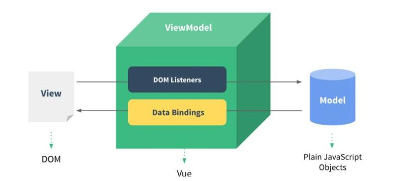
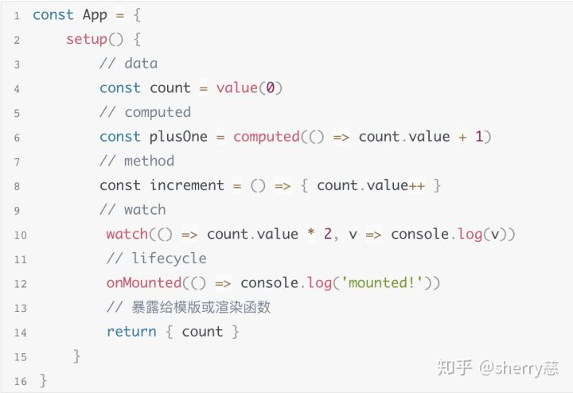

# Vue


## vue生命周期

### vue2生命周期


| API             | 描述                                             |
| --------------- | ------------------------------------------------ |
| `beforeCreate`  | 此时数据data和事件方法methods还未绑定到app对象上 |
| `created`       | 此时数据data和事件方法methods绑定到app对象上     |
| `beforeMount`   | 渲染之前，根据数据生成的DOM对象是获取不到的      |
| `mounted`       | 渲染之后，数据生成的DOM对象能获取到              |
| `beforeUpdate`  | 数据更改，但内容为更改之前                       |
| `updated`       | 内容已更改完毕                                   |
| `beforeDestroy` | 应用销毁之前                                     |
| `destroyed`     | 应用销毁之后                                     |


### **vue3生命周期**钩子

| API               | 描述                                                         |
| ----------------- | ------------------------------------------------------------ |
| `beforeCreate`    | 在实例初始化之后，数据观测和event/watch事件配置之前          |
| `created`         | 在实例创建完成之后。数据观测，property和方法的运算，watch/event事件回调完成。挂载阶段未开始，`$el` property 尚不可用。 |
| `beforeMount`     | 在挂载开始之前，`render`函数首次调用                         |
| `mounted`         | 实例被挂载后，这时`app.mount`被新创建的`vm.$el`替换。如果希望等到整个视图都渲染完毕，可以在`mounted`内部使用vm.$nextTick() |
| `beforeUpdate`    | 数据更新时，发生在虚拟DOM打补丁之前。适合在更新前访问现有的DOM，比如手动移除已添加的事件监听器。 |
| `updated`         | 数据更改导致虚拟DOM重新渲染和打补丁之后。组件DOM已经更新，可以执行依赖于DOM的操作。**不会**保证所有子组件都一起被重绘。如果希望等到整个视图都重绘完毕，可以在`update`内部使用vm.$nextTick() |
| `beforeUnmount`   | 在卸载组件实例之前。在此阶段，实例仍然是正常的。             |
| `unmounted`       | 卸载组件实例后。组件实例的所有指令都被解除绑定，所有事件侦听器都被移除，所有子组件实例被卸载。 |
| `errorCaptured`   | 当捕获一个来自子孙组件的错误时。收到3个参数：错误对象、发生错误的组件实例和一个包含错误来源信息的字符串。返回`false`可以阻止错误继续向上传播。 |
| `renderTracked`   | 跟踪虚拟DOM重新渲染时。接收`debugger event`作为参数，告诉你哪个操作跟踪了组件以及该操作的目标对象和键。 |
| `renderTriggered` | 当虚拟DOM重新渲染被触发时。接收`debugger event`作为参数，告诉你是什么操作触发了重新渲染，以及该操作的目标对象和键。 |
| activated         | 被`keep-alive`缓存的组件激活时调用                           |
| deactivated       | 被`keep-alive`缓存的组件停用时调用。                         |


## vue 双向数据绑定

`v-model`是 vue 中最常用的用于双向数据绑定的指令。

双向数据绑定指的是视图和数据的双向绑定：视图的更新触发所需数据的改变，而数据的改变触发依赖它的视图的重新渲染。

### MVVM

在更抽象的层面上，可以用 MVVM 模型来描述双向数据绑定：



在 MVVM 模型中，视图（View）代表了 DOM 元素的集合；模型（Model）代表了 JS 对象的集合（这些 JS 对象也是我们数据的来源）；而 视图模型（ViewModel）在 Vue 框架中，代表了 Vue 框架的一些中间处理逻辑。

1. 从视图到模型，是通过 DOM Listeners，通俗地说，是依靠 DOM 事件。 

   在 DOM 元素上绑定事件处理函数。当用户操作 DOM 元素并改变视图（比如 改变了输入框的输入内容），会触发事件，JS 会调用事件处理函数。

   在事件处理函数中，可以根据用户的操作改变模型中所需的 JS 对象（数据）。

2. 从模型到视图，是通过 Data Bindings，大致上说，这条线就是 【响应式数据】 干的活了。

   DOM 元素将某些属性与模型中的某个 JS 对象（数据）进行绑定，由于这些数据都是 【响应式】的，因此当数据改变时，DOM元素的属性也会响应改变。

   **如此，DOM 元素是不是就【依赖】于某个数据了。可以有很多不同的 DOM 元素都依赖于同一个数据（或者其属性），因此数据要进行【依赖收集】(depend)。而当数据改变时，它要通知（notify）依赖它的所有依赖项进行重新渲染。**

   这就是响应式的大致思路了。


可以用Vue的其他指令实现一个简单的数据双向绑定例子，供参考：

```javascript
<input v-bind:value = "value" @input="changeValue">
  
  
export default {
	data(){
    return {
      value: ""
    }
  },
  methods:{
    changeValue(event){
      this.value = event.target.value
    }
  }
}
```

- `input`事件和`changeValue`事件处理函数，作为视图到模型的桥梁
- 通过`v-bind`将输入框的`value`属性和Vue实例的`value`数据绑定，作为模型到视图的桥梁。（注意，在Vue实例的data选项定义的数据都会被自动转换为【响应式】）


### Vue2 响应式

<a href="https://cn.vuejs.org/v2/guide/reactivity.html">官网链接</a>

vue2 响应式原理是通过 **数据劫持** 结合 **发布订阅模式**的方式来实现的。

数据劫持的核心方法就是使用`Object.defineProperty`把数据的每个属性添加`getter/setter`。

- DOM 元素将属性绑定数据时，必然会先获取一次数据的值作为属性的初始值——这样就会触发数据的`getter`。别忘了还要【收集依赖】。（”你的属性是依赖我的？好的，我记一下。待会我变了会通知你“）
- 而在数据发生改变时，会触发其`setter`，并对每个依赖项进行通知。（对每个记过的人：”我变了，告诉你一下，你要重新渲染了“）

为什么说这是 **发布订阅模式** 呢？

这些依赖项（DOM 元素）就像数据的订阅者，一旦数据改变，就会被通知，并进行重新渲染。

但是怎么记录这些依赖项呢？其实是用以下的`Watcher`去记录DOM元素是如何渲染的（**渲染函数**），并不关心真正对应的是哪个DOM元素。因为可以根据渲染函数去重新构建这个DOM元素（Vue中使用虚拟DOM节点）。（怎么在拿到数据的新值以后，重新渲染相应的DOM元素）。

以下的`Dep`更像是个中间人，记录一个数据的所有依赖项（订阅者）。数据变化时，首先被`Observer`通知”数据变化了“，然后通知记录过的每个依赖项”数据变化了“。（然后`Watcher`自己调用自己的渲染函数，决定怎么更新视图）

以下的`Observer`则是一道数据的监视器和拦截器。在此进行数据劫持的相关操作，以便在`getter`触发时通知`Dep`进行【依赖收集】，在`setter`触发时通知`Dep`数据变化。

总结来说，以 发布订阅模式 来说，数据是 subject，视图是 subscriber，有个`Dep`对象充当中间人。


#### Observer:	

```javascript
function defineReactive(data, key, val) {
    observe(val); // 递归遍历所有子属性
    var dep = new Dep(); 
    Object.defineProperty(data, key, {
        enumerable: true,
        configurable: true,
        get: function() {
            if (Dep.target) {.  // 判断是否需要添加订阅者
                dep.addSub(Dep.target); // 在这里添加一个订阅者
            }
            return val;
        },
        set: function(newVal) {
            if (val === newVal) {
                return;
            }
            val = newVal;
            console.log('属性' + key + '已经被监听了，现在值为：“' + newVal.toString() + '”');
            dep.notify(); // 如果数据变化，通知所有订阅者
        }
    });
}
Dep.target = null;

function Dep () {
    this.subs = [];
}
Dep.prototype = {
    addSub: function(sub) {
        this.subs.push(sub);
    },
    notify: function() {
        this.subs.forEach(function(sub) {
            sub.update();
        });
    }
};
```

#### watcher: 

生成时加入到dep数组里

```javascript
function Watcher(vm, exp, cb) {
    this.cb = cb;
    this.vm = vm;
    this.exp = exp;
    this.value = this.get();  // 将自己添加到订阅器的操作
}
 
Watcher.prototype = {
    update: function() {
        this.run();
    },
    run: function() {
        var value = this.vm.data[this.exp];
        var oldVal = this.value;
        if (value !== oldVal) {
            this.value = value;
            this.cb.call(this.vm, value, oldVal);
        }
    },
    get: function() {
        Dep.target = this;  // 缓存自己
        var value = this.vm.data[this.exp]  // 强制执行监听器里的get函数
        Dep.target = null;  // 释放自己
        return value;
    }
};
```

#### observer和watcher连接起来

```javascript
function SelfVue (data, el, exp) {
    this.data = data;
    observe(data);
    el.innerHTML = this.data[exp];  // 初始化模板数据的值
    new Watcher(this, exp, function (value) {
        el.innerHTML = value;
    });
    return this;
}
```


## Vue3 响应式

<a href="https://v3.cn.vuejs.org/guide/reactivity.html">官方链接</a>

Vue3 的响应式原理和 vue2 不同，使用了 ES6的`Proxy`对象代替`Object.defineProperty()`方法。

`Proxy`对象本质上也是对源数据的一层代理，可以拦截对源数据的任何交互。其中也可以设置`getter`和`setter`拦截器。

只不过，`Proxy`对象是对整个源数据的代理，对源数据任何属性的交互都会被代理对象拦截到！这样就不用以前那样遍历源数据的所有属性并对每个属性调用`Object.defineProperty()`了！

响应式的核心思想并没有变，详情参考官方链接。


## vue父子组件通信

#### **父向子：props**

子组件在props中添加一个属性，比如 `myproducts`，用于接收数据。

```javascript
props: {
	myproducts: Array,
}
```

在父组件中，比如要传的数据变量名为`products`。

父组件引入的子组件上，用`v-bind:myproducts="products"`，将父组件要传的变量和子组件的prop绑定。

接下来，在子组件可以使用该prop接收到的数据进行操作。

#### **子向父：$emit**事件

在子组件中，调用this.$emit(<子方法名>, 要传递的变量)，比如`this.$emit("childFunc", this.message);`

在父组件中，定义一个父方法，比如`parentFunc`。用于接收子组件传来的数据。

在父组件引入的子组件上，用`v-bind:childFunc = "parentFunc"`将父方法与子方法绑定。

接下来，当子组件调用this.$emit()时，数据传入到父方法的参数列表中。


## vue兄弟组件通信

通过vue全局事件。

首先在main.js中定义一个全局事件对象并绑定在Vue原型的$bus属性上。

```javascript
Vue.prototype.$bus = new Vue();
```

发送方组件：发起一个全局事件 this.$bus.$emit(<事件名>, 数据)，比如`this.$bus.$emit("message", this.message);`

接收方组件：接收这个全局事件，事件名保持一致 `this.$bus.$on("message", function(message){ ... } )`


## vue路由管理

Vue-router 实例，一个路由引入对应的一个组件。这里用了异步引入的方法。

```javascript
export const router = new Router({
	routes: [
		{
			path: '/login',
			name: 'login',
			component: () => import('@/components/Login')
		},
		{
			path: '/register',
			name: 'register',
			component: () => import('@/components/Login')
		},
		{
			path: '/home',
			name: 'home',
			component: () => import('@/components/Home'),
			meta: {
				requireAuth: true,  // 添加该字段，表示进入这个路由是需要登录的
			},
		},
	]
})
```


vue router 分为两个模式：hash 和 history

### hash模式

利用`window.location.hash`。url的hash值（url中会出现`#`，`#`表示网页的一个位置，其后面的字符，就是该位置的标识符）发生变化时，根据这个值渲染绑定这个路由的组件。被称为前端路由，

- 路由跳转并不会真的向服务器发送请求。因为`#`后面的值不会发送到服务器，所以hash值改变不会触发浏览器发送请求。

  比如说访问`http://www.mywebsite.com/#`。第一次会发送请求到服务器，请求的url为`http://www.mywebsite.com/`（这是不可避免的），通常后端在处理路由`/`会返回`index.html`。

  而在后续跳转到其他路由，只是修改`#`以后的值，因为如果发送请求，请求url依然是`http://www.mywebsite.com/`，所以并不会服务器发送请求。

- 页面跳转是通过修改`window.location.href`的值。

- 页面跳转事件是监听window的`onhashchange`事件，在事件处理函数中渲染路由对应的组件。


### history模式

利用了HTML5中全新升级的 History API，处理浏览器的历史记录。

- 因为没再使用hash值，所以url没有了`#`。而相对应的，每次改变了路由是真实改变了请求的url，所以都会向服务器请求url。如果服务器没有对该url的处理，那就会报 404 咯。
  - 当然，可以现在nginx上配置 try_file 属性，让 nginx 在处理url的时候，可以试一试转发到其他路由，比如默认的`/index.html`。从而让服务器处理url有个兜底`index.html`
- 路由前进调用`history.pushState()`，路由后退调用`history.popState()`。
- 页面跳转事件是监听window的`onpopstate`事件，在事件处理函数中渲染路由对应的组件。

`pushState()`接收3个参数：stateObject、title 和 url。

- 改变的stateObject 通过 history.state 来访问。
- `title` 用于跳转后的页面标签页的 title。
- `url`是要跳转到的 url。

**优势**：

1. history模式能修改到同域名下的url，而不是仅仅修改`#`后的hash值。可以跳转的url更多。比如可以从`http://www.mywebsite.com/list`跳转到`http://www.mywebsite.com/video`。（存疑，因为改变hash值其实也能满足跳转到router实例里规定的所有路由，你还想跳转到哪些url？）

2. `pushState()`设置的新URL可以与当前URL一模一样，这样也会把记录添加到栈中；而hash设置的新值必须与原来不一样才会触发动作将记录添加到栈中；
3. `pushState()`通过stateObject参数可以添加任意类型的数据到记录中；而hash只可添加短字符串；
4. `pushState()`可额外设置title属性供后续使用。


## vuex状态管理


页面中模版获取state数据渲染页面，用户通过action改变数据导致页面重新渲染。

`state`：存放全局状态

`mutations`：对state成员进行操作，其中的方法用this.$store.commit(<方法名>，数据)调用。

`getters`：加工state成员并向外界传递

`action`：异步操作

`modules`：模块化状态管理

### state

在mutations的方法中，为配合Vue的响应式数据，应该：

Vue.set添加或设置某个成员的值

```javascript
Vue.set(state,"age",15)
```

Vue.delete删除成员

```javascript
Vue.delete(state,'age')
```

### mutations

包含了同步函数。

index.js

```javascript
import Vue from 'vue'
import Vuex from 'vuex'

Vue.use(Vuex)

const store = new Vuex.store({
    state:{
        name:'helloVueX'
    },
    mutations:{
        //es6语法，等同edit:funcion(){...}
        edit(state，payload){
            state.name = 'jack'
        }
    }
})

export default store
```

在组件中，调用mutations中的方法：

```javascript
this.$store.commit('edit')
```

### getters

```javascript
getters:{
    nameInfo(state){
        return "姓名:"+state.name
    },
    fullInfo(state,getters){
        return getters.nameInfo+'年龄:'+state.age
    }  
}
```

在组件中，调用getters中的方法得到加工state成员后的返回值：

```javascript
this.$store.getters.fullInfo
```

### actions

包含了异步函数。

`Actions`中的方法有两个默认参数

- `context` 上下文(相当于箭头函数中的this)对象
- `payload` 挂载参数

```javascript
actions:{
    aEdit(context,payload){
        return new Promise((resolve,reject)=>{
            setTimeout(()=>{
                context.commit('edit',payload)
                resolve()
            },2000)
        })
    }
}
```

在组件中，调用actions中的方法：

```javascript
this.$store.dispatch('aEdit',{age:15})
```

### modules

将store分割成许多模块（module），每个模块拥有自己的state, mutations, actions, getter

```javascript
modules:{
    a:{
        state:{},
        getters:{},
        ....
    }
}
```

在组件中，调用模块a的状态：

```javascript
this.$store.state.a
```


## vue3.0和2.0的区别

1. ##### 压缩包体积更小

   当前最小化并被压缩的 Vue 运行时大小约为 20kB（2.6.10 版为 22.8kB）。Vue 3.0捆绑包的大小大约会减少一半，即只有10kB

2. ##### Object.defineProperty -> Proxy

   Vue2.0响应式原理

   - 响应化过程需要遍历data，props等，消耗较大
   - 不支持Set/Map、class、数组等类型
   - 新加或删除属性无法监听
   - 数组响应化需要额外实现
   - 对应的修改语法有限制

   Vue3.0响应式原理：使用ES6的Proxy来解决这些问题。

   - 在目标对象之上架了一层代理，代理的是对象而不是对象的属性，颗粒度变大。

3. ##### Virtual DOM 重构

   vdom的本质是一个抽象层，用javascript描述界面渲染成什么样子。react用jsx，没办法检测出可以优化的动态代码，所以做时间分片，<u>vue中足够快的话可以不用时间分片</u>。

   **传统vdom的性能瓶颈：**

   - 虽然 Vue 能够保证触发更新的组件最小化，但在单个组件内部依然需要遍历该组件的整个 vdom 树。
   - 传统 vdom 的性能跟模版大小正相关，跟动态节点的数量无关。在一些组件整个模版内只有少量动态节点的情况下，这些遍历都是性能的浪费。
   - JSX 和手写的 render function 是完全动态的，过度的灵活性导致运行时可以用于优化的信息不足

   **那为什么不直接抛弃vdom呢？**

   - 高级场景下手写 render function 获得更强的表达力
   - 生成的代码更简洁
   - 兼容2.x

   <u>vue的特点是底层为Virtual DOM，上层包含有大量静态信息的模版</u>。为了兼容手写 render function，最大化利用模版静态信息，vue3.0采用了<u>动静结合</u>的解决方案，将vdom的操作颗粒度变小，每次触发更新不再以组件为单位进行遍历，主要更改如下

   - 将模版基于动态节点指令切割为嵌套的区块
   - 每个区块内部的节点结构是固定的
   - 每个区块只需要以一个 Array 追踪自身包含的动态节点

   **vue3.0将 vdom 更新性能由与模版整体大小相关提升为与动态内容的数量相关**

4. ##### 选用Function_based API

   

   1、vue3.0将组件的逻辑都写在了函数内部，setup()会取代vue2.x的data()函数，返回一个对象，暴露给模板，而且只在初始化的时候调用一次，因为值可以被跟踪。

   2、新的函数api：const count = value(0)

   3、计算属性返回的也是这个值的包装。

   4、onMounted生命周期函数直接注入。

   **Function-based API 对比Class-based API有以下优点**

   1，**<u>对typescript更加友好</u>**，typescript对函数的参数和返回值都非常好，写Function-based API既是javascript又是typescript，不需要任何的类型声明，typescript可以自己做类型推导。

   2，静态的import和export是treeshaking的前提，Function-based API中的方法都是从全局的vue中import进来的。

   3，函数内部的变量名和函数名都可以被压缩为单个字母，但是对象和类的属性和方法名默认不被压缩（为了防止引用出错）。

   4，更灵活的逻辑复用。

   目前如果我们要在组件之间共享一些代码，则有两个可用的选择：mixins 和作用域插槽（ scoped slots），但是它们都存在一些缺陷：

   1，mixins 的最大缺点在于我们对它实际上添加到组件中的行为一无所知。这不仅使代码变得难以理解，而且还可能导致名称与现有属性和函数发生冲突。

   2，通过使用作用域插槽，我们确切地知道可以通过 v-slot 属性访问了哪些属性，因此代码更容易理解。这种方法的缺点是我们只能在模板中访问它，并且只能在组件作用域内使用。

   高阶组件在vue中比较少，在react中引入是作为mixins的替代品，但是比mixins更糟糕，高阶组件可以将多个组件进行包装，子组件通过props接收数据，多个高阶组件一起使用，不知道数据来自哪个高阶组件，存在命名空间的冲突。而且高阶组件嵌套得越多，额外的组件实例就越多，造成性能损耗。


## Vue 2 全局API

### Vue.extend

创建一个“子类”。参数是一个包含组件选项的对象。

```javascript
// 创建构造器
var Profile = Vue.extend({
  template: '<p>{{firstName}} {{lastName}} aka {{alias}}</p>',
  data: function () {
    return {
      firstName: 'Walter',
      lastName: 'White',
      alias: 'Heisenberg'
    }
  }
})
// 创建 Profile 实例，并挂载到一个元素上。
new Profile().$mount('#mount-point')
```

### Vue.nextTick

`Vue.nextTick([callback, context])`

在下次DOM更新循环结束之后执行延迟回调。在修改数据之后立即使用这个方法，获取更新后的DOM。

```javascript
// 修改数据
vm.msg = "hello"
// DOM还没有更新
Vue.nextTick(function(){
	//DOM 更新了
})

// 作为一个Promise使用
Vue.nextTick()
	.then(function(){
		// DOM更新了
	})
```

### Vue.set

`Vue.set(target, propertyName/index, value)`

向响应式对象中添加一个property，并确保这个新property同样是响应式的，且触发视图更新。

### Vue.delete

`Vue.delete(target,propertyName/index)`

删除对象的property。如果对象是响应式的，确保删除能触发更新视图。

### Vue.directive

`Vue.directive(id, [definition])`

注册或获取<u>全局指令</u>。

### Vue.filter

`Vue.filter(id, [definition])`

注册或获取全局过滤器。

### Vue.component

`Vue.component(id, [definition])`

注册或获取<u>全局组件</u>。注册还会自动使用给定的`id`设置组件名称。

```javascript
// 注册组件，传入一个扩展过的构造器
Vue.component('my-component', Vue.extend({ /* ... */ }))

// 注册组件，传入一个选项对象 (自动调用 Vue.extend)
Vue.component('my-component', { /* ... */ })

// 获取注册的组件 (始终返回构造器)
var MyComponent = Vue.component('my-component')
```

### Vue.use

`Vue.use(plugin)`

安装Vue.js插件。如果插件是一个对象，必须提供`install`方法。如果插件是一个函数，它会被作为install方法。install方法调用时，会将Vue作为参数传入。

- 需要在调用 new Vue() 之前被调用。

### Vue.mixin

`Vue.mixin(mixin)`

全局注册一个混入，影响注册之后所有创建的Vue实例。可以使用混入，向组件注入自定义行为。

### Vue.compile

`Vue.compile(template)`

将一个模板字符串编译成 render 函数。

```javascript
var res = Vue.compile('<div><span>{{ msg }}</span></div>')

new Vue({
  data: {
    msg: 'hello'
  },
  render: res.render,
  staticRenderFns: res.staticRenderFns
})
```

### Vue.observable

`Vue.observable(object)`

让一个对象可响应。**Vue内部用它来处理`data`函数返回的对象。**

返回的对象可以直接用于<u>渲染函数</u>和<u>计算属性</u>内，并且会在发生变更时触发响应的更新。

```javascript
const state = Vue.observable({ count: 0 })

const Demo = {
  render(h) {
    return h('button', {
      on: { click: () => { state.count++ }}
    }, `count is: ${state.count}`)
  }
}
```

### Vue.version属性

提供字符串形式的Vue安装版本号。


## Vue 2 选项与数据

### data

Vue 实例的数据对象。

Vue 会递归地把 data 的 property 转换为 getter/setter，从而让 data 的 property 能够响应数据变化。

实例创建后，通过`vm.$data`访问原始数据对象。Vue 实例代理了 data 对象上所有 property，因此访问`vm.a`等价于访问`vm.$data.a`。

#### 为什么data是函数

当一个**组件**被定义，`data` 必须声明为返回一个初始数据对象的函数。

因为组件可能被用来创建**多个实例**。如果 `data` 仍然是一个纯粹的对象，则所有的实例将**共享引用**同一个数据对象！

通过提供 `data` 函数，每次创建一个新实例后，我们能够调用 `data` 函数，从而返回初始数据的一个全新副本数据对象。


### props

用于从父组件接收数据或对象。

接收的对象可以有如下选项：

- `type`：类型检查。可以是`String`、`Number`、`Boolean`、`Array`、`Object`、`Date`、`Function`、`Symbol`。
- `default`：默认值。如果该 prop 没有被传入，则使用这个值。
- `required`：是否是必填项。
- `validator`：自定义验证函数。会将该 prop 的值作为唯一的参数代入。

```javascript
// 简单语法
Vue.component('props-demo-simple', {
  props: ['size', 'myMessage']
})

// 对象语法 
Vue.component('props-demo-advanced', {
  props: {
    // 检测类型
    height: Number,
    // 检测类型 + 其他验证
    age: {
      type: Number,
      default: 0,
      required: true,
      validator: function (value) {
        return value >= 0
      }
    }
  }
})
```


### computed（计算属性）

计算属性会被混入到组件实例中，所有的 gette r和 setter 的`this`上下文绑定为组件实例。

如果使用箭头函数，则`this`不会指向组件实例，但实例会作为函数的第一个参数。

- 计算属性的结果会被**缓存**，只有当依赖的响应式 property 变化时才会重新计算。

```javascript
computed: {
    // 仅读取
    aDouble() {
      return this.a * 2
    },
    // 读取和设置
    aPlus: {
      get() {
        return this.a + 1
      },
      set(v) {
        this.a = v - 1
      }
    }
  }
```


### methods

methods 会被混入到组件实例中。可以通过 VM 实例来访问。方法中的`this`绑定为组件实例。

- 不应该使用箭头函数来定义 method 函数，因为箭头函数的`this`绑定了父级作用域的上下文，而非组件实例。如`this.a`将是undefined。

```javascript
methods: {
    plus() {
      this.a++
    }
  }
```


### watch

一个对象，键是要侦听的响应式  property ——包含 data 或 计算属性 中的property，值是对应的回调函数。

组件实例会在实例化时调用`$watch`。

- 不应该使用箭头函数定义 watcher 函数。

```javascript
watch: {
	a(val, oldVal){
		console.log(`new: ${val}, old: ${oldVal}`);
	},
	// 监听对象b的任何属性的改变，无论嵌套多深（深层监听）
	b:{
		handler(val, oldVal){
			console.log('c changed');
		},
		deep:true
	}
}
```


## Vue 2 指令

### v-text

更新元素的`textContent`。

```vue
<span v-text="msg"></span>
```

更新部分的`textContent`，使用插值`{{}}`

```vue
<span>{{msg}}</span>
```


### v-html

更新元素的`innerHTML`。

- 容易受到 XSS攻击。

```vue
<div v-html="html"></div>
```


### v-show

根据表达式的真假值，切换元素的CSS样式：`display`。条件变化时触发过渡效果。


### v-if

条件渲染元素。在切换时元素及它的数据绑定/组件**被销毁并重建**。条件变化时触发过渡效果。

### v-else

条件渲染。限制：前一兄弟元素必须有`v-if`或`v-else-if`。

### v-else-if

条件渲染。限制：前一兄弟元素必须有`v-if`或`v-else-if`。


### v-for

基于源数据多次渲染元素或模板。

- 值使用特定语法：`alias in expression`，为当前遍历的元素提供别名。

```vue
<div v-for="item in items">
  {{ item.text }}
</div>
```

- 默认尝试原地修改元素。使用`key`属性强制重新排序元素：

```vue
<div v-for="item in items" :key="item.id">
	{{ item.text }}
</div>
```


### v-on

绑定事件监听器。缩写为`@`。

用在普通元素上时，只能监听**原生DOM事件**。用在自定义元素组件上时，也可以监听子组件触发的**自定义事件**。

可以传入一个`$event`对象表示事件对象：`v-on:click="handle('ok',$event)"`。

```vue
<!-- 方法处理器 -->
<button v-on:click="doThis"></button>

<!-- 动态事件 (2.6.0+) -->
<button v-on:[event]="doThis"></button>

<!-- 内联语句 -->
<button v-on:click="doThat('hello', $event)"></button>
```


### v-bind

动态绑定一或多个属性，或一个组件 prop 到表达式。缩写为`:`。

- 绑定DOM的attribute属性

```vue
<!-- 绑定一个 attribute -->

```

- 可以绑定`class`或`style`属性。

```vue
<!-- class 绑定 -->
<div :class="{ red: isRed }"></div>
<div :class="[classA, classB]"></div>
<div :class="[classA, { classB: isB, classC: isC }]">

<!-- style 绑定 -->
<div :style="{ fontSize: size + 'px' }"></div>
<div :style="[styleObjectA, styleObjectB]"></div>
```

- 绑定prop

```vue
<!-- prop 绑定。“prop”必须在 my-component 中声明。-->
<my-component :prop="someThing"></my-component>
```

- 传递数据给子元素

```javascript
<!-- 通过 $props 将父组件的 props 一起传给子组件 -->
<child-component v-bind="$props"></child-component>
```


### v-model

在表单控件或组件上创建双向绑定。


### v-slot

提供具名插槽或需要接收prop的插槽。缩写为`#`。


### v-pre

跳过这个元素和它的子元素的编译过程。可以用来显示原始Mustache标签（插值）。跳过大量没有指令的节点会加快编译。

```vue
<span v-pre>{{ this will not be compiled }}</span>
```


### v-cloak

保持在元素上直到关联实例结束编译。和CSS规则如`[v-cloak] { display: none }`一起用时，可以隐藏未编译的Mustache标签（插值）直到实例准备完毕。

```css
[v-cloak] {
  display: none;
}
```

```html
<div v-cloak>
  {{ message }}
</div>
```


### v-once

只渲染元素和组件**一次**。用于优化性能。

```vue
<!-- 单个元素 -->
<span v-once>This will never change: {{msg}}</span>
```


## Vue 2 特殊属性

### is属性

用于 动态组件。

```vue
<component :is="currentView"></component
```

特殊用法：如果想用Vue组件替换原生DOM对象，加上前缀`vue`：

```vue
<table>
	<tr is="vue:my-row-component"></tr>
</table>
```


### ref属性

用于在DOM元素或组件上注册一个引用。随后可以在父组件的$refs上访问。

- 非响应式的

```vue
<p ref="p">hello</p>
<child-component ref="child"></child-component>
// 当动态绑定ref时，可以把ref定义为一个回调函数，显式传递元素或组件
<child-component :ref="(el)=>child=el"></child-component>
```


### key属性

在区分一组旧节点和新节点时，用于标识虚拟DOM中的VNode。如果有key，会基于key来重新排序元素。

拥有同一个父元素的子元素们必须有各自唯一的key。重复的key会导致渲染错误。

- 最常见的用法是在`v-for`中

```vue
<ul>
    <li v-for="item in items" :key="item.id">...</li>
</ul>
```


### slot

用于一个组件的占位符。

```vue
// 在组件 comp-a 中
<ul>
    <slot></slot>
</ul>

// 在引入它的父组件中
<comp-a>
	<h1>hello world</h1>
</comp-a>

// 相当于
<ul>
    <h1>hello world</h1>
</ul>
```

插入到组件中的html内容会被填充到`slot`的位置。

- `slot`可以有一个名字属性，在父组件中使用`v-slot:${name}`来指定替换匹配名字的`slot`，不写名字默认为default。（**具名插槽**）

```vue
// 在组件comp-a中
<div>
    <header>
        <slot name="header"></slot>
    </header>
    <main>
    	<slot></slot>
    </main>
    <footer>
    	<slot name="footer"></slot>
    </footer>
</div>
//在父组件中
<comp-a>
	<template v-slot:header>
		Header content	//这部分填充到名为header的slot中
    </template>
    	Default slot content //这部分默认填充到默认slot中
    <template v-slot:footer>
		Footer content //这部分填充到名为footer的slot中
    </template>
</comp-a>
```

- 可以把子组件的值传给`slot`，在父组件中用`v-slot:${name}`的值来接收：

```vue
// 在组件 comp-a 中
<ul>
    <slot :users="users"></slot>
</ul>

// 在引入它的父组件中
<comp-a>
    <template v-slot:default="users">
		<li v-for="user in users" :key="user.id">...</li>
    </template>
</comp-a>
```


## Vue 2 内置组件

### keep-alive属性

- include：只有匹配的组件会被缓存。
- exclude：所有组件除了匹配的组件会被缓存。
- max：缓存的组件的最大数量。

当包住一个动态组件时，`keep-alive`会缓存组件实例而不会销毁他们。

`keep-alive`是抽象组件，不会渲染成一个DOM元素。

当被包在`keep-alive`中的组件切换时，它的`actviated`和`deactivated`生命周期钩子会被调用。（替代了`mounted`和`unmounted`）。

- 用于保存组件状态和避免重新渲染。

```vue
<keep-alive>
	<component :is="view"></component>
</keep-alive>

<keep-alive>
	<comp-a v-if="a > 1"></comp-a>
    <comp-b v-else></comp-b>
</keep-alive>
```

- `include`和`exclude`会先检查组件的`name`属性，如果不存在则检查它在父组件里的`key`。匿名组件不会被匹配到。

```vue
<!-- comma-delimited string -->
<keep-alive include="a,b">
  <component :is="view"></component>
</keep-alive>

<!-- regex (use `v-bind`) -->
<keep-alive :include="/a|b/">
  <component :is="view"></component>
</keep-alive>

<!-- Array (use `v-bind`) -->
<keep-alive :include="['a', 'b']">
  <component :is="view"></component>
</keep-alive>
```

- `max`会在缓存的数量达到以后，最未被访问的组件实例会被销毁，随后创建新的实例。

- **注意**：`keep-alive`对函数组件不起作用，因为它们没有实例。


### transition

作为<u>单个</u>元素/组件的过渡效果。

```vue
<!-- 简单元素 -->
<transition>
  <div v-if="ok">toggled content</div>
</transition>

<!-- 动态组件 -->
<transition name="fade" mode="out-in" appear>
  <component :is="view"></component>
</transition>

<!-- 事件钩子 -->
<div id="transition-demo">
  <transition @after-enter="transitionComplete">
    <div v-show="ok">toggled content</div>
  </transition>
</div>
```


### transition-group

作为多个元素/组件的过渡效果

```vue
<transition-group tag="ul" name="slide">
  <li v-for="item in items" :key="item.id">
    {{ item.text }}
  </li>
</transition-group>
```


## Vue 2 重要用法

### 自定义指令

- 注册全局自定义指令

```javascript
Vue.directive('foucs',{
	inserted: function(el){
		el.focus()
	}
})
```

- 注册局部指令，组件中`directives`选项

```javascript
directives: {
	focus:{
		inserted: function(el){
			el.focus()
		}
	}
}
```

- 使用自定义指令 `v-xxx`

```javascript
<input v-focus>
```

#### 钩子函数

- bind：只调用一次，指令第一次绑定到元素时调用。
- inserted：被绑定元素插入父节点时调用。（仅保证父节点存在，但不一定已被插入文档中）
- update：所在组件的VNode更新时调用，但是可能发生在其子VNode更新之前。
- componentUpdated：指令所在组件的VNode及其子Node全部更新后调用。
- unbind：只调用一次，指令与元素解绑时调用。


### 过滤器

可以用于 双花括号插值 和 `v-bind`表达式。过滤器应该被添加在JS表达式尾部，由“管道”符号指示，如下例中，`capitalize`和`formatId`为过滤器：

```javascript
<!-- 在双花括号中 -->
{{ message | capitalize }}

<!-- 在 `v-bind` 中 -->
<div v-bind:id="rawId | formatId"></div>
```

- 定义全局自定义过滤器

```javascript
Vue.filter('capitalize', function (value) {
  if (!value) return ''
  value = value.toString()
  return value.charAt(0).toUpperCase() + value.slice(1)
})

new Vue({
  // ...
})
```

- 定义局部过滤器，组件的`filters`选项

```javascript
filters: {
  capitalize: function (value) {
    if (!value) return ''
    value = value.toString()
    return value.charAt(0).toUpperCase() + value.slice(1)
  }
}
```


## Vue 3 选项

### data

- 类型：`Function`

- 返回组件实例的 data 对象。Vue在创建新组件实例时会调用此函数，然后通过响应性系统把返回的对象包裹起来，并以`$data`的形式存储在组件实例中。

#### 为什么data是函数

- 当一个**组件**被定义，`data` 必须声明为返回一个初始数据对象的函数。

  因为组件可能被用来创建**多个实例**。如果 `data` 仍然是一个纯粹的对象，则所有的实例将**共享引用**同一个数据对象！

  通过提供 `data` 函数，每次创建一个新实例后，我们能够调用 `data` 函数，从而返回初始数据的一个全新副本数据对象。


### props

用于从父组件接收数据或对象。

接收的对象可以有如下选项：

- `type`：类型检查。可以是`String`、`Number`、`Boolean`、`Array`、`Object`、`Date`、`Function`、`Symbol`。
- `default`：默认值。如果该 prop 没有被传入，则使用这个值。
- `required`：是否是必填项。
- `validator`：自定义验证函数。会将该 prop 的值作为唯一的参数代入。

```javascript
// 简单语法
props: ['size', 'myMessage']

// 对象语法 
props: {
    // 类型检查
    height: Number,
    // 类型检查 + 其他验证
    age: {
      type: Number,
      default: 0,
      required: true,
      validator: value => {
        return value >= 0
      }
    }
  }
```


### computed（计算属性）

计算属性会被混入到组件实例中，所有的 gette r和 setter 的`this`上下文绑定为组件实例。

如果使用箭头函数，则`this`不会指向组件实例，但实例会作为函数的第一个参数。

- 计算属性的结果会被**缓存**，只有当依赖的响应式 property 变化时才会重新计算。

```javascript
computed: {
    // 仅读取
    aDouble() {
      return this.a * 2
    },
    // 读取和设置
    aPlus: {
      get() {
        return this.a + 1
      },
      set(v) {
        this.a = v - 1
      }
    }
  }
```


### methods

methods 会被混入到组件实例中。可以通过 VM 实例来访问。方法中的`this`绑定为组件实例。

- 不应该使用箭头函数来定义 method 函数，因为箭头函数的`this`绑定了父级作用域的上下文，而非组件实例。如`this.a`将是undefined。

```javascript
methods: {
    plus() {
      this.a++
    }
  }
```


### watch

一个对象，键是要侦听的响应式  property ——包含 data 或 计算属性 中的property，值是对应的回调函数。

组件实例会在实例化时调用`$watch`。

- 不应该使用箭头函数定义 watcher 函数。

```javascript
watch: {
	a(val, oldVal){
		console.log(`new: ${val}, old: ${oldVal}`);
	},
	// 监听对象b的任何属性的改变，无论嵌套多深（深层监听）
	b:{
		handler(val, oldVal){
			console.log('c changed');
		},
		deep:true
	}
}
```


### 组件的emits选项

可以是数组或对象，从组件触发自定义事件。

如果是对象，每个property 的值可以是null 或验证函数。验证函数将接收传递给`$emit`调用的其他参数。如`this.$emit('foo',1)`被调用，`foo`的响应验证函数将接收参数`1`返回布尔值，表示事件参数是否有效。

```javascript
emits: {
    // 没有验证函数
    click: null,

    // 带有验证函数
    submit: payload => {
      if (payload.email && payload.password) {
        return true
      } else {
        console.warn(`Invalid submit event payload!`)
        return false
      }
    }
  }
```


## VUE2.x源码

### 数据驱动


### 组件化


### 响应式原理

#### 响应式对象

##### Object.defineProperty

`Object.defineProperty` 方法会直接在一个对象上定义一个新属性，或者修改一个对象的现有属性， 并返回这个对象，先来看一下它的语法：

```js
Object.defineProperty(obj, prop, descriptor)
```

`obj` 是要在其上定义属性的对象；`prop` 是要定义或修改的属性的名称；`descriptor` 是将被定义或修改的属性描述符。

比较核心的是 `descriptor`，它有很多可选键值，具体的可以去参阅它的[文档](https://developer.mozilla.org/zh-CN/docs/Web/JavaScript/Reference/Global_Objects/Object/defineProperty)。这里我们最关心的是 `get` 和 `set`，`get` 是一个给属性提供的 getter 方法，当我们访问了该属性的时候会触发 getter 方法；`set` 是一个给属性提供的 setter 方法，当我们对该属性做修改的时候会触发 setter 方法。

一旦对象拥有了 getter 和 setter，我们可以简单地把这个对象称为响应式对象。那么 Vue.js 把哪些对象变成了响应式对象了呢，接下来我们从源码层面分析。

##### initState

在 Vue 的初始化阶段，`_init` 方法执行的时候，会执行 `initState(vm)` 方法，它的定义在 `src/core/instance/state.js` 中。

```js
export function initState (vm: Component) {
  vm._watchers = []
  const opts = vm.$options
  if (opts.props) initProps(vm, opts.props)
  if (opts.methods) initMethods(vm, opts.methods)
  if (opts.data) {
    initData(vm)
  } else {
    observe(vm._data = {}, true /* asRootData */)
  }
  if (opts.computed) initComputed(vm, opts.computed)
  if (opts.watch && opts.watch !== nativeWatch) {
    initWatch(vm, opts.watch)
  }
}
```

`initState` 方法主要是对 `props`、`methods`、`data`、`computed` 和 `wathcer` 等属性做了初始化操作。这里我们重点分析 `props` 和 `data`，对于其它属性的初始化我们之后再详细分析。

- initProps

```js
function initProps (vm: Component, propsOptions: Object) {
  const propsData = vm.$options.propsData || {}
  const props = vm._props = {}
  // cache prop keys so that future props updates can iterate using Array
  // instead of dynamic object key enumeration.
  const keys = vm.$options._propKeys = []
  const isRoot = !vm.$parent
  // root instance props should be converted
  if (!isRoot) {
    toggleObserving(false)
  }
  for (const key in propsOptions) {
    keys.push(key)
    const value = validateProp(key, propsOptions, propsData, vm)
    /* istanbul ignore else */
    if (process.env.NODE_ENV !== 'production') {
      const hyphenatedKey = hyphenate(key)
      if (isReservedAttribute(hyphenatedKey) ||
          config.isReservedAttr(hyphenatedKey)) {
        warn(
          `"${hyphenatedKey}" is a reserved attribute and cannot be used as component prop.`,
          vm
        )
      }
      defineReactive(props, key, value, () => {
        if (vm.$parent && !isUpdatingChildComponent) {
          warn(
            `Avoid mutating a prop directly since the value will be ` +
            `overwritten whenever the parent component re-renders. ` +
            `Instead, use a data or computed property based on the prop's ` +
            `value. Prop being mutated: "${key}"`,
            vm
          )
        }
      })
    } else {
      defineReactive(props, key, value)
    }
    // static props are already proxied on the component's prototype
    // during Vue.extend(). We only need to proxy props defined at
    // instantiation here.
    if (!(key in vm)) {
      proxy(vm, `_props`, key)
    }
  }
  toggleObserving(true)
}
```

`props` 的初始化主要过程，就是遍历定义的 `props` 配置。遍历的过程主要做两件事情：一个是调用 `defineReactive` 方法把每个 `prop` 对应的值变成响应式，可以通过 `vm._props.xxx` 访问到定义 `props` 中对应的属性。对于 `defineReactive` 方法，我们稍后会介绍；另一个是通过 `proxy` 把 `vm._props.xxx` 的访问代理到 `vm.xxx` 上，我们稍后也会介绍。

- initData

```js
function initData (vm: Component) {
  let data = vm.$options.data
  data = vm._data = typeof data === 'function'
    ? getData(data, vm)
    : data || {}
  if (!isPlainObject(data)) {
    data = {}
    process.env.NODE_ENV !== 'production' && warn(
      'data functions should return an object:\n' +
      'https://vuejs.org/v2/guide/components.html#data-Must-Be-a-Function',
      vm
    )
  }
  // proxy data on instance
  const keys = Object.keys(data)
  const props = vm.$options.props
  const methods = vm.$options.methods
  let i = keys.length
  while (i--) {
    const key = keys[i]
    if (process.env.NODE_ENV !== 'production') {
      if (methods && hasOwn(methods, key)) {
        warn(
          `Method "${key}" has already been defined as a data property.`,
          vm
        )
      }
    }
    if (props && hasOwn(props, key)) {
      process.env.NODE_ENV !== 'production' && warn(
        `The data property "${key}" is already declared as a prop. ` +
        `Use prop default value instead.`,
        vm
      )
    } else if (!isReserved(key)) {
      proxy(vm, `_data`, key)
    }
  }
  // observe data
  observe(data, true /* asRootData */)
}
```

`data` 的初始化主要过程也是做两件事，一个是对定义 `data` 函数返回对象的遍历，通过 `proxy` 把每一个值 `vm._data.xxx` 都代理到 `vm.xxx` 上；另一个是调用 `observe` 方法观测整个 `data` 的变化，把 `data` 也变成响应式，可以通过 `vm._data.xxx` 访问到定义 `data` 返回函数中对应的属性，`observe` 我们稍后会介绍。

可以看到，无论是 `props` 或是 `data` 的初始化都是把它们变成响应式对象，这个过程我们接触到几个函数，接下来我们来详细分析它们。

##### proxy

首先介绍一下代理，代理的作用是把 `props` 和 `data` 上的属性代理到 `vm` 实例上，这也就是为什么比如我们定义了如下 props，却可以通过 vm 实例访问到它。

```js
let comP = {
  props: {
    msg: 'hello'
  },
  methods: {
    say() {
      console.log(this.msg)
    }
  }
}
```

我们可以在 `say` 函数中通过 `this.msg` 访问到我们定义在 `props` 中的 `msg`，这个过程发生在 `proxy` 阶段：

```js
const sharedPropertyDefinition = {
  enumerable: true,
  configurable: true,
  get: noop,
  set: noop
}

export function proxy (target: Object, sourceKey: string, key: string) {
  sharedPropertyDefinition.get = function proxyGetter () {
    return this[sourceKey][key]
  }
  sharedPropertyDefinition.set = function proxySetter (val) {
    this[sourceKey][key] = val
  }
  Object.defineProperty(target, key, sharedPropertyDefinition)
}
```

`proxy` 方法的实现很简单，通过 `Object.defineProperty` 把 `target[sourceKey][key]` 的读写变成了对 `target[key]` 的读写。所以对于 `props` 而言，对 `vm._props.xxx` 的读写变成了 `vm.xxx` 的读写，而对于 `vm._props.xxx` 我们可以访问到定义在 `props` 中的属性，所以我们就可以通过 `vm.xxx` 访问到定义在 `props` 中的 `xxx` 属性了。同理，对于 `data` 而言，对 `vm._data.xxxx` 的读写变成了对 `vm.xxxx` 的读写，而对于 `vm._data.xxxx` 我们可以访问到定义在 `data` 函数返回对象中的属性，所以我们就可以通过 `vm.xxxx` 访问到定义在 `data` 函数返回对象中的 `xxxx` 属性了。

##### `observe`

`observe` 的功能就是用来监测数据的变化，它的定义在 `src/core/observer/index.js` 中：

```js
/**
 * Attempt to create an observer instance for a value,
 * returns the new observer if successfully observed,
 * or the existing observer if the value already has one.
 */
export function observe (value: any, asRootData: ?boolean): Observer | void {
  if (!isObject(value) || value instanceof VNode) {
    return
  }
  let ob: Observer | void
  if (hasOwn(value, '__ob__') && value.__ob__ instanceof Observer) {
    ob = value.__ob__
  } else if (
    shouldObserve &&
    !isServerRendering() &&
    (Array.isArray(value) || isPlainObject(value)) &&
    Object.isExtensible(value) &&
    !value._isVue
  ) {
    ob = new Observer(value)
  }
  if (asRootData && ob) {
    ob.vmCount++
  }
  return ob
}
```

`observe` 方法的作用就是给非 VNode 的对象类型数据添加一个 `Observer`，如果已经添加过则直接返回，否则在满足一定条件下去实例化一个 `Observer` 对象实例。接下来我们来看一下 `Observer` 的作用。

##### Observer

`Observer` 是一个类，它的作用是给对象的属性添加 getter 和 setter，用于依赖收集和派发更新：

```js
/**
 * Observer class that is attached to each observed
 * object. Once attached, the observer converts the target
 * object's property keys into getter/setters that
 * collect dependencies and dispatch updates.
 */
export class Observer {
  value: any;
  dep: Dep;
  vmCount: number; // number of vms that has this object as root $data

  constructor (value: any) {
    this.value = value
    this.dep = new Dep()
    this.vmCount = 0
    def(value, '__ob__', this)
    if (Array.isArray(value)) {
      const augment = hasProto
        ? protoAugment
        : copyAugment
      augment(value, arrayMethods, arrayKeys)
      this.observeArray(value)
    } else {
      this.walk(value)
    }
  }

  /**
   * Walk through each property and convert them into
   * getter/setters. This method should only be called when
   * value type is Object.
   */
  walk (obj: Object) {
    const keys = Object.keys(obj)
    for (let i = 0; i < keys.length; i++) {
      defineReactive(obj, keys[i])
    }
  }

  /**
   * Observe a list of Array items.
   */
  observeArray (items: Array<any>) {
    for (let i = 0, l = items.length; i < l; i++) {
      observe(items[i])
    }
  }
}
```

`Observer` 的构造函数逻辑很简单，首先实例化 `Dep` 对象，这块稍后会介绍，接着通过执行 `def` 函数把自身实例添加到数据对象 `value` 的 `__ob__` 属性上，`def` 的定义在 `src/core/util/lang.js` 中：

```js
/**
 * Define a property.
 */
export function def (obj: Object, key: string, val: any, enumerable?: boolean) {
  Object.defineProperty(obj, key, {
    value: val,
    enumerable: !!enumerable,
    writable: true,
    configurable: true
  })
}
```

`def` 函数是一个非常简单的`Object.defineProperty` 的封装，这就是为什么我在开发中输出 `data` 上对象类型的数据，会发现该对象多了一个 `__ob__` 的属性。

回到 `Observer` 的构造函数，接下来会对 `value` 做判断，对于数组会调用 `observeArray` 方法，否则对纯对象调用 `walk` 方法。可以看到 `observeArray` 是遍历数组再次调用 `observe` 方法，而 `walk` 方法是遍历对象的 key 调用 `defineReactive` 方法，那么我们来看一下这个方法是做什么的。

##### defineReactive

`defineReactive` 的功能就是定义一个响应式对象，给对象动态添加 getter 和 setter，它的定义在 `src/core/observer/index.js` 中：

```js
/**
 * Define a reactive property on an Object.
 */
export function defineReactive (
  obj: Object,
  key: string,
  val: any,
  customSetter?: ?Function,
  shallow?: boolean
) {
  const dep = new Dep()

  const property = Object.getOwnPropertyDescriptor(obj, key)
  if (property && property.configurable === false) {
    return
  }

  // cater for pre-defined getter/setters
  const getter = property && property.get
  const setter = property && property.set
  if ((!getter || setter) && arguments.length === 2) {
    val = obj[key]
  }

  let childOb = !shallow && observe(val)
  Object.defineProperty(obj, key, {
    enumerable: true,
    configurable: true,
    get: function reactiveGetter () {
      const value = getter ? getter.call(obj) : val
      if (Dep.target) {
        dep.depend()
        if (childOb) {
          childOb.dep.depend()
          if (Array.isArray(value)) {
            dependArray(value)
          }
        }
      }
      return value
    },
    set: function reactiveSetter (newVal) {
      const value = getter ? getter.call(obj) : val
      /* eslint-disable no-self-compare */
      if (newVal === value || (newVal !== newVal && value !== value)) {
        return
      }
      /* eslint-enable no-self-compare */
      if (process.env.NODE_ENV !== 'production' && customSetter) {
        customSetter()
      }
      if (setter) {
        setter.call(obj, newVal)
      } else {
        val = newVal
      }
      childOb = !shallow && observe(newVal)
      dep.notify()
    }
  })
}
```

`defineReactive` 函数最开始初始化 `Dep` 对象的实例，接着拿到 `obj` 的属性描述符，然后对子对象递归调用 `observe` 方法，这样就保证了无论 `obj` 的结构多复杂，它的所有子属性也能变成响应式的对象，这样我们访问或修改 `obj` 中一个嵌套较深的属性，也能触发 getter 和 setter。最后利用 `Object.defineProperty` 去给 `obj` 的属性 `key` 添加 getter 和 setter。而关于 getter 和 setter 的具体实现，我们会在之后介绍。

##### 总结

这一节我们介绍了响应式对象，核心就是利用 `Object.defineProperty` 给数据添加了 getter 和 setter，目的就是为了在我们访问数据以及写数据的时候能自动执行一些逻辑：getter 做的事情是依赖收集，setter 做的事情是派发更新，那么在接下来的章节我们会重点对这两个过程分析。

#### 依赖收集


#### 派发更新


#### nextTick


#### 检测变化的注意事项


#### 计算属性 vs 侦听属性


#### 组件更新


#### 原理图


